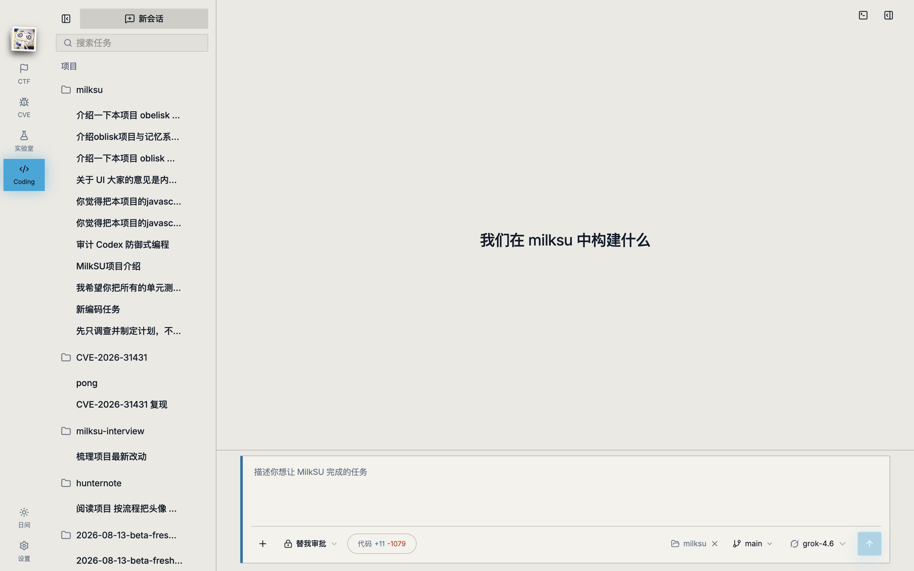
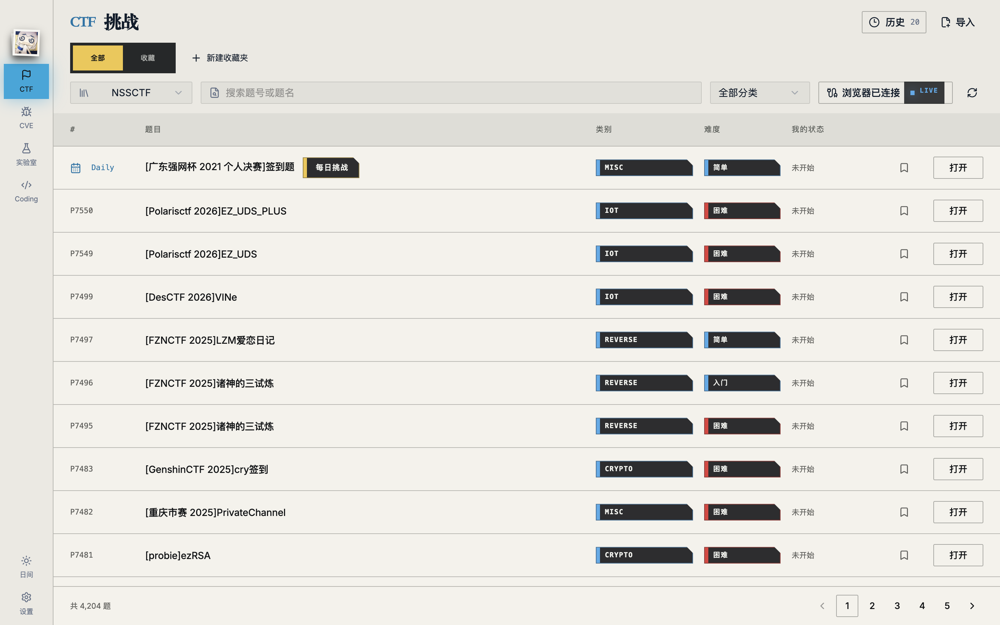
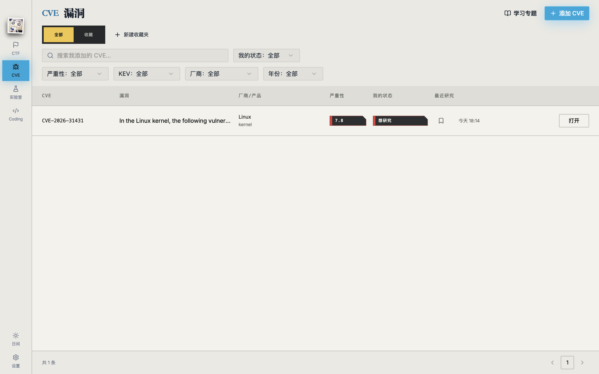
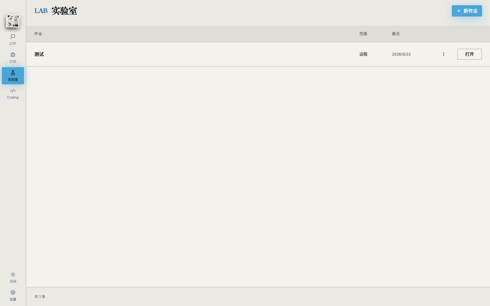
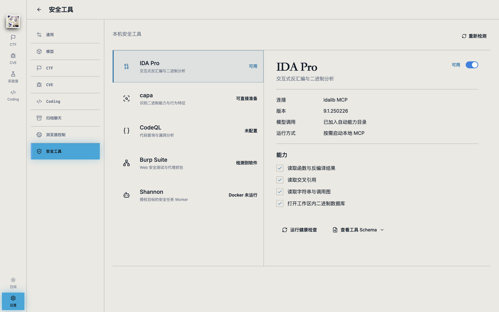

<p align="center">
  
</p>

<h1 align="center">MilkSU</h1>

<p align="center">
  面向安全学习、漏洞研究与软件开发的本地 AI 工作台
</p>

<p align="center">
  <a href="https://github.com/MilkSU-Official/milksu/releases"></a>
  
  
  
</p>

<p align="center">
  <a href="https://github.com/MilkSU-Official/milksu/releases">下载内测版</a>
  ·
  <a href="docs/architecture/current-system.md">了解系统</a>
  ·
  <a href="https://github.com/MilkSU-Official/milksu/issues">反馈问题</a>
</p>



MilkSU 把 Coding、CTF、CVE 和实验室放进同一个桌面工作台。你可以让 Agent 阅读项目、修改文件、运行测试，也可以从一道 CTF、一个 CVE 或一次实验室作业出发，把题面、材料、研究过程和最终产物留在同一个可回看的任务里。

它不是又一个只有输入框的聊天客户端。MilkSU 让 Agent 的工作对象真正出现在你面前：项目文件、内置浏览器、真实浏览器标签页和外部桌面应用都可以成为当前任务的一部分；你可以随时观察、补充要求、接管或停止。

可下载的最新三端回执发行是 **26.822.1**。下载页以 [v26.822.1](https://github.com/MilkSU-Official/milksu/releases/tag/v26.822.1) 为准，不要把同版本号的后续提交或空 tag 当成已经发出的包。

## 你可以用 MilkSU 做什么

### Coding

- 让 Agent 理解现有仓库，完成修改、构建、测试和代码审阅；
- 使用 Plan / Go 工作方式和只读、请求批准、替我审批、完全访问控制执行范围；
- 查看文件变更、Git 状态、终端任务和可预览产物；
- 按任务使用浏览器、Browser Use、Computer Use、MCP、LSP 和已审核 Skill；
- 在干净 Git 项目中自动隔离修改，不打乱当前工作区。

模型可以通过类型化工作台动作列出或切换内置浏览器标签、打开产物、环境、变更和终端，以及操作会话、实验室、CVE、CTF 记录；上下文接近窗口上限约 85% 时会走与手动压缩相同的整理。

### CTF

- 浏览 NSSCTF、CTFshow 题库，收藏题目并获得每日训练建议；
- 导入自定义题目，为每道题建立独立工作区；
- 在 Coach、Copilot 和 Delegate 之间选择合适的协作深度；
- 保存材料、Evidence、候选、Judge 回执、检查点和复盘；
- 把题目连同上下文交给同一个 Coding Agent 继续处理。

### CVE

- 按编号、产品或关键词搜索公开 CVE，并加入个人研究列表；
- 汇总 NVD、CISA KEV、EPSS、OSV、GitHub Advisory 等公开来源；
- 手动维护“想研究、研究中、已归档”等个人状态；
- 点进档案后复现，报告写在工作区 `report.md`，对话留在右下角小窗。

### 实验室

- 给出本地或远程作业要求，开一次探测；
- Agent 把过程写进同一份可继续改的报告；
- 作业可以改名，对话同样走可拖放小窗。

<table>
  <tr>
    <td width="50%">
      
      <p align="center"><sub>CTF 题库与每日挑战</sub></p>
    </td>
    <td width="50%">
      
      <p align="center"><sub>CVE 列表、筛选与点进档案复现</sub></p>
    </td>
  </tr>
  <tr>
    <td width="50%">
      
      <p align="center"><sub>实验室作业列表与改名入口</sub></p>
    </td>
    <td width="50%">
      
      <p align="center"><sub>设置里的本机安全工具</sub></p>
    </td>
  </tr>
</table>

## Agent 不只看得到，也做得到

MilkSU 会把当前任务可用的能力告诉模型，再由模型按上下文选择合适的工具。用户不需要在每次任务前手工拼装一套工具链，产品也不会靠扫描句子里的关键词来打开浏览器或切换页面。

- **项目能力**：文件、Shell、Git、LSP、测试与 Artifact 预览；
- **网页能力**：会话隔离的内置浏览器，以及用户明确选择的真实 Chrome / Edge 标签页；
- **桌面能力**：针对准确 App 和窗口的 Computer Use；
- **安全工具**：已经准备并启用的 IDA Pro / idalib、capa 等能力可以按需进入 Coding；
- **压缩与工作台**：上下文接近上限时整理会话；模型可以直接操作标签、产物、右侧状态面和产品记录。

## 开始使用

MilkSU 目前处于内测阶段。

1. 从 [Releases](https://github.com/MilkSU-Official/milksu/releases/tag/v26.822.1) 下载 `26.822.1`：
   - **macOS Apple Silicon**：Developer ID 签名并经 Apple 公证的 DMG，正式支持；
   - **Windows x64**：未签名安装器，可能出现 SmartScreen 提示；打包 Runtime 与 Pi Agent 回合已在真实安装包验证；
   - **Linux x64**：试用 DEB，已验证包结构、Sidecar、Go Runtime 与 Xvfb 启动，不含 Secret Service、本地 OCR 或 Computer Use。
2. 安装并打开 MilkSU；
3. 使用 GitHub 登录；
4. 由内测管理员为账户开通模型，或在“设置 → 模型”中添加自己的 Provider / OpenAI-compatible 中转站；
5. 选择 Coding、CTF、CVE 或实验室，开始第一个任务。

账户未分配模型额度时仍可登录和浏览本地功能，只是暂时不能发起模型任务。macOS 正式版本使用 Developer ID 签名与 Apple 公证；Stable 客户端支持登录后检查受保护的应用更新，但 `26.822.1` 没有发布 OTA。

## 本地优先

- 用户可见的 Coding、CTF 和 CVE 产物保存在各系统用户文档目录下的 `MilkSU/`；
- 项目目录、浏览器标签页和桌面窗口都需要明确进入当前任务范围；
- Provider 凭据保存在本机凭据存储中，不进入聊天内容、普通日志或项目文件；
- CTF 的成功结果以平台 Judge 或用户确认的结果为准，不由模型自述决定。

## 当前状态

最近一次带哈希回执的三端内测包是 **26.822.1**（2026-08-22 今日首发）：CVE 档案复现、实验室、对话小窗、`milksu_workspace` 原子记录操作，以及今日三端安装包。

MilkSU 面向个人学习、授权研究和本地开发，不是互联网资产扫描器或无人值守的自动红队平台。

## 本地开发

需要 Node.js、npm、Go。桌面构建在 macOS Apple Silicon 上最完整；Windows / Linux 可跑对应平台的开发与打包脚本。

```bash
# 安装依赖
npm install
npm --prefix app install

# 启动 Vue 预览
npm --prefix app run dev

# 启动桌面开发版本
npm run desktop:start
```

提交前至少运行与改动对应的测试：

```bash
go test ./...
npm run test:sidecar
npm --prefix app run test
npm --prefix app run build
```

更完整的架构、开发边界和当前事实请从以下文档开始：

- [当前开发目标](docs/developer/current-objectives.md)
- [文档与事实状态](docs/developer/document-status.md)
- [当前系统与分层](docs/architecture/current-system.md)
- [架构索引](docs/architecture/index.md)

## 鸣谢

感谢在内测期间直接向仓库提交代码的同学。没有他们，`26.817.x` 三端包和后面的工作台修复到不了现在这个位置。

| 同学 | 主要贡献 |
| --- | --- |
| Hikaru（HikaruQwQ） | Windows / Linux 启动与打包、账户授权恢复、Sidecar 安装路径、发行 workflow 与测试门禁 |
| 东云 | 账户模型可用性与可调用目录（PR #3） |
| 荒景肆（ArakeiShi） | Windows 产物目录和数据目录打开（PR #6） |
| 薄荷布丁（SkyAerope） | 自定义中转站保存与 MilkSU 账户行（PR #7） |
| AsabaLazy（Aeko233）、Luo | CTF 收藏/全部视图改走本地目录（PR #8） |

完整提交记录以 Git 历史为准。问题和产品建议可以继续提到 [GitHub Issues](https://github.com/MilkSU-Official/milksu/issues)，或发送邮件至 [milksu@proton.me](mailto:milksu@proton.me)。
