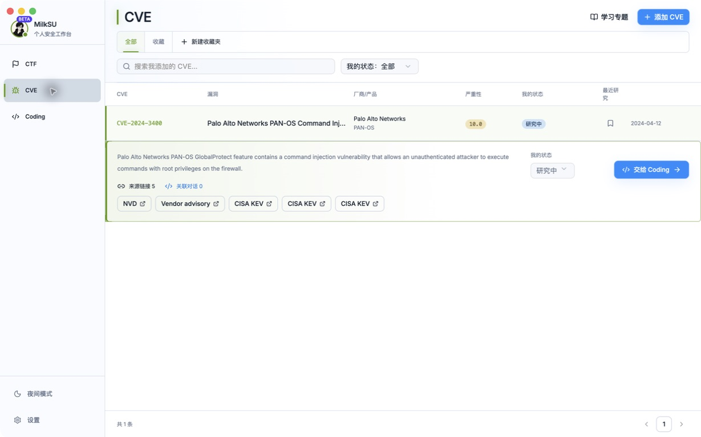
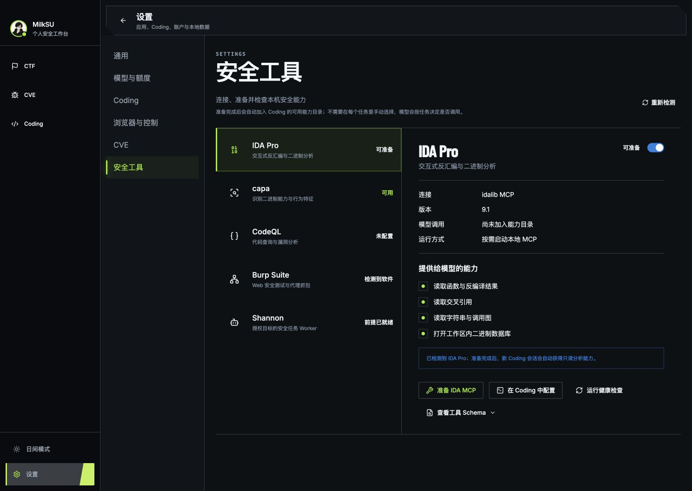

<p align="center">
  
</p>

<h1 align="center">MilkSU</h1>

<p align="center">
  面向安全学习、漏洞研究与软件开发的本地 AI 工作台
</p>

<p align="center">
  <a href="https://github.com/MilkSU-Official/milksu/releases"></a>
  
  
</p>

<p align="center">
  <a href="https://github.com/MilkSU-Official/milksu/releases">下载内测版</a>
  ·
  <a href="docs/architecture/current-system.md">了解系统</a>
  ·
  <a href="https://github.com/MilkSU-Official/milksu/issues">反馈问题</a>
</p>


MilkSU 把 Coding、CTF 和 CVE 放进同一个桌面工作台。你可以让 Agent 阅读项目、修改文件、运行测试，也可以从一道 CTF 或一个 CVE 出发，把题面、材料、研究过程和最终产物留在同一个可回看的任务里。

它不是又一个只有输入框的聊天客户端。MilkSU 让 Agent 的工作对象真正出现在你面前：项目文件、内置浏览器、真实浏览器标签页和外部桌面应用都可以成为当前任务的一部分；你可以随时观察、补充要求、接管或停止。

## 你可以用 MilkSU 做什么

### Coding

- 让 Agent 理解现有仓库，完成修改、构建、测试和代码审阅；
- 使用 Plan / Go 工作方式和不同权限档位控制执行范围；
- 查看文件变更、Git 状态、终端任务和可预览产物；
- 按任务使用浏览器、Browser Use、Computer Use、MCP、LSP 和已审核 Skill；
- 在干净 Git 项目中自动隔离修改，不打乱当前工作区。

### CTF

- 浏览 NSSCTF、CTFshow 题库，收藏题目并获得每日训练建议；
- 导入自定义题目，为每道题建立独立工作区；
- 在 Coach、Copilot 和 Delegate 之间选择合适的协作深度；
- 保存材料、Evidence、候选、Judge 回执、检查点和复盘；
- 把题目连同上下文交给同一个 Coding Agent 继续处理。

### CVE

- 按编号、产品或关键词搜索公开 CVE，并加入个人研究列表；
- 汇总 NVD、CISA KEV、EPSS、OSV、GitHub Advisory 等公开来源；
- 手动维护“想研究、研究中、已归档”等个人状态；
- 将漏洞背景和来源一并交给 Coding，继续阅读代码或整理研究材料。

<table>
  <tr>
    <td width="50%">
      
      <p align="center"><sub>CTF 题库、每日挑战与 Coding 交接</sub></p>
    </td>
    <td width="50%">
      
      <p align="center"><sub>个人 CVE 研究列表与公开来源</sub></p>
    </td>
  </tr>
</table>

## Agent 不只看得到，也做得到

MilkSU 会把当前任务可用的能力告诉模型，再由模型按上下文选择合适的工具。用户不需要在每次任务前手工拼装一套工具链。

- **项目能力**：文件、Shell、Git、LSP、测试与 Artifact 预览；
- **网页能力**：会话隔离的内置浏览器，以及用户明确选择的真实 Chrome / Edge 标签页；
- **桌面能力**：针对准确 App 和窗口的 Computer Use；
- **安全工具**：已经准备并启用的 IDA Pro / idalib、capa 等能力可以按需进入 Coding；
- **历史能力**：搜索本机 Coding、CTF、CVE 会话，并按需生成人类可读的语义关系图。



## 开始使用

MilkSU 目前处于内测阶段，正式支持 **macOS Apple Silicon**。

1. 从 [Releases](https://github.com/MilkSU-Official/milksu/releases) 下载最新 DMG；
2. 将 MilkSU 拖入“应用程序”并打开；
3. 使用 GitHub 登录；
4. 由内测管理员为账户开通模型，或在“设置 → 模型与额度”中添加自己的 Provider / OpenAI-compatible 中转站；
5. 选择 Coding、CTF 或 CVE，开始第一个任务。

账户未分配模型额度时仍可登录和浏览本地功能，只是暂时不能发起模型任务。正式版本使用 Developer ID 签名与 Apple 公证；Stable 客户端支持登录后检查受保护的应用更新。

## 本地优先

- 用户可见的 Coding、CTF 和 CVE 产物保存在 `~/Documents/MilkSU/`；
- 项目目录、浏览器标签页和桌面窗口都需要明确进入当前任务范围；
- Provider 凭据保存在本机凭据存储中，不进入聊天内容、普通日志或项目文件；
- CTF 的成功结果以平台 Judge 或用户确认的结果为准，不由模型自述决定。

## 当前状态

MilkSU 已经有可分发的 macOS 内测包，核心 Coding、CTF 和 CVE 工作流可用，但仍在快速迭代。Windows 打包、更多安全工具的真实任务验证、完整 OTA 升级回执和更广的跨应用测试仍在推进。

MilkSU 面向个人学习、授权研究和本地开发，不是互联网资产扫描器或无人值守的自动红队平台。

## 本地开发

需要 Node.js、npm、Go，以及用于桌面构建的 macOS Apple Silicon 环境。

```bash
# 安装依赖
npm install
npm --prefix app install

# 启动 Vue 预览
npm --prefix app run dev

# 启动桌面开发版本
npm run desktop:start
```

提交前至少运行与改动对应的测试：

```bash
go test ./...
npm run test:sidecar
npm --prefix app run test
npm --prefix app run build
```

更完整的架构、开发边界和当前事实请从以下文档开始：

- [当前开发目标](docs/developer/current-objectives.md)
- [文档与事实状态](docs/developer/document-status.md)
- [当前系统与分层](docs/architecture/current-system.md)
- [架构索引](docs/architecture/index.md)

## 反馈

内测问题和产品建议可以提交到 [GitHub Issues](https://github.com/MilkSU-Official/milksu/issues)，或发送邮件至 [milksu@proton.me](mailto:milksu@proton.me)。
