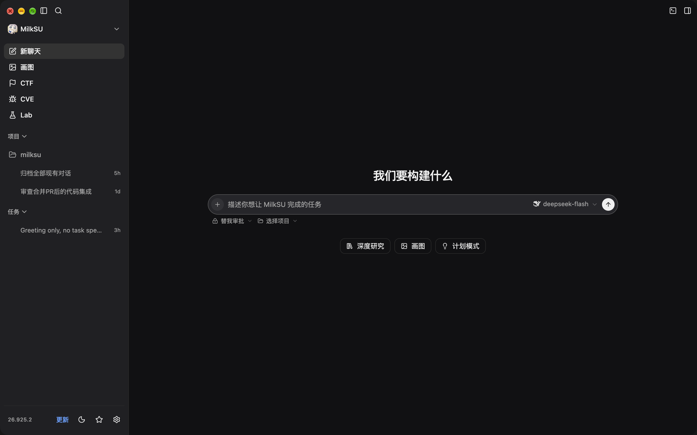
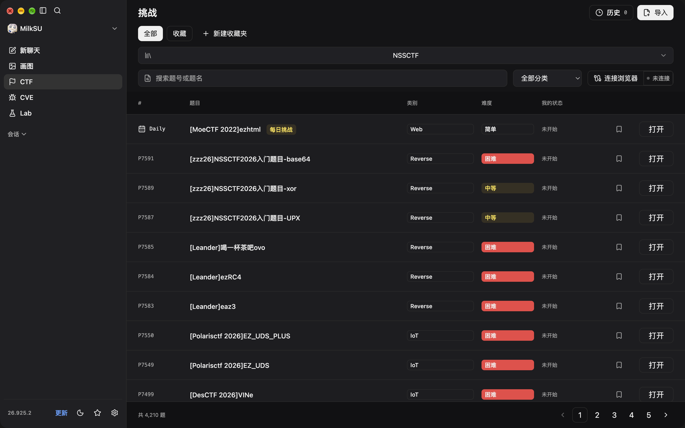
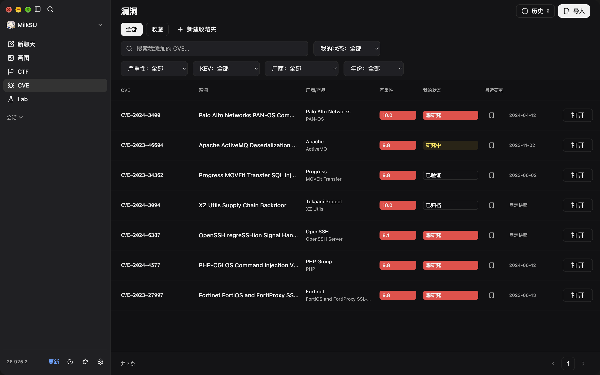
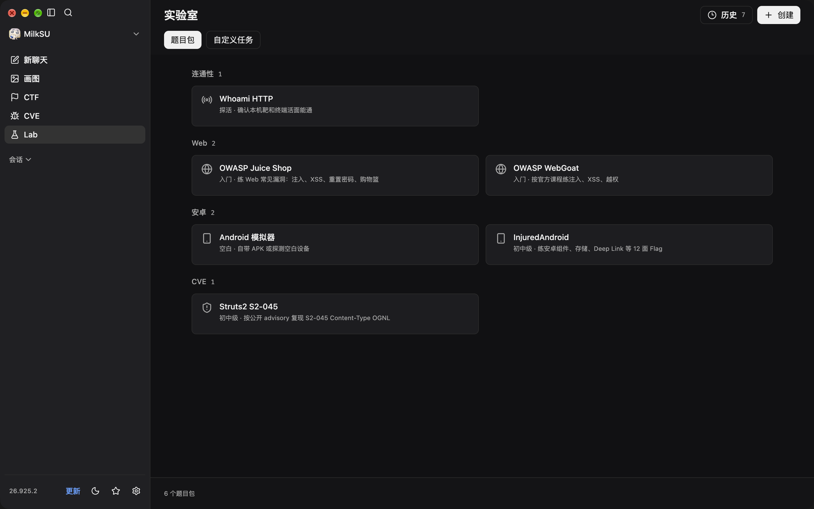
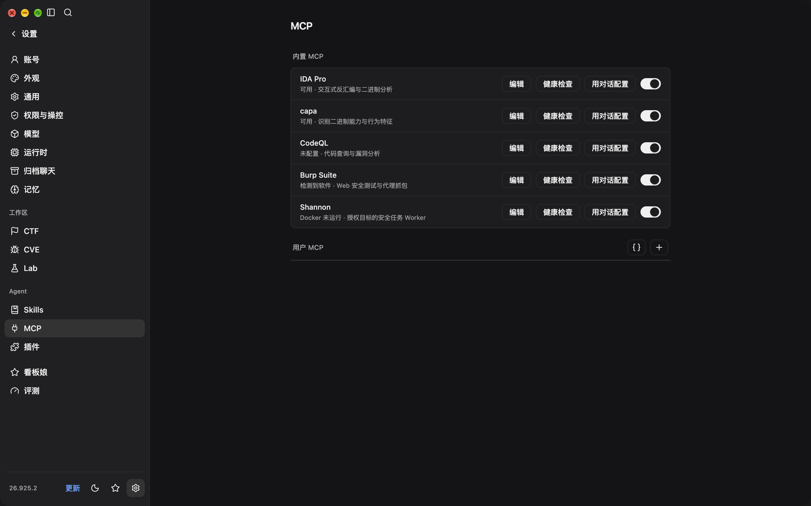

<p align="center">
  
</p>

<h1 align="center">MilkSU</h1>

<p align="center">
  面向安全学习、漏洞研究与软件开发的本地 AI 工作台
</p>

<p align="center">
  <a href="https://github.com/MilkSU-Official/milksu/releases/tag/v26.927.3"></a>
  <a href="LICENSE"></a>
  
  
</p>

<p align="center">
  <a href="https://github.com/MilkSU-Official/milksu/releases/tag/v26.927.3">下载 26.927.3</a>
  ·
  <a href="https://github.com/MilkSU-Official/milksu/releases">全部发行</a>
  ·
  <a href="docs/architecture/current-system.md">了解系统</a>
  ·
  <a href="https://github.com/MilkSU-Official/milksu/issues">反馈问题</a>
</p>



MilkSU 把 Coding、CTF、CVE 和实验室放进同一个桌面。界面是 React + shadcn。Agent 读项目、改文件、跑测试。对着一道题、一个 CVE 或一次实验室作业，题面、材料、过程和产物都留在同一条可回看的任务里。

它不是只有输入框的聊天客户端。项目文件、内置浏览器、你选定的真实浏览器标签页、外部桌面应用，都可以成为当前任务的一部分。你可以随时看、补一句、接管或停掉。新对话默认用 Pi，也可以选 DeepSeek Harness。已登录后侧栏「更新」会打开进度框；下完并校验后，再点安装并重启。

## 能做什么

### Coding

打开仓库，让 Agent 改代码、构建、测试、审阅。会话能改名、归档、恢复；回到 Coding 接着上次，不必每次从空白草稿开始。输入框旁有上下文用量；接近窗口约 80% 且空闲时会自动整理。整理上下文或接到新会话时，短会话不再报错；新会话铺上一会话原文或 harness 摘要。执行范围用 Plan / Go，以及只读、请求批准、替我审批、完全访问。

### CTF

浏览 NSSCTF、CTFshow，收藏题目，拿每日训练。点进详情再打开，为每道题单独工作区。材料、Evidence、候选、Judge 回执和复盘都留在题目里。解题对话在右下角可拖放小窗，和终端、Git、产物在一起。成功只由平台 Judge 或你本人确认。

### CVE

按编号、产品或关键词搜索公开 CVE，加入个人研究列表。点进档案再复现：Agent 编辑 `report.md`，对话留在小窗。不以「复现成功 / 没复现上」当完成面。

### 实验室

和 CTF / CVE / Coding 同级。可以给本地或远程地址开一次探测，也可以从题目包起本机 Docker 靶（Juice Shop / WebGoat / S2-045 / whoami）或安卓 MilkSU-Lab。Agent 把过程写进 `report.md`。

### 画图

侧栏「画图」单独成页。用一句话描述要画的内容，选定图像模型后生成；结果留在画图会话里，改描述可以再画一版。画图会话和 Coding 会话分开。

### 看板娘

桌面上的陪伴小窗。跟着产品状态换动作，空闲、对话、做决定各有姿态。在「设置 → 看板娘」里换皮肤：导入自己的帧，或选插件提供的皮肤。

<table>
  <tr>
    <td width="50%">
      
      <p align="center"><sub>CTF 题库与每日挑战</sub></p>
    </td>
    <td width="50%">
      
      <p align="center"><sub>CVE 列表与点进档案复现</sub></p>
    </td>
  </tr>
  <tr>
    <td width="50%">
      
      <p align="center"><sub>实验室题目包与本机靶机</sub></p>
    </td>
    <td width="50%">
      
      <p align="center"><sub>设置里的 MCP 与本机安全工具</sub></p>
    </td>
  </tr>
  <tr>
    <td width="50%">
      
      <p align="center"><sub>画图：描述要画的内容</sub></p>
    </td>
    <td width="50%">
      
      <p align="center"><sub>桌面看板娘</sub></p>
    </td>
  </tr>
</table>

## Agent 怎么动手

当前任务里有哪些能力，产品会告诉模型；模型按上下文选用。不会靠扫描你句子里的关键词去开浏览器或切页。

- 文件、Shell、Git、LSP、测试、产物预览
- 会话隔离的内置浏览器，以及你明确点选的 Chrome / Edge 标签页
- Computer Use：macOS / Windows 按窗口；Linux GNOME 按整桌面授权
- 设置里准备 IDA Pro / idalib、capa，就绪后可进 Coding 或实验室作业

项目目录、浏览器标签页和桌面窗口都要明确进入当前任务。设置、凭据、审批档和你自己的日常 Chrome 不交给这个工具。

## 安装

当前安装包是 **[26.927.3](https://github.com/MilkSU-Official/milksu/releases/tag/v26.927.3)**：macOS ARM64 DMG（Developer ID 签名并公证，安装引导图为 Retina @2x）、Windows x64 EXE、Linux x64 `.deb` 与 `.tar.gz`。这一版把全部状态目录统一到 `~/.milksu`，首次启动自动迁移旧数据；修复 macOS 更新下载失败；Sidecar 按目标平台裁剪外来平台二进制；修掉 DSH 桥队列回合失败、看板娘进行中的会话标题点不到与记忆页没有检索、CVE 复盘「记下」开关、coding 引用与附件标记六个回归。Windows 安装器尚未代码签名，可能被 SmartScreen 拦住。已登录后侧栏「更新」打开进度框下载，下完后点安装并重启。

| 系统 | 安装包 | Computer Use | Browser Use |
| --- | --- | --- | --- |
| macOS Apple Silicon | DMG | 窗口 | 可用 |
| Windows x64 | EXE | 窗口 | 可用 |
| Linux x64 GNOME Wayland | `.deb` / `.tar.gz` | 整桌面 Portal | 可用 |
| Linux Hyprland / Xorg | 同上 | 不可用 | 可用 |

Linux 只发两份包：Ubuntu / Debian 用 `.deb`，Omarchy / Arch / NixOS 用同一份 `.tar.gz`。Linux 暂无 Secret Service 和本地 OCR。

```bash
# Ubuntu / Debian
sudo apt install ./MilkSU-Linux-x64-26.927.3.deb

# Omarchy / Arch：用仓库 `packaging/linux/PKGBUILD.in`，填版本与 sha256 后
makepkg -si

# NixOS：解压同一 tar.gz
MILKSU_LINUX_UNPACKED=/path/to/unpacked nix --impure build ./packaging/linux
```

打开后用 GitHub 或用户名密码登录。管理员为账户开通模型，或在「设置 → 模型」按厂商目录、自定义接口添加自己的 Provider。没有模型额度时仍可登录和看本地内容，只是还不能发起模型任务。

用户可见产物在各系统文档目录下的 `MilkSU/`；运行状态（配置、会话、工作区、缓存）统一在 `~/.milksu/`。凭据留在本机，不进聊天、普通日志或项目文件。

## 适用范围与免责

MilkSU 面向个人学习、授权安全研究和本地开发。对目标的探测、复现和分析，只应在题目、靶机、你自己的系统或已获得书面授权的目标上进行；使用者自行遵守所在地法律法规，超出上述用途的后果由使用者承担，MilkSU 及其贡献者不担责。完整担保免责与责任限制见 [LICENSE](LICENSE)。

## 本地开发

需要 Node.js、npm、Go。

```bash
npm install
npm --prefix app install
npm run desktop:start
```

`npm install` 会自动安装 lefthook 的 pre-commit hook。提交前它会检查 staged 的 Go 文件是否经过 `gofmt` 格式化，并对改动包运行 `go test`。

提交前跑与改动对应的测试：`go test ./...`、`npm run test:sidecar`、`npm --prefix app run test`。

开发入口：[当前开发目标](docs/developer/current-objectives.md)、[当前系统](docs/architecture/current-system.md)。

## 鸣谢

应用图标原图由 **奶噗** 绘制。后来的 logo 在此基础上用即梦做了调整。看板娘的图都是基于画师原图的二次创作。

<p align="center">
  <a href="https://github.com/HikaruQwQ"></a>
  &nbsp;
  <a href="https://github.com/SuInk"></a>
  &nbsp;
  <a href="https://github.com/2409324124"></a>
  &nbsp;
  <a href="https://github.com/ArakeiShi"></a>
  &nbsp;
  <a href="https://github.com/SkyAerope"></a>
  &nbsp;
  <a href="https://github.com/AsabaLazy"></a>
  &nbsp;
  <a href="https://github.com/luo"></a>
  &nbsp;
  <a href="https://github.com/shiluoshiro"></a>
  &nbsp;
  <a href="https://github.com/MetatronPrototype"></a>
  &nbsp;
  <a href="https://github.com/senahimenohoshi"></a>
</p>

感谢在内测期间直接向仓库提交代码的同学。没有 ta 们，MilkSU 无法到今天这样基本可用的地步。

| 同学 | 主要贡献 |
| --- | --- |
| [Hikaru（HikaruQwQ）](https://github.com/HikaruQwQ) | Windows / Linux 启动与打包（PR #4）、账户授权恢复、Sidecar 安装路径、发行 workflow 与测试门禁；Composer 目标/计划/目录 chips（PR #12）；工具活动组展开与完成态（PR #20）；项目会话后台完成提醒（PR #26）；前端 typecheck（PR #28）；上下文用量与按模型思考档位（PR #31） |
| [SuInk](https://github.com/SuInk) | 会话归档与恢复、行内改名、主题切换、回到 Coding 时恢复上次视图 |
| [东云](https://github.com/2409324124) | 账户模型可用性与可调用目录（PR #3） |
| [荒景肆（ArakeiShi）](https://github.com/ArakeiShi) | Windows 无 Git 启动与 Computer Use 驱动（PR #5）；产物目录和数据目录打开（PR #6）；实验性 v1 本地插件框架（PR #34） |
| [薄荷布丁（SkyAerope）](https://github.com/SkyAerope) | 自定义中转站保存与 MilkSU 账户行、设置里的数据库兼容行（PR #7） |
| [AsabaLazy（Aeko233）](https://github.com/AsabaLazy)、[Luo](https://github.com/luo) | CTF 收藏/全部视图改走本地目录（PR #8）；Windows 源码换行测试（PR #9）；应用级本地调试模式（PR #10）。Aeko233：产品回归脚本保护宿主 MilkSU 进程、启动路径断言适配多平台（PR #171、#172）；Computer Use 的 Cua Driver 升到 0.29.1（PR #184）；Linux 桌面可用性一批：聊天窗口拖拽与最大化、设置页标题栏拖拽区域、开发版关联登录回调（PR #190、#200、#197）；桌面与浏览器 URL 输入校验（PR #191）；浏览器发现与打包测试不再依赖宿主环境（PR #192、#194）；capa 按沙箱平台门控（PR #193）；补齐高风险 hook 依赖缺口（PR #195）；统一诊断导出并校验文件可靠性（PR #196）；TokenFlux 配置弹窗、聊天标题栏与输入框边缘、回到最新按钮（PR #198、#204、#205） |
| [shiluoshiro](https://github.com/shiluoshiro) | 设置页切换分类时清掉上一分类提示（PR #25） |
| [メタトロン（MetatronPrototype）](https://github.com/MetatronPrototype) | bash 调用注入默认超时上界，非活跃工作区的 Sidecar 停靠保活（PR #80）；凭据变更改为惰性替换 Sidecar，停止与运行态跟住引擎真相（PR #83）；会话草稿隔离、计划收起、资料页失败重试与钉选排序（PR #97）；回收停止事件限定到当时会话、流式文本按批合并（PR #98）；破坏性删除先测量再判定再记录（PR #105）；HEIC 照片按文件头量尺寸发送（PR #137）、中文根路径的 socket 字节上限（PR #138）；模型失败必须让读者看见、思考复读时提醒（PR #155）；审批条判定抽成可测纯模块（PR #156）；压缩阈值按窗口与最大输出算，面板标出可用输入上限（PR #173）；模型请求两段式预算、回合停滞看门狗、首字节预算调宽、挂死先告警后掐死与引擎重启兜底（PR #203、#208、#212、#213）；桌面任务通知五类（需拍板、异常终止、已完成、疑似挂死、后台失败）加提示音与 Dock 角标，前台压制按会话（PR #210、#211、#214）；巨型对话流式不再整窗重渲染、转写区保住原生滚动惯性（PR #202、#201）；会话状态指示体系与上下文过大的小指示（PR #209、#207）；审批条底色不再半透明（PR #215） |
| [senahimenohoshi](https://github.com/senahimenohoshi) | Deep Research durable 工作流：研究运行、来源、引用与报告持久化在 research store，支持后台续跑、中断恢复与取消；Research 浏览器走回环 egress 代理隔离出口；对话内状态卡跟住进度与产物（PR #206） |

问题和产品建议可以提到 [GitHub Issues](https://github.com/MilkSU-Official/milksu/issues)，或发到 [milksu@proton.me](mailto:milksu@proton.me)。

## 开源组件

MilkSU 建立在这些项目之上。第三方保留各自原许可，完整文本见 [NOTICE](NOTICE) 和 `third_party/licenses/`。

### Agent 内核与记忆

| 项目 | 在 MilkSU 中做什么 | 许可 |
| --- | --- | --- |
| [Pi](https://github.com/earendil-works/pi)（`@earendil-works/pi-coding-agent` 1.0.0，含 pi-ai、pi-tui） | 默认 Agent 内核：通用会话、上下文压缩和工具循环 | MIT |
| Pi 扩展（pi-goal、pi-lsp、pi-mcp-adapter、pi-sub-agent、pi-better-background-tasks） | 目标、LSP、MCP 适配与后台子代理 | MIT |
| [DeepSeek Harness](https://github.com/deepseek-ai/deepseek-harness)（`@deepseek-ai/dsh` 0.2.0-rc.2，走 ACP） | 可选 Agent 运行时，新对话可在 Pi 与 DSH 之间选 | MIT |
| [Obelisk](https://github.com/tommy0103/obelisk) | 本地会话记忆与学习记录的分层。companion sidecar 以上游 writer lease 写 `companion/obelisk.sqlite` 索引，Go 不直接写这个库 | AGPL-3.0 |

### 桌面壳与界面

| 项目 | 在 MilkSU 中做什么 | 许可 |
| --- | --- | --- |
| Electron | 跨平台桌面壳，托管受管 Go 运行时与 Agent Sidecar | MIT |
| React 19 | 产品 UI 框架 | MIT |
| shadcn/ui + Radix UI | 组件基座（New York、zinc 主题） | MIT |
| Tailwind CSS v4 | 样式系统 | MIT |
| xterm.js（`@xterm/xterm` 6.0.0） | 底部终端面板 | MIT |
| lucide-react | 全套界面图标 | ISC |
| markdown-it、highlight.js、DOMPurify | 对话正文的 Markdown 渲染、代码高亮与 HTML 消毒 | MIT、MPL-2.0 OR Apache-2.0 |
| @tanstack/react-virtual | 长列表虚拟化（会话与消息） | MIT |
| Archify | `milksu_archify` 界面布局工具 | MIT |
| Vite、TypeScript、Vitest、oxlint、lefthook | 前端构建、类型、测试与提交门禁 | 各自许可，TypeScript 为 Apache-2.0 |
| VitePress | 文档站 | MIT |

### Go 运行时与桌面集成

| 项目 | 在 MilkSU 中做什么 | 许可 |
| --- | --- | --- |
| modelcontextprotocol/go-sdk v1.7.0 | 内置与用户 MCP 的服务端 / 客户端 | MIT |
| modernc.org/sqlite | 纯 Go SQLite，看板娘记忆索引等本地库 | MIT |
| creack/pty v1.1.24 | 终端伪终端 | MIT |
| gorilla/websocket v1.5.3 | 桌面 RPC 与事件推送的长连接 | BSD-2-Clause |
| godbus/dbus v5 | Linux 桌面集成（Portal、通知等） | BSD-2-Clause |
| gopher-lua v1.1.2 | 插件的 Lua 运行时 | MIT |
| google/uuid、gopkg.in/yaml.v3 | 通用工具库 | BSD、MIT |

### Computer Use 与浏览器

| 项目 | 在 MilkSU 中做什么 | 许可 |
| --- | --- | --- |
| Cua Driver 0.29.1 | macOS / Windows 后台 GUI 操作（AX 树 + 截图，不抢鼠标） | MIT |
| Playwright MCP | 会话隔离的内置浏览器自动化 | Apache-2.0 |

### 实验室靶机

题目包按 digest 固定下载或拉取镜像，不进仓库，也不链接进 MilkSU 二进制。

| 项目 | 用途 | 许可 |
| --- | --- | --- |
| InjuredAndroid 1.0.12 | 安卓题目包，校验 SHA-256 后下载 APK | Apache-2.0 |
| OWASP Juice Shop | Web 靶机 | MIT |
| OWASP WebGoat | Web 靶机，隔离运行 | GPL-2.0 |
| Vulhub Struts2 S2-045 | CVE 复现靶机 | 上游许可 |
| traefik/whoami | Linux 连通性靶机 | MIT |

### 字体与历史界面来源

Inter Variable、Noto Sans SC Variable、Geist 等可变字体经 @fontsource 分发，按 SIL Open Font License 1.1 使用，不因 MilkSU 的 AGPL 授权而改变。更早的界面还残留 ak-ui 与 Beautiful UI 的材料，许可文本在 `third_party/licenses/`；`v26.915.1` 及更早的 Vue 安装包用过 Felinic（`@felinic/ui`），上游未附 SPDX 许可文件。

## 许可证

MilkSU 以 [GNU Affero General Public License v3.0 only](LICENSE) 发布。第三方组件保留各自原许可，见 [NOTICE](NOTICE) 和 `third_party/licenses/`。
