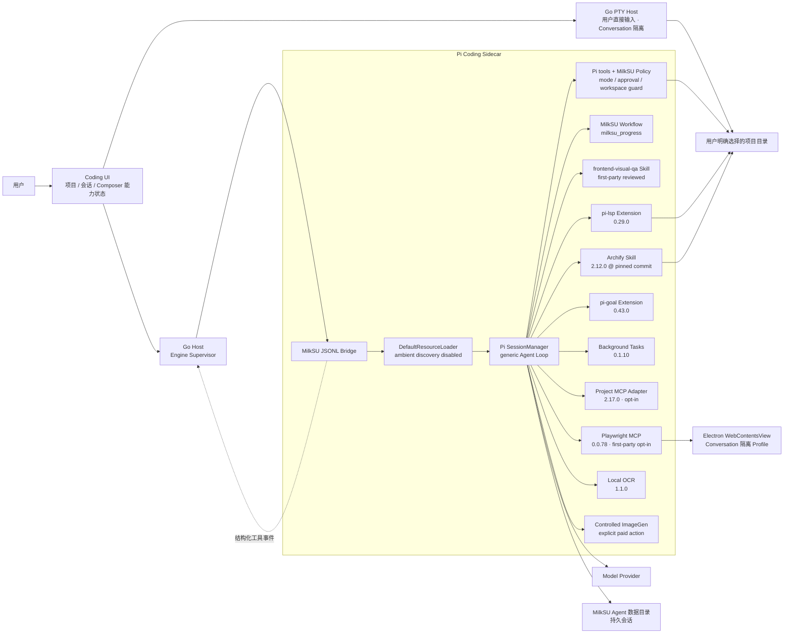
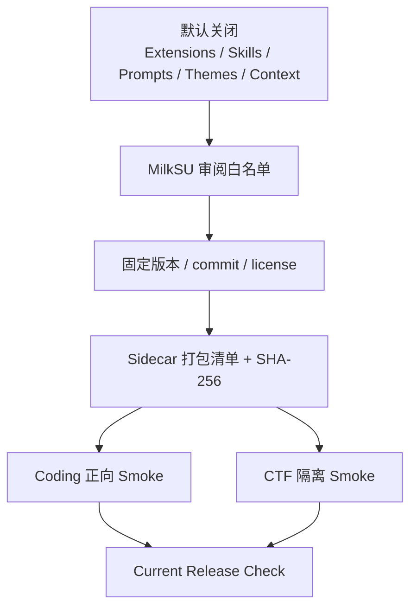
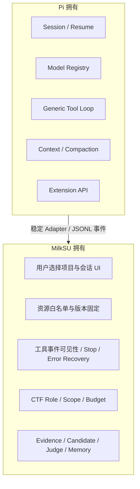

# Coding Agent / Pi 扩展边界

> 文档状态：Current engineering contract
>
> 事实审计：2026-09-02
>
> Coding 核心交付、附件、统一 Composer 能力入口、PTY、后台任务、Git、Archify、隔离 Browser 和 LSP 已有真实或
> 专项证据；Artifact Preview、Project MCP、Computer Use 外部 App slice、PR 发布确认、
> Session Index 列表/关系图、worktree 和恢复处于不同程度的 Verified / Implemented / Partial。ImageGen
> 仍缺真实 Provider 扩样。当前完成度以代码、测试、Git 历史和
> [当前开发目标](/developer/current-objectives)为准。

MilkSU 不重写通用 Coding Agent Loop。Pi 负责会话、模型、上下文、工具循环和扩展 API；
MilkSU 负责桌面授权、固定资源白名单、工具可见性、事件桥、产品 UI，以及 CTF 专用的事实、
预算、Scope 和 Judge。

## 组件边界

## 普通 Coding 与 CTF 会话矩阵

下表是 **`26.823.1` 之后的现有接线**。CTF / CVE / 实验室与 Coding 共用完整 Pi Coding loop；
领域工具、Judge 和题目工作区叠在上面，不是替换。

| 能力 | 普通 Coding | CTF Solver / Tool Builder / Strategist | 归属 |
| --- | --- | --- | --- |
| Pi Session / Model / Tool Loop | 是 | 是 | Pi |
| `read/grep/find/ls` | Pi 内置工具，使用当前系统用户可读路径；所选项目只固定会话 cwd | 同一套 Pi 工具；题目工作区固定会话 cwd | Pi；CTF 另加 MilkSU Policy |
| `edit/write` | Pi 内置工具；`Go + 替我审批` 或 `完全访问` 按当前系统用户权限执行，Ask 档位仍逐次批准 | 同一套 Pi 工具 | Pi；CTF 另加 `sidecar/pi/bridge-policy.js` |
| `bash` | Pi 内置 Bash，支持正常开发命令、Shell 组合、Git、网络和用户可访问目录；Provider Key 不传给子进程 | 同一套 Pi Bash | Pi；CTF 另加 `sidecar/pi/bridge-policy.js` |
| `milksu_progress` | 是 | 是，附角色 Guidance | MilkSU first-party Extension |
| 已审核 Pi Skills | `frontend-visual-qa` 与 Archify 可从 Composer “+”作为可删除 Skill 状态加入；发送时使用 Pi 原生 `/skill:name` 展开 | 同一套已审核 Skill | 固定 Coding Skill；MilkSU 只投影选择状态 |
| `lsp_diagnostics` / `lsp_fix` | 诊断可用；`lsp_fix` 先只读计算并校验项目内目标、统一 Diff 与文件哈希。请求批准展示完整 Diff；替我审批 / 完全访问在项目内自动应用并写后复核 | 同一套 LSP | 固定 Coding Extension + MilkSU 审阅 Adapter |
| Pi Goal | 是；与桌面目标状态并存 | 同一套 Goal；CTF 另有 Judge 语义 | 固定 Coding Extension |
| 项目终端 / 后台任务 | 是；用户直接操作的多会话 PTY 由 Go Host 承担，后台任务复用固定 Pi Extension；两者按 Conversation 隔离，展示生命周期、输出和停止动作 | 同一套终端 / 后台任务 | `creack/pty + xterm.js` Host Adapter；固定 Coding Extension + MilkSU 状态投影 |
| 项目 MCP | 用户从 Composer “+”打开现有项目 MCP 管理面，再从 `.mcp.json` 明确选择；调用遵循当前权限档位，不能由 Agent 安装或扩大工具面 | 同一套项目 MCP | 固定 Coding Extension + MilkSU Sandbox |
| 浏览器 | 普通 Coding 打开右栏或调用类型化 `milksu_workspace` 浏览器动作时拉起会话隔离的内置 Chromium；每个标签是独立 `WebContentsView`。用户与 Agent 共用当前 Target，工具调用遵循当前权限档位并保留页面、Console、Network 和截图证据。不扫描用户句子决定是否打开浏览器 | 同一套隔离浏览器 | Electron Browser Host + Scoped CDP Proxy + 固定 Playwright MCP |
| `milksu_workspace` | 类型化产品 UI 工具：列出/聚焦/关闭内置浏览器标签，列出/预览产物，打开环境、变更、终端和后台任务。不改设置、凭据、审批档，不附着用户 Chrome | 同一套产品 UI 工具 | MilkSU first-party Extension + Desktop RPC |
| 上下文压缩 | Pi 拥有 Compaction。用量达到窗口约 85% 且 Session 空闲时自动走与 `/compact` 相同的路径；用户 `/compact` 与 `compact_context` 立即排队该路径，不受 85% 限制 | 复用同一 Pi 压缩，不另建摘要器 | Pi Session compact；MilkSU 只投影用量并在空闲点调度自动整理 |
| Browser Use | 用户把可删除 Scope 加入本轮输入后，固定 Playwright extension mode 才能进入真实浏览器标签页配对路径；不复用沙箱 profile | 同一套 Browser Use | 固定 Playwright MCP + 用户标签页授权 |
| Artifact Preview | 工作区内 Markdown、HTML 和图片；HTML 使用隔离、CSP、禁网和大小限制 | 同一套产物预览 | Go Preview Policy + Vue right page |
| ImageGen | 文生图和参考图编辑；用户明确发起付费动作，输出限制在项目资产范围并可预览 | 同一套 ImageGen | 受控 Provider Adapter |
| Computer Use | 用户选择当前可见的非浏览器 App / PID / Window 并锁定不可变 Scope；调用遵循当前权限档位，`workspace-auto` 不会隐式启用或扩大 Scope | 同一套 Computer Use | Go Host + Computer Use Adapter |
| PR / worktree | PR 发布前展示仓库、分支、提交和目标；写入 Agent 使用独立 worktree | 同一套 Git / worktree | Go Git/Platform Adapter |
| 相关历史 | 底层 Session Index 仍索引本机会话；单会话相关历史、过滤、搜索和图谱前端已删除，不再作为产品表面 | 当前无此 UI | Go 索引保留 |
| 文件 / 图片附件 | 是；复制到用户数据目录，纯文本模型可走本地 OCR 或已配置视觉模型 | 使用 CTF Material 管线，不复用 Coding 附件上下文 | MilkSU 附件桥 + 本地 OCR |
| CTF 类型化工具 | 否 | Pi 会话上的 `ctf_inspect` / `ctf_decode` / `ctf_triage` 与 Judge；已删除独立 Security Bridge typed-action 循环 | MilkSU CTF domain + Pi |
| 平台提交 | 否 | Agent 不能直接提交，只能写候选 | MilkSU Judge Gate |

当前隔离由 `sidecar/pi/bridge.js` 的 `sessionRole` 分支和 `scripts/package-sidecar.mjs` 的正/负 Smoke
断言执行：普通 Coding 能看到固定资源，CTF 会话现在看不到 frontend-visual-qa、Archify、LSP、Goal、
后台任务和项目 MCP。扩展 CTF/CVE 接线时一并改这些断言，不要把旧断言当成产品方向。

## Composer 能力状态

Composer 左下“+”是已审核能力的统一选择面，不是插件安装器，也不建立第二套 Agent Harness：

- 文件、Goal 和 Plan 属于当前输入或会话状态；未选择 Plan 时默认就是 Go，不提供 `/go`；
- 浏览器与项目 MCP 只打开现有右侧管理面，不伪造一条用户消息；
- Browser Use 与 Computer Use 先插入可删除 Scope，用户发送时才把准确授权交给 Runtime；
- Skill 先插入可删除状态，发送时直接转换为 Pi 原生 `/skill:name`，MilkSU 不解析或执行 Skill；
- 菜单只展示打包白名单和当前 Session 投影的已审核资源，项目内容不能借菜单安装任意 Server、
  Skill 或扩大工具面。

`/` 仍是熟练用户的直接入口，“+”为不熟悉命令的用户提供同一状态变换。两条路径必须收敛到
同一后端能力与授权语义，选择动作本身不得直接发送。

## 执行模式与权限策略

`executionMode` 和 `approvalPolicy` 是 Conversation 的持久字段，经 Electron Preload / Desktop RPC → Go Supervisor →
JSONL Sidecar 传递。`sidecar/pi/bridge-policy.js` 每回合重新计算 allowlist，调用
`session.setActiveTools()`；独立 `tool_call` hook 再阻止不在列表中的调用。因此切换按钮不是
只改变 Prompt 或 UI 文案。

| Execution | Approval | 后端实际能力 |
| --- | --- | --- |
| `Plan` | 任意 | `read/grep/find/ls/milksu_progress/lsp_diagnostics`；明确移除 `bash/edit/write/lsp_fix`。 |
| `Go` | `Read-only` | 与 Plan 相同，只允许分析和诊断。 |
| `Go` | `Ask` | 读取类工具直接执行；`bash/edit/write`、后台任务及项目 MCP 等有副作用调用会暂停，等待桌面单次批准或拒绝；`lsp_fix` 在暂停前先计算并展示完整统一 Diff。 |
| `Go` | `替我审批`（存储值 `workspace-auto`） | 已启用的普通文件、命令、隔离浏览器（`milksu-playwright`）、Computer Use、只读 MCP 和合规委托自动执行；文件与 Shell 使用 Pi 内置工具和当前系统用户权限。请求批准档对可授权调用可给“本对话始终允许”；ImageGen、外部账户授权和破坏性删除仍每次确认。 |
| `Go` | `完全访问`（存储值 `full-auto`） | 用户显式选择后，已启用能力自动执行；Provider Key、禁止工具、付费/发布/扩 Scope 和不可逆外部动作等硬边界不随档位消失。 |

旧 Conversation 没有字段时使用已有的 `Go + workspace-auto` 语义，保持 Coding Agent
可以直接交付代码。普通 Coding 不维护第二套 workspace-only 文件/Shell 或 Node 权限状态机：
cwd 用于恢复项目上下文，真正的文件和命令语义由 Pi 内置工具及操作系统用户权限提供。
MilkSU 继续隔离 Provider 凭据，并在递归删除 Home、当前 cwd 或大型目录前二次确认。
`完全访问` 必须由用户从 Composer 权限菜单明确选择，不能由模型、项目文件或旧会话自行升级。

MilkSU 已在 Sidecar 与桌面之间实现 Approval Broker：需要审批的工具调用带上稳定请求
ID 暂停，桌面明确显示目标、参数和风险，并把一次性批准或拒绝结果送回原调用。
项目 MCP、Browser Use、Computer Use 和 ImageGen 都需要先显式启用相应能力面，不会因
权限档位静默安装、登录账户或扩大 Scope；启用后的普通调用遵循当前权限档位，避免在“替我
审批”和“完全访问”中制造无意义的逐次确认。内置浏览器在普通 Coding Go 或用户打开右栏时自动就绪，使用 Conversation 隔离 Profile，不再要求设置页或额外批准；Electron Host 只经 Go Runtime 向当前 Pi Session 注入
瞬态、限定单一 Target 的 loopback 描述符，
不把 CDP 地址写进前端、SQLite 或项目配置。模型通过 `milksu_workspace` 列出或聚焦标签，不能用 Playwright 枚举任意产品页。Browser Use 另走固定 Playwright extension mode 和
用户标签页批准，不继承沙箱 profile。Computer Use 已完成外部可见 App、bundle / PID / Window
不可变 Scope、Calculator observe/click 和纯文本模型读取工具截图的辅助视觉小纵切；Developer ID
正式签名包已通过，更多 App、权限拒绝与该正式身份下的 TCC 扩样仍未完成。Provider API Key
不进入模型上下文，也不传给 Bash、MCP 或 Computer Use 子进程。

## 资源加载与供应链

当前固定资源：

| 资源 | 固定版本 | 当前代码证据 | 当前验收 |
| --- | --- | --- | --- |
| Pi Coding Agent | `0.84.1` | `package.json`、`scripts/package-sidecar.mjs` | Sidecar 打包 / Smoke 已有 |
| `frontend-visual-qa` | first-party | `skills/frontend-visual-qa`、`sidecar/pi/bridge-skills.js`、Composer Skill 状态 | **Verified narrow task**：要求测试、真实预览和沙箱 Browser 证据；打包 Sidecar 加载；CTF 从 `26.823.1` 起共用同一套 Skill |
| Archify | `2.12.0`，commit `7b49d0b…` | `third_party/archify`、`sidecar/pi/bridge.js`、Sidecar manifest、Composer 产品动作 | **Verified**：真实打包 App 一键生成固定 JSON/HTML、9/9、0 error、0 warning，并在右侧预览 |
| `@narumitw/pi-lsp` | `0.29.0` | `sidecar/pi/bridge-resource-policy.js`、`sidecar/pi/bridge-lsp.js`、`sidecar/pi/bridge.js`、`package-lock.json`、Sidecar `lsp-runtime` | 项目命令覆盖和凭据继承已阻断；TypeScript `5.3.0`、Vue `3.3.9`、SDK `6.0.3` 与官方 `gopls 0.23.0` 固定随包；真实原生 fixture 分别返回 `TS2322 @ 1:14` 与 `compiler.IncompatibleAssign @ 3:21`；TypeScript `source.organizeImports` 已验自动应用、精确 Diff、批准/拒绝和写后复核 |
| `@narumitw/pi-goal` | `0.43.0` | `sidecar/pi/bridge-resource-policy.js`、`sidecar/pi/bridge.js`、`package-lock.json` | **Verified**：Coding / CTF / CVE / 实验室固定加载；桌面目标仍以 `milksu_progress` 为事实源 |
| `pi-better-background-tasks` | `0.1.10` | `sidecar/pi/bridge.js`、Sidecar manifest、会话级控制/运行时事件、右侧终端页 | **Verified**：真实原生会话运行短命令，并启动监听 `127.0.0.1:18876` 的任务；显示 PID/端口/有界日志后从桌面停止并确认端口关闭；不同 Conversation 的任务互相不可见；CTF 从 `26.823.1` 起共用同一套后台任务 |
| `@xterm/xterm` / `@xterm/addon-fit` | `6.0.0` / `0.11.0` | `CodingTerminalPanel.vue`、`third_party/licenses/xterm.js-MIT.txt` | **Verified**：真实原生 App 显示项目 Shell、实时输入输出和 resize；前端独立懒加载，不进入基础 ChatPage chunk |
| `github.com/creack/pty` | `1.1.24` | `internal/codingterminal`、`app_coding_terminal.go`、`third_party/licenses/creack-pty-MIT.txt` | **Verified on macOS arm64**：多会话 PTY、stdin、resize、stop、退出状态、输出尾部、Conversation ownership 和 Provider Key 环境剥离通过 race test 与原生 `pwd` |
| `pi-mcp-adapter` | `2.17.0` | `sidecar/pi/bridge.js`、项目 MCP 配置摘要与批准桥 | **Verified**：项目显式选择、摘要校验、Sandbox、环境过滤、逐次审批；CTF 从 `26.823.1` 起共用同一套项目 MCP |
| `@playwright/mcp` | `0.0.78` | `sidecar/pi/bridge-mcp.js`、`internal/browsercap`、Electron Browser Host、右侧浏览器页、Browser Use 面、Sidecar manifest | **内置 Browser narrow task verified**：打包 App 中用户与 Agent 共用会话隔离 `WebContentsView`，Agent 已经限定单一 Target 的 CDP Proxy 读取真实页面且未回退 Shell；点击/表单/公开调研、面板折叠后的连续执行与 extension mode 真实标签页配对仍按各自任务验收，不能由旧外部 Chrome fixture 代替；CTF 从 `26.823.1` 起共用同一套隔离浏览器 |
| `@napi-rs/system-ocr` | `1.1.0` | Coding 附件桥、Sidecar manifest、平台原生包 | **Verified**：图片附件可本地 OCR；配置视觉路由时可改用视觉模型 |
| MilkSU Workflow | first-party | `createMilkSUWorkflowExtension` | Schema 和可见事件已有 |

## 谁负责什么

不能跨越的边界：

- MilkSU 不实现第二套通用 Planner、ReAct Loop、Compaction 或 LSP。
- Pi 插件不能直接把 CTF Job 标为成功，也不能绕过 CTF Candidate / Judge Gate。
- 项目里的 `.pi` 或用户级 Pi 资源不能通过 Ambient Discovery 静默进入产品会话。
- LSP 不读取项目 `.pi/pi-lsp.json`；实际 Server 通过 `/usr/bin/env -i` 启动，只继承
  `HOME/PATH/TMPDIR/LANG/LC_ALL`，不能看到 Provider 或 Relay Key。
- 插件升级不能使用浮动版本；必须重新审阅许可、权限和正向能力。CTF 现在少接 Coding 资源是现有接线，扩展时改断言，不要把负向隔离当成产品方向。
- 扩展异常不能吞掉持久会话或让 UI 永久停在“运行中”。
- 用户在右侧 PTY 中直接键入的命令以当前 macOS 用户权限运行；它不是 Agent 工具，也不受
  Plan/Go 自动执行策略伪装。Agent 自动命令仍走 Pi 与桌面审批，二者的权限语义不能混用。

## 当前验收入口

本页不再维护第二份 R0.x 完成清单。精确状态以当前代码、测试、Git 历史、原生 App 验收和
[当前目标](/developer/current-objectives)为准：

- Archify、隔离 Coding Browser、MilkSU 前端视觉 QA、Git 日常闭环等已完成项保持回归；
- LSP、Artifact Preview、Project MCP、Browser Use、ImageGen、Computer Use、PR、worktree 和跨 App
  恢复按各自真实验收缺口推进；
- 最终结果是一次打包 MilkSU 的长时间 “MilkSU develops MilkSU”，不是插件数量或按钮
  数量；
- CTF Session 当前看不到 frontend-visual-qa、Archify、LSP、Goal、后台任务、项目 MCP、隔离 Browser
  和其他普通 Coding 资源。这是现有接线；需要时可以直接接。

当前正确说法是“Coding 核心和多项扩展已有工程主链或窄验收，但完整长时间自举尚未通过”，
不能写成“插件体系已完成”或“与 Codex 等价”。
