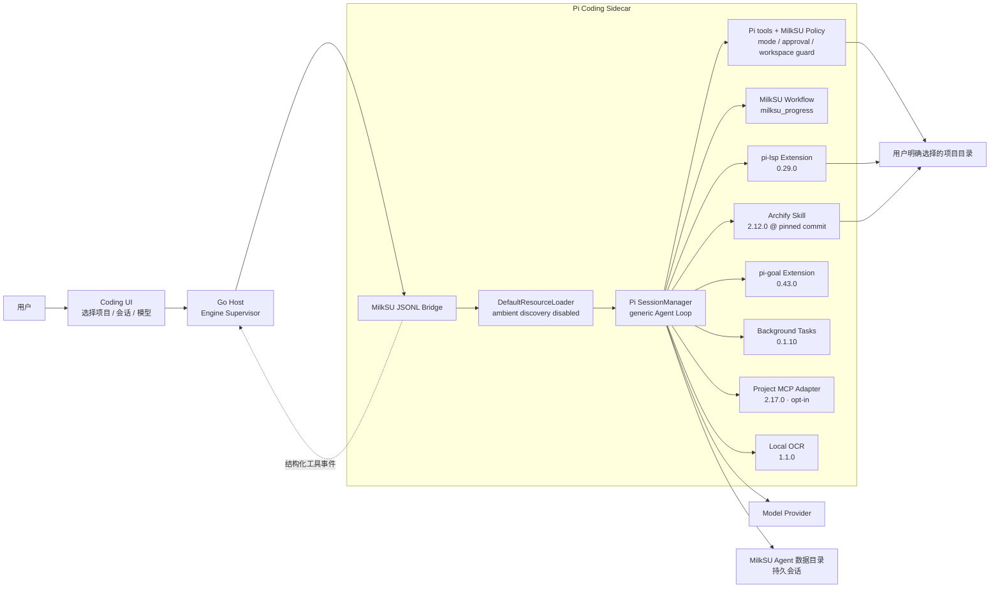
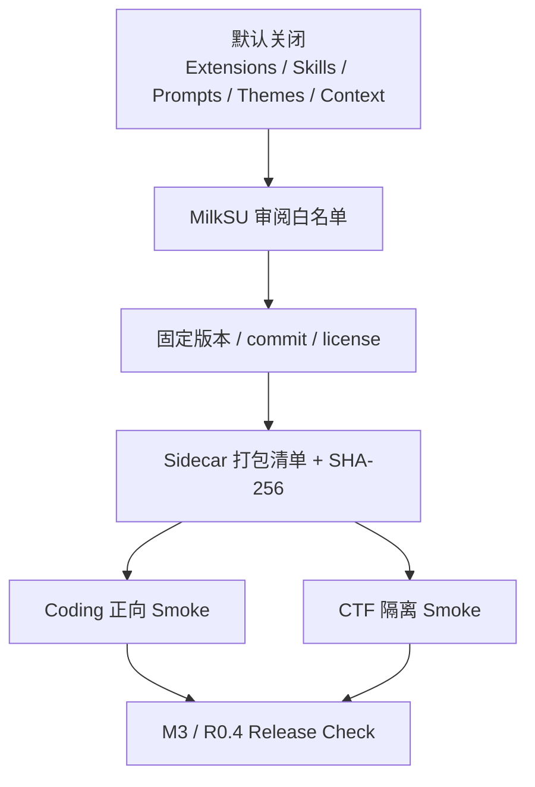
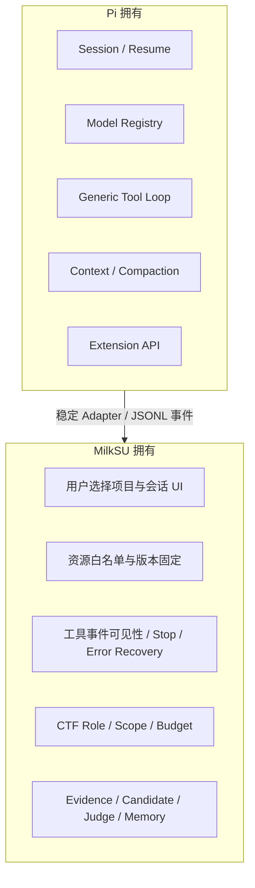

# Coding Agent / Pi 扩展边界

> 状态：Coding 核心交付链、桌面逐次审批、附件、后台任务和项目 MCP
> **Verified / Implemented**；LSP 语言服务器、Coding Browser 与 Computer Use **Partial / Planned**。

MilkSU 不重写通用 Coding Agent Loop。Pi 负责会话、模型、上下文、工具循环和扩展 API；
MilkSU 负责桌面授权、固定资源白名单、工具可见性、事件桥、产品 UI，以及 CTF 专用的事实、
预算、Scope 和 Judge。

## 组件边界

## 普通 Coding 与 CTF 会话矩阵

| 能力 | 普通 Coding | CTF Solver / Tool Builder / Strategist | 归属 |
| --- | --- | --- | --- |
| Pi Session / Model / Tool Loop | 是 | 是 | Pi |
| `read/grep/find/ls` | 所选项目范围 | MilkSU 单题工作区内按角色裁剪 | Pi 工具 + MilkSU Policy |
| `edit/write` | `Go + Project Auto` 的文件工具限制在项目内；显式 `Full Access` 的终端继承当前用户权限 | 按 CTF Role 裁剪 | Pi 工具 + `bridge-policy.js` |
| `bash` | `Project Auto` 支持正常开发命令、Shell 组合、Git 和网络，但写入受 macOS 项目沙箱约束；`Full Access` 显式解除项目沙箱 | Coach/Strategist 无；Solver 模式按策略；Tool Builder 仅离线工作区 | Pi 工具 + `bridge-policy.js` |
| `milksu_progress` | 是 | 是，附角色 Guidance | MilkSU first-party Extension |
| Archify | 是 | **否** | 固定 Coding Skill |
| `lsp_diagnostics` / `lsp_fix` | 诊断可用；`lsp_fix` 在三档策略中均阻止，等待独立审批协议 | **否** | 固定 Coding Extension + MilkSU 启动策略 |
| Pi Goal | 是；与桌面目标状态并存 | **否**；CTF 使用自己的进度与 Judge 语义 | 固定 Coding Extension |
| 后台任务 | 是；生命周期事件已接入，完整进程/端口面板待补 | **否** | 固定 Coding Extension |
| 项目 MCP | 用户从项目 `.mcp.json` 明确选择后启用，每次调用仍走桌面审批 | **否** | 固定 Coding Extension + MilkSU Sandbox |
| 文件 / 图片附件 | 是；复制到用户数据目录，纯文本模型可走本地 OCR 或已配置视觉模型 | 使用 CTF Material 管线，不复用 Coding 附件上下文 | MilkSU 附件桥 + 本地 OCR |
| CTF 类型化工具 | 否 | 按 Role、Scope 和协作模式 | MilkSU CTF Harness |
| 平台提交 | 否 | Agent 不能直接提交，只能写候选 | MilkSU Judge Gate |

这个隔离由 `bridge.js` 的 `sessionRole` 分支和 `scripts/package-sidecar.mjs` 的正/负 Smoke
断言共同保护：普通 Coding 必须看到固定资源，CTF 必须看不到 Archify、LSP、Goal、
后台任务和项目 MCP。

## 执行模式与权限策略

`executionMode` 和 `approvalPolicy` 是 Conversation 的持久字段，经 Wails → Go Supervisor →
JSONL Sidecar 传递。`bridge-policy.js` 每回合重新计算 allowlist，调用
`session.setActiveTools()`；独立 `tool_call` hook 再阻止不在列表中的调用。因此切换按钮不是
只改变 Prompt 或 UI 文案。

| Execution | Approval | 后端实际能力 |
| --- | --- | --- |
| `Plan` | 任意 | `read/grep/find/ls/milksu_progress/lsp_diagnostics`；明确移除 `bash/edit/write/lsp_fix`。 |
| `Go` | `Read-only` | 与 Plan 相同，只允许分析和诊断。 |
| `Go` | `Ask` | 读取类工具直接执行；`bash/edit/write`、后台任务及项目 MCP 等有副作用调用会暂停，等待桌面单次批准或拒绝。 |
| `Go` | `Project Auto`（存储值 `workspace-auto`） | 项目内文件、Git、常规开发命令和网络自动执行；文件写入仍受项目沙箱约束。Agent HOME/TMP/Node wrapper 位于用户数据目录；旧项目中的 `.milksu` 仍受保护。 |
| `Go` | `Full Access`（存储值 `full-auto`） | 用户显式选择后，终端以当前本机用户权限自动执行，可访问项目外文件和网络；Provider Key 仍从子进程环境移除。 |

旧 Conversation 没有字段时迁移为 `Go + Project Auto`，保持 Coding Agent 可以直接交付
代码。`Project Auto` 不再维护脆弱的命令白名单：Agent 可以使用真实研发所需的命令、
Shell 运算符、Git 和网络；macOS `sandbox-exec` 仍把写入收口在项目内，并只为审阅过的
打包资源开放只读路径。`Full Access` 必须由用户从 Composer 权限菜单明确选择，不能由
模型、项目文件或旧会话自行升级。

MilkSU 已在 Sidecar 与桌面之间实现 Approval Broker：需要审批的工具调用带上稳定请求
ID 暂停，桌面明确显示目标、参数和风险，并把一次性批准或拒绝结果送回原调用。
项目 MCP 也使用独立的逐次审批和沙箱，不会因为用户选择 `Project Auto` 或
`Full Access` 就静默启用。Coding Browser、Computer Use 与 `lsp_fix` 的完整产品入口
仍未接入；Provider API Key 不进入模型上下文，也不传给 Bash 或 MCP 子进程；
`Full Access` 能使用的只是当前登录用户本来可用的本地凭据和 SSH Agent。

## 资源加载与供应链

当前固定资源：

| 资源 | 固定版本 | 当前代码证据 | 当前验收 |
| --- | --- | --- | --- |
| Pi Coding Agent | `0.83.0` | `package.json`、`scripts/package-sidecar.mjs` | Sidecar 打包 / Smoke 已有 |
| Archify | `2.12.0`，commit `7b49d0b…` | `third_party/archify`、`bridge.js`、Sidecar manifest、Composer 产品动作 | **Verified**：真实打包 App 一键生成固定 JSON/HTML、9/9、0 error、0 warning，并在右侧预览 |
| `@narumitw/pi-lsp` | `0.29.0` | `bridge-resource-policy.js`、`bridge.js`、`package-lock.json` | 项目命令覆盖和凭据继承已阻断；语言服务器尚未打包，真实诊断与 opt-in fix 待验 |
| `@narumitw/pi-goal` | `0.43.0` | `bridge-resource-policy.js`、`bridge.js`、`package-lock.json` | **Verified**：普通 Coding 固定加载，CTF 负向隔离；桌面目标仍以 `milksu_progress` 为事实源 |
| `pi-better-background-tasks` | `0.1.10` | `bridge.js`、Sidecar manifest、运行时事件 | **Verified / Partial UI**：后台生命周期可用；统一进程、端口与日志面板待补 |
| `pi-mcp-adapter` | `2.17.0` | `bridge.js`、项目 MCP 配置摘要与批准桥 | **Verified**：项目显式选择、摘要校验、Sandbox、环境过滤、逐次审批和 CTF 负向隔离 |
| `@napi-rs/system-ocr` | `1.1.0` | Coding 附件桥、Sidecar manifest、平台原生包 | **Verified**：图片附件可本地 OCR；配置视觉路由时可改用视觉模型 |
| MilkSU Workflow | first-party | `createMilkSUWorkflowExtension` | Schema 和可见事件已有 |

## 谁负责什么

不能跨越的边界：

- MilkSU 不实现第二套通用 Planner、ReAct Loop、Compaction 或 LSP。
- Pi 插件不能直接把 CTF Job 标为成功，也不能绕过 CTF Candidate / Judge Gate。
- 项目里的 `.pi` 或用户级 Pi 资源不能通过 Ambient Discovery 静默进入产品会话。
- LSP 不读取项目 `.pi/pi-lsp.json`；实际 Server 通过 `/usr/bin/env -i` 启动，只继承
  `HOME/PATH/TMPDIR/LANG/LC_ALL`，不能看到 Provider 或 Relay Key。
- 插件升级不能使用浮动版本；必须重新审阅许可、权限、正向能力和 CTF 负向隔离。
- 扩展异常不能吞掉持久会话或让 UI 永久停在“运行中”。

## R0.4 真实验收清单

1. **Archify**：在普通 Coding 会话点击一次“架构图”，自动读取仓库、选择系统架构图与
   固定输出目录、执行 9 项校验并在右侧预览；CTF 会话必须找不到该 Skill。
2. **LSP**：先打包审核过的 Go/Vue/TypeScript Server，再在固定小项目制造一个确定性诊断；
   `lsp_diagnostics` 返回位置，`lsp_fix` 在独立审批协议完成前始终不可见。
3. **固定资源门禁**：Goal、后台任务、项目 MCP、附件与 OCR 必须通过打包清单、
   SHA-256、普通 Coding 正向 Smoke 和 CTF 负向隔离；失败恢复保留在 MilkSU Supervisor，
   不重新引入未固定的 `pi-retry`。
4. **权限可见性**：Composer 使用 Codex 风格三档菜单显示 `请求批准 / 替我审批 /
   完全访问权限`，右侧环境信息只展示生效状态；Plan 负向测试、Project Auto 项目外写入
   拒绝、Ask 单次审批和 Full Access 显式项目外写入回归同时通过。
5. **CTF 隔离**：重复 Sidecar 负向 Smoke；CTF Session 不加载 Archify/LSP/Goal/
   后台任务/项目 MCP，
   Recorder 的回合预算、候选闸门和轨迹仍通过。

当前正确说法是“核心插件已经固定并通过打包与隔离验收；LSP 语言服务器、Coding Browser、
Computer Use 和完整进程面板尚未完成”，不是“Coding Agent 插件体系已完成”。
