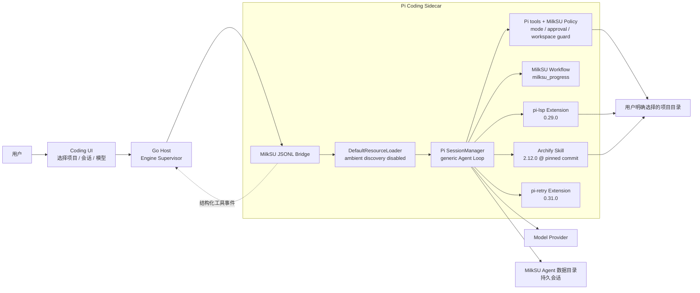
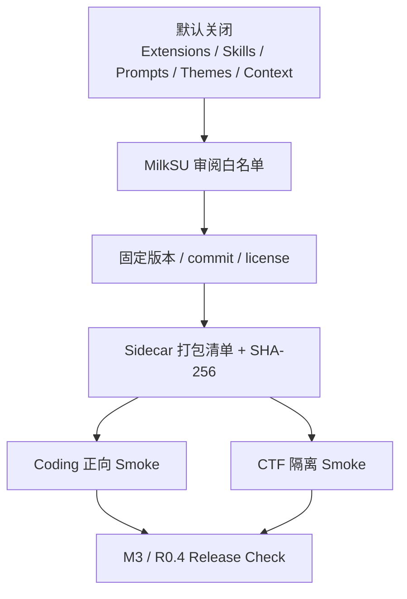
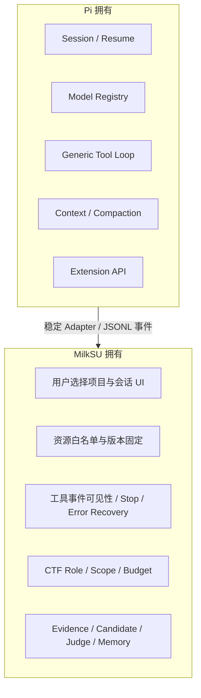

# Coding Agent / Pi 扩展边界

> 状态：Coding 核心交付链 **Verified**；通用扩展的真实专项验收与桌面逐次审批
> **Partial**。

MilkSU 不重写通用 Coding Agent Loop。Pi 负责会话、模型、上下文、工具循环和扩展 API；
MilkSU 负责桌面授权、固定资源白名单、工具可见性、事件桥、产品 UI，以及 CTF 专用的事实、
预算、Scope 和 Judge。

## 组件边界

## 普通 Coding 与 CTF 会话矩阵

| 能力 | 普通 Coding | CTF Solver / Tool Builder / Strategist | 归属 |
| --- | --- | --- | --- |
| Pi Session / Model / Tool Loop | 是 | 是 | Pi |
| `read/grep/find/ls` | 所选项目范围 | MilkSU 单题工作区内按角色裁剪 | Pi 工具 + MilkSU Policy |
| `edit/write` | `Go + Project Auto` 的文件工具限制在项目内；显式 `Full Access` 的终端继承当前用户权限 | 按 CTF Role 裁剪 | Pi 工具 + `bridge-policy.js` |
| `bash` | `Project Auto` 支持正常开发命令、Shell 组合、Git 和网络，但写入受 macOS 项目沙箱约束；`Full Access` 显式解除项目沙箱 | Coach/Strategist 无；Solver 模式按策略；Tool Builder 仅离线工作区 | Pi 工具 + `bridge-policy.js` |
| `milksu_progress` | 是 | 是，附角色 Guidance | MilkSU first-party Extension |
| Archify | 是 | **否** | 固定 Coding Skill |
| `lsp_diagnostics` / `lsp_fix` | 诊断可用；`lsp_fix` 在三档策略中均阻止，等待独立审批协议 | **否** | 固定 Coding Extension + MilkSU 启动策略 |
| Pi Retry | 是 | **否**；CTF 使用 Recorder 自己的预算和循环语义 | 固定 Coding Extension |
| CTF 类型化工具 | 否 | 按 Role、Scope 和协作模式 | MilkSU CTF Harness |
| 平台提交 | 否 | Agent 不能直接提交，只能写候选 | MilkSU Judge Gate |

这个隔离由 `bridge.js` 的 `sessionRole` 分支和 `scripts/package-sidecar.mjs` 的正/负 Smoke
断言共同保护：普通 Coding 必须看到固定资源，CTF 必须看不到 Archify、LSP 和 Retry。

## 执行模式与权限策略

`executionMode` 和 `approvalPolicy` 是 Conversation 的持久字段，经 Wails → Go Supervisor →
JSONL Sidecar 传递。`bridge-policy.js` 每回合重新计算 allowlist，调用
`session.setActiveTools()`；独立 `tool_call` hook 再阻止不在列表中的调用。因此切换按钮不是
只改变 Prompt 或 UI 文案。

| Execution | Approval | 后端实际能力 |
| --- | --- | --- |
| `Plan` | 任意 | `read/grep/find/ls/milksu_progress/lsp_diagnostics`；明确移除 `bash/edit/write/lsp_fix`。 |
| `Go` | `Read-only` | 与 Plan 相同，只允许分析和诊断。 |
| `Go` | `Ask` | 当前仍与 Read-only 相同；UI 明确显示“需批准”，但不会假装已经弹出逐工具审批。 |
| `Go` | `Project Auto`（存储值 `workspace-auto`） | 项目内文件、Git、常规开发命令和网络自动执行；文件写入仍受项目沙箱约束，`.milksu` 受保护。 |
| `Go` | `Full Access`（存储值 `full-auto`） | 用户显式选择后，终端以当前本机用户权限自动执行，可访问项目外文件和网络；Provider Key 仍从子进程环境移除。 |

旧 Conversation 没有字段时迁移为 `Go + Project Auto`，保持 Coding Agent 可以直接交付
代码。`Project Auto` 不再维护脆弱的命令白名单：Agent 可以使用真实研发所需的命令、
Shell 运算符、Git 和网络；macOS `sandbox-exec` 仍把写入收口在项目内，并只为审阅过的
打包资源开放只读路径。`Full Access` 必须由用户从 Composer 权限菜单明确选择，不能由
模型、项目文件或旧会话自行升级。

当前 Pi SDK 的 `tool_call` hook 可以阻止调用，但 MilkSU 的 headless Sidecar 没有把
`ctx.ui.confirm/select` 同步转发到桌面并等待用户决定的协议。因此 `Ask` 是真实的
“approval required, execution blocked”状态，不是完整的交互审批。Browser/MCP、
Computer Use 与 `lsp_fix` 仍未接入；它们不能因为用户选择 `Project Auto` 或
`Full Access` 就被静默启用。Provider API Key 不进入模型上下文，也不传给任何 Bash
子进程；`Full Access` 能使用的只是当前登录用户本来可用的本地凭据和 SSH Agent。

## 资源加载与供应链

当前固定资源：

| 资源 | 固定版本 | 当前代码证据 | 当前验收 |
| --- | --- | --- | --- |
| Pi Coding Agent | `0.80.2` | `package.json`、`scripts/package-sidecar.mjs` | Sidecar 打包 / Smoke 已有 |
| Archify | `2.12.0`，commit `7b49d0b…` | `third_party/archify`、`bridge.js`、Sidecar manifest、Composer 产品动作 | **Verified**：真实打包 App 一键生成固定 JSON/HTML、9/9、0 error、0 warning，并在右侧预览 |
| `@narumitw/pi-lsp` | `0.29.0` | `bridge-resource-policy.js`、`bridge.js`、`package-lock.json` | 项目命令覆盖和凭据继承已阻断；语言服务器尚未打包，真实诊断与 opt-in fix 待验 |
| `@narumitw/pi-retry` | `0.31.0` | `bridge-resource-policy.js`、`bridge.js`、`package-lock.json` | 扩展加载 Smoke 已有；保留瞬态错误分类，90 秒 watchdog 暂停到慢模型回归后 |
| MilkSU Workflow | first-party | `createMilkSUWorkflowExtension` | Schema 和可见事件已有 |

## 谁负责什么

不能跨越的边界：

- MilkSU 不实现第二套通用 Planner、ReAct Loop、Compaction 或 LSP。
- Pi 插件不能直接把 CTF Job 标为成功，也不能绕过 CTF Candidate / Judge Gate。
- 项目里的 `.pi` 或用户级 Pi 资源不能通过 Ambient Discovery 静默进入产品会话。
- LSP 不读取项目 `.pi/pi-lsp.json`；实际 Server 通过 `/usr/bin/env -i` 启动，只继承
  `HOME/PATH/TMPDIR/LANG/LC_ALL`，不能看到 Provider 或 Relay Key。
- 插件升级不能使用浮动版本；必须重新审阅许可、权限、正向能力和 CTF 负向隔离。
- 扩展异常不能吞掉持久会话或让 UI 永久停在“运行中”。

## R0.4 真实验收清单

1. **Archify**：在普通 Coding 会话点击一次“架构图”，自动读取仓库、选择系统架构图与
   固定输出目录、执行 9 项校验并在右侧预览；CTF 会话必须找不到该 Skill。
2. **LSP**：先打包审核过的 Go/Vue/TypeScript Server，再在固定小项目制造一个确定性诊断；
   `lsp_diagnostics` 返回位置，`lsp_fix` 在独立审批协议完成前始终不可见。
3. **Retry**：用可控的瞬时错误和慢首 Token fixture 证明使用 Pi 的有界重试，不产生
   第二个无限重试循环；确认阈值后才恢复 stalled stream watchdog。
4. **权限可见性**：Composer 使用 Codex 风格三档菜单显示 `请求批准 / 替我审批 /
   完全访问权限`，右侧环境信息只展示生效状态；Plan 负向测试、Project Auto 项目外写入
   拒绝和 Full Access 显式项目外写入回归同时通过。
5. **CTF 隔离**：重复 Sidecar 负向 Smoke；CTF Session 不加载 Archify/LSP/Retry，
   Recorder 的回合预算、候选闸门和轨迹仍通过。

在这五项完成前，正确说法是“插件已经固定并接入 Sidecar”，不是“Coding Agent 插件体系已完成”。
