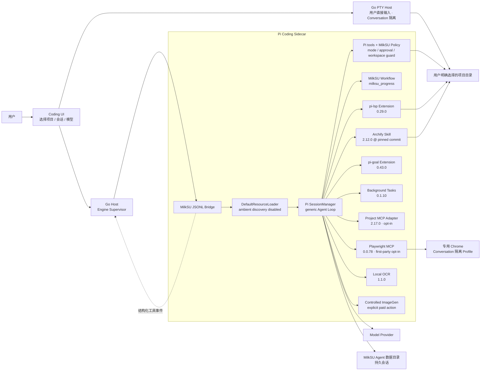
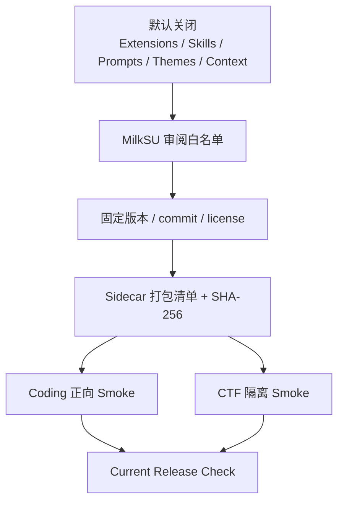
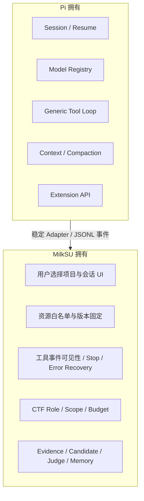

# Coding Agent / Pi 扩展边界

> 文档状态：Current engineering contract
>
> 事实审计：2026-08-05
>
> Coding 核心交付、附件、PTY、后台任务、Git、Archify、隔离 Browser 和 LSP 已有真实或
> 专项证据；Artifact Preview、Project MCP、Computer Use 外部 App slice、PR 发布确认、
> Session Index、worktree 和恢复处于不同程度的 Verified / Implemented / Partial。ImageGen
> 仍缺真实 Provider 扩样。逐项完成度只看
> [目标覆盖台账](/developer/objective-coverage-ledger)。

MilkSU 不重写通用 Coding Agent Loop。Pi 负责会话、模型、上下文、工具循环和扩展 API；
MilkSU 负责桌面授权、固定资源白名单、工具可见性、事件桥、产品 UI，以及 CTF 专用的事实、
预算、Scope 和 Judge。

## 组件边界

## 普通 Coding 与 CTF 会话矩阵

| 能力 | 普通 Coding | CTF Solver / Tool Builder / Strategist | 归属 |
| --- | --- | --- | --- |
| Pi Session / Model / Tool Loop | 是 | 是 | Pi |
| `read/grep/find/ls` | 所选项目范围 | MilkSU 单题工作区内按角色裁剪 | Pi 工具 + MilkSU Policy |
| `edit/write` | `Go + 替我审批`（存储值 `workspace-auto`）的文件工具限制在项目内；显式 `完全访问` 的终端继承当前用户权限 | 按 CTF Role 裁剪 | Pi 工具 + `bridge-policy.js` |
| `bash` | `替我审批` 支持正常开发命令、Shell 组合、Git 和网络，但写入受 macOS 项目沙箱约束；`完全访问` 显式解除项目沙箱 | Coach/Strategist 无；Solver 模式按策略；Tool Builder 仅离线工作区 | Pi 工具 + `bridge-policy.js` |
| `milksu_progress` | 是 | 是，附角色 Guidance | MilkSU first-party Extension |
| Archify | 是 | **否** | 固定 Coding Skill |
| `lsp_diagnostics` / `lsp_fix` | 诊断可用；`lsp_fix` 先只读计算并校验项目内目标、统一 Diff 与文件哈希。请求批准展示完整 Diff；替我审批 / 完全访问在项目内自动应用并写后复核 | **否** | 固定 Coding Extension + MilkSU 审阅 Adapter |
| Pi Goal | 是；与桌面目标状态并存 | **否**；CTF 使用自己的进度与 Judge 语义 | 固定 Coding Extension |
| 项目终端 / 后台任务 | 是；用户直接操作的多会话 PTY 由 Go Host 承担，后台任务复用固定 Pi Extension；两者按 Conversation 隔离，展示生命周期、输出和停止动作 | **否** | `creack/pty + xterm.js` Host Adapter；固定 Coding Extension + MilkSU 状态投影 |
| 项目 MCP | 用户从项目 `.mcp.json` 明确选择后启用；调用遵循当前权限档位，不能由 Agent 安装或扩大工具面 | **否** | 固定 Coding Extension + MilkSU Sandbox |
| Coding Browser | 用户从右侧浏览器页显式启动专用 Chrome；工具调用遵循当前权限档位并保留页面、Console、Network 和截图证据 | **否** | 固定 Playwright MCP + Go Browser Manager + MilkSU Sandbox |
| Artifact Preview | 工作区内 Markdown、HTML 和图片；HTML 使用隔离、CSP、禁网和大小限制 | **否** | Go Preview Policy + Vue right page |
| ImageGen | 文生图和参考图编辑；用户明确发起付费动作，输出限制在项目资产范围并可预览 | **否** | 受控 Provider Adapter |
| Computer Use | 用户选择当前可见 App / 窗口并锁定不可变 Scope；当前实现仍固定 MilkSU 自身，调用遵循当前权限档位，Workspace Auto 不会隐式启用 | **否** | Go Host + Computer Use Adapter |
| PR / worktree | PR 发布前展示仓库、分支、提交和目标；写入 Agent 使用独立 worktree | **否** | Go Git/Platform Adapter |
| 文件 / 图片附件 | 是；复制到用户数据目录，纯文本模型可走本地 OCR 或已配置视觉模型 | 使用 CTF Material 管线，不复用 Coding 附件上下文 | MilkSU 附件桥 + 本地 OCR |
| CTF 类型化工具 | 否 | 按 Role、Scope 和协作模式 | MilkSU CTF Harness |
| 平台提交 | 否 | Agent 不能直接提交，只能写候选 | MilkSU Judge Gate |

这个隔离由 `bridge.js` 的 `sessionRole` 分支和 `scripts/package-sidecar.mjs` 的正/负 Smoke
断言共同保护：普通 Coding 必须看到固定资源，CTF 必须看不到 Archify、LSP、Goal、
后台任务和项目 MCP。

## 执行模式与权限策略

`executionMode` 和 `approvalPolicy` 是 Conversation 的持久字段，经 Wails → Go Supervisor →
JSONL Sidecar 传递。`bridge-policy.js` 每回合重新计算 allowlist，调用
`session.setActiveTools()`；独立 `tool_call` hook 再阻止不在列表中的调用。因此切换按钮不是
只改变 Prompt 或 UI 文案。

| Execution | Approval | 后端实际能力 |
| --- | --- | --- |
| `Plan` | 任意 | `read/grep/find/ls/milksu_progress/lsp_diagnostics`；明确移除 `bash/edit/write/lsp_fix`。 |
| `Go` | `Read-only` | 与 Plan 相同，只允许分析和诊断。 |
| `Go` | `Ask` | 读取类工具直接执行；`bash/edit/write`、后台任务及项目 MCP 等有副作用调用会暂停，等待桌面单次批准或拒绝；`lsp_fix` 在暂停前先计算并展示完整统一 Diff。 |
| `Go` | `替我审批`（存储值 `workspace-auto`） | 已启用且固定范围内的普通文件、命令、Browser、Computer Use、只读 MCP 和合规委托自动执行；文件写入仍受项目沙箱约束。 |
| `Go` | `完全访问`（存储值 `full-auto`） | 用户显式选择后，已启用能力自动执行；Provider Key、禁止工具、付费/发布/扩 Scope 和不可逆外部动作等硬边界不随档位消失。 |

旧 Conversation 没有字段时使用已有的 `Go + workspace-auto` 读取语义，保持 Coding Agent
可以直接交付代码。`替我审批` 不维护脆弱的命令白名单：Agent 可以使用真实研发所需的命令、
Shell 运算符、Git 和网络；macOS `sandbox-exec` 仍把写入收口在项目内，并只为审阅过的
打包资源开放只读路径。`完全访问` 必须由用户从 Composer 权限菜单明确选择，不能由
模型、项目文件或旧会话自行升级。

MilkSU 已在 Sidecar 与桌面之间实现 Approval Broker：需要审批的工具调用带上稳定请求
ID 暂停，桌面明确显示目标、参数和风险，并把一次性批准或拒绝结果送回原调用。
项目 MCP、Coding Browser、Computer Use 和 ImageGen 都需要先显式启用相应能力面，不会因
权限档位静默安装、登录账户或扩大 Scope；启用后的普通调用遵循当前权限档位，避免在“替我
审批”和“完全访问”中制造无意义的逐次确认。Coding Browser 只能由用户从右侧页面显式
启动，使用
Conversation 隔离 Profile；Go Host 只向当前 Pi Session 注入瞬态 loopback 描述符，
不把 CDP 地址写进前端、SQLite 或项目配置。Computer Use 已有自控 MilkSU 的可见会话主链，
但跨 App 的用户选择、bundle / PID / 窗口不可变 Scope、纯文本模型读取工具截图的辅助视觉
回路，以及 macOS Accessibility / Screen Recording 真实验收仍未完成。Provider API Key
不进入模型上下文，也不传给 Bash、MCP 或 Computer Use 子进程。

## 资源加载与供应链

当前固定资源：

| 资源 | 固定版本 | 当前代码证据 | 当前验收 |
| --- | --- | --- | --- |
| Pi Coding Agent | `0.83.0` | `package.json`、`scripts/package-sidecar.mjs` | Sidecar 打包 / Smoke 已有 |
| Archify | `2.12.0`，commit `7b49d0b…` | `third_party/archify`、`bridge.js`、Sidecar manifest、Composer 产品动作 | **Verified**：真实打包 App 一键生成固定 JSON/HTML、9/9、0 error、0 warning，并在右侧预览 |
| `@narumitw/pi-lsp` | `0.29.0` | `bridge-resource-policy.js`、`bridge-lsp.js`、`bridge.js`、`package-lock.json`、Sidecar `lsp-runtime` | 项目命令覆盖和凭据继承已阻断；TypeScript `5.3.0`、Vue `3.3.9`、SDK `6.0.3` 与官方 `gopls 0.23.0` 固定随包；真实原生 fixture 分别返回 `TS2322 @ 1:14` 与 `compiler.IncompatibleAssign @ 3:21`；TypeScript `source.organizeImports` 已验自动应用、精确 Diff、批准/拒绝和写后复核 |
| `@narumitw/pi-goal` | `0.43.0` | `bridge-resource-policy.js`、`bridge.js`、`package-lock.json` | **Verified**：普通 Coding 固定加载，CTF 负向隔离；桌面目标仍以 `milksu_progress` 为事实源 |
| `pi-better-background-tasks` | `0.1.10` | `bridge.js`、Sidecar manifest、会话级控制/运行时事件、右侧终端页 | **Verified**：真实原生会话运行短命令，并启动监听 `127.0.0.1:18876` 的任务；显示 PID/端口/有界日志后从桌面停止并确认端口关闭；不同 Conversation 的任务互相不可见，CTF 保持负向隔离 |
| `@xterm/xterm` / `@xterm/addon-fit` | `6.0.0` / `0.11.0` | `CodingTerminalPanel.vue`、`third_party/licenses/xterm.js-MIT.txt` | **Verified**：真实原生 App 显示项目 Shell、实时输入输出和 resize；前端独立懒加载，不进入基础 ChatPage chunk |
| `github.com/creack/pty` | `1.1.24` | `internal/codingterminal`、`app_coding_terminal.go`、`third_party/licenses/creack-pty-MIT.txt` | **Verified on macOS arm64**：多会话 PTY、stdin、resize、stop、退出状态、输出尾部、Conversation ownership 和 Provider Key 环境剥离通过 race test 与原生 `pwd` |
| `pi-mcp-adapter` | `2.17.0` | `bridge.js`、项目 MCP 配置摘要与批准桥 | **Verified**：项目显式选择、摘要校验、Sandbox、环境过滤、逐次审批和 CTF 负向隔离 |
| `@playwright/mcp` | `0.0.78` | `bridge-mcp.js`、`internal/browsercap`、右侧浏览器页、Sidecar manifest | **Verified**：真实打包 App 启动专用 Chrome，并在逐次审批下完成 snapshot、type、click、结果回读和停止；CTF 会话不加载该服务器 |
| `@napi-rs/system-ocr` | `1.1.0` | Coding 附件桥、Sidecar manifest、平台原生包 | **Verified**：图片附件可本地 OCR；配置视觉路由时可改用视觉模型 |
| MilkSU Workflow | first-party | `createMilkSUWorkflowExtension` | Schema 和可见事件已有 |

## 谁负责什么

不能跨越的边界：

- MilkSU 不实现第二套通用 Planner、ReAct Loop、Compaction 或 LSP。
- Pi 插件不能直接把 CTF Job 标为成功，也不能绕过 CTF Candidate / Judge Gate。
- 项目里的 `.pi` 或用户级 Pi 资源不能通过 Ambient Discovery 静默进入产品会话。
- LSP 不读取项目 `.pi/pi-lsp.json`；实际 Server 通过 `/usr/bin/env -i` 启动，只继承
  `HOME/PATH/TMPDIR/LANG/LC_ALL`，不能看到 Provider 或 Relay Key。
- 插件升级不能使用浮动版本；必须重新审阅许可、权限、正向能力和 CTF 负向隔离。
- 扩展异常不能吞掉持久会话或让 UI 永久停在“运行中”。
- 用户在右侧 PTY 中直接键入的命令以当前 macOS 用户权限运行；它不是 Agent 工具，也不受
  Plan/Go 自动执行策略伪装。Agent 自动命令仍走 Pi 与桌面审批，二者的权限语义不能混用。

## 当前验收入口

本页不再维护第二份 R0.x 完成清单。精确状态使用覆盖台账的 `COD-01`–`COD-30` 与
`RUN-03`、`RUN-08`：

- Archify、隔离 Coding Browser、MilkSU 前端视觉 QA、Git 日常闭环等已完成项保持回归；
- LSP、Artifact Preview、Project MCP、ImageGen、Computer Use、PR、worktree 和跨 App
  恢复按各自真实验收缺口推进；
- 最终结果是一次打包 MilkSU 的长时间 “MilkSU develops MilkSU”，不是插件数量或按钮
  数量；
- CTF Session 必须继续看不到 Archify、LSP、Goal、后台任务、项目 MCP、Coding Browser
  和其他普通 Coding 资源。

当前正确说法是“Coding 核心和多项扩展已有工程主链或窄验收，但完整长时间自举尚未通过”，
不能写成“插件体系已完成”或“与 Codex 等价”。
