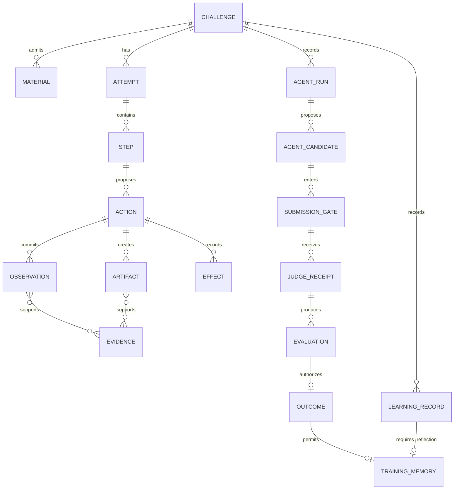
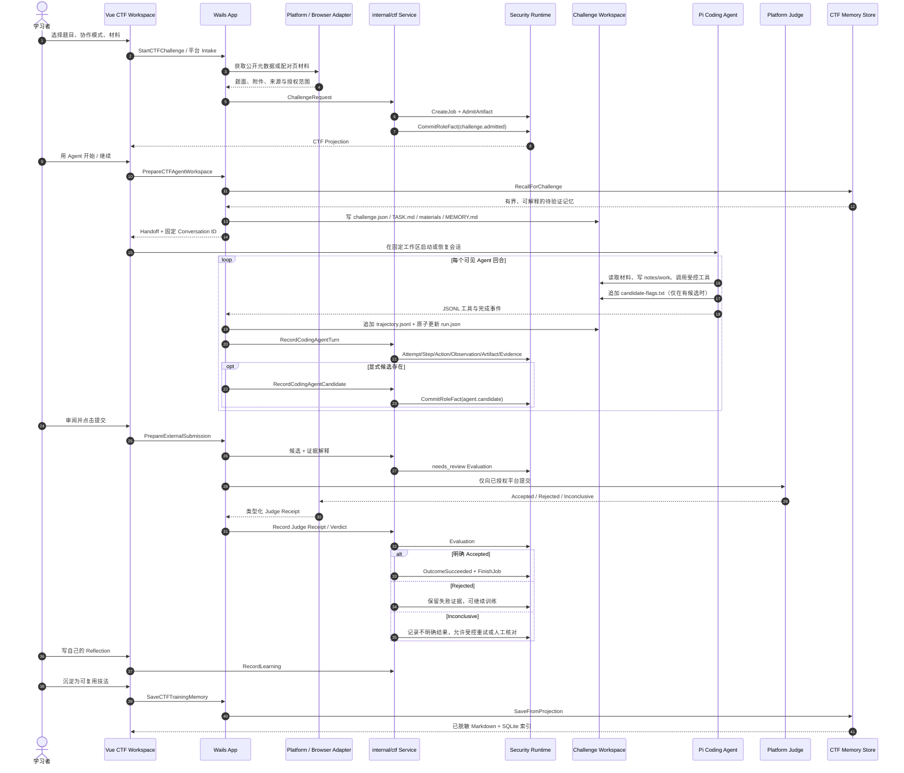
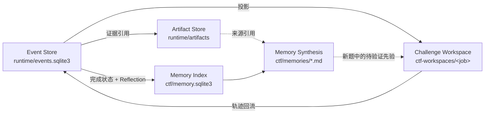

# CTF Intake → Agent → Judge → Memory

> 状态：CTF 主链 **Implemented**；部分平台与原生 UI 回归仍属于发布门。本文不包含已暂停的
> Managed Labs。

## 数据模型

关键不变量：

1. `AgentCandidate` 不是 `Outcome`。
2. 成功 `Outcome` 必须引用一条 `pass` Evaluation。
3. 外部题只有平台明确回执或受控人工确认可以把候选判为通过。
4. Memory 是用户确认后的综合缓存；原始 Event、Artifact、Trajectory 和 Judge Receipt
   才是证据层。

## 主时序

## 每一步的事实归属

| 阶段 | 真相归属 | 主要实现 | 状态 |
| --- | --- | --- | --- |
| Catalog / Intake | 平台 Adapter 提供来源；CTF Service 归一化 | `internal/nssctf`、`internal/ctfshow`、`internal/browsercap`、`ctf.validateRequest` | **Implemented** |
| Artifact admission | Security Runtime 计算 SHA-256 并保存 | `internal/securityruntime/artifact_store.go` | **Implemented** |
| Challenge fact | `challenge.admitted` Role Fact | `internal/ctf/service.go`、`internal/ctf/model.go` | **Implemented** |
| Workspace handoff | 每题固定目录和固定会话 ID | `internal/ctf/workspace.go`、`app.go` | **Implemented** |
| Agent execution | Pi 负责通用 Loop；MilkSU 负责策略和工作区 | `bridge.js`、`bridge-policy.js`、`internal/engine` | **Implemented / Partial** |
| Trajectory checkpoint | Recorder + `trajectory.jsonl` + `run.json` | `ctf_agent_recorder.go`、`internal/ctf/run_checkpoint.go` | **Implemented** |
| Candidate gate | 只读显式候选文件，不从聊天猜 Flag | `ReadAgentWorkspaceResult`、`RecordCodingAgentCandidate` | **Implemented** |
| External Judge | 平台或受控人工确认 | `PrepareExternalSubmission`、NSSCTF/CTFshow Bridge、Arena | **Implemented** |
| Recovery | Event Projection、PI checkpoint、inconclusive 重试 | `securityruntime.Recover`、`ctf.Service.Recover` | **Implemented** |
| Debrief | 由已提交事实确定性投影 | `internal/ctf/projection.go`、`training_report.go` | **Implemented** |
| Long-term memory | Reflection 后显式保存，候选和凭据脱敏 | `internal/ctf/memory.go` | **Implemented** |

## 持久化位置

Memory 不复制原始 Flag、API Key、Bearer Token 或 URL Secret。新题召回按分类、题名、
知识点、标签、置信度和时间做本地可解释排序；同一 Job 不召回自己的综合记忆。

## 明确未完成

- 动态 endpoint 从题面发现后仍需要完整的用户确认 UI，文字本身不能自动扩大 Scope。
- 宿主机 PI Shell 不是容器；macOS Seatbelt 也不是跨平台的精确网络隔离。
- CTFshow 适配代码存在，但真实账号 E2E 需要持续作为发布回归保存。
- NYU CTF Bench 已接入固定索引、fail-closed safe-static one-shot Runner、两回合 Pi
  只读 Agent Runtime、Digest Judge 和静态报告；完整挑战 Runner、作用型 Agent 工具链与
  代表性真实成绩仍不存在。
- Managed Labs 已暂停，不属于本时序的可用入口或完成条件。
