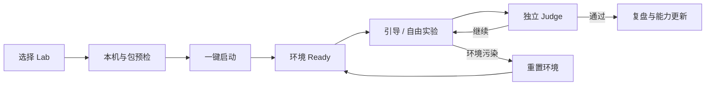
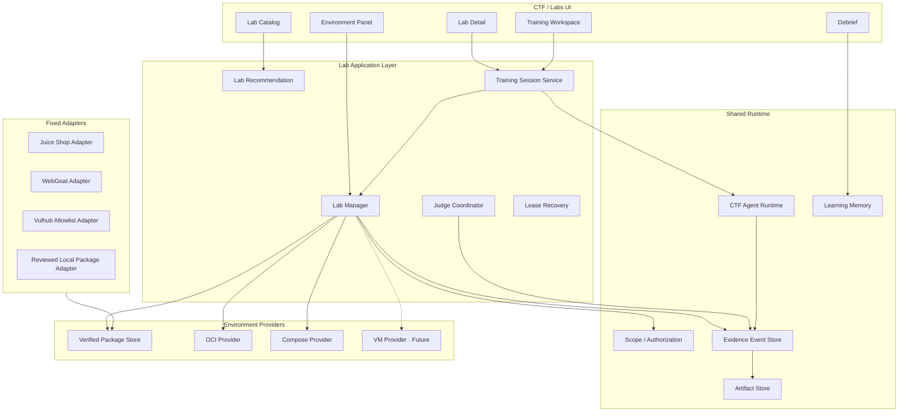
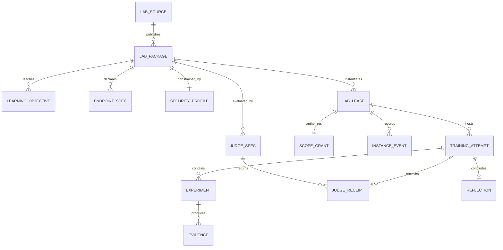
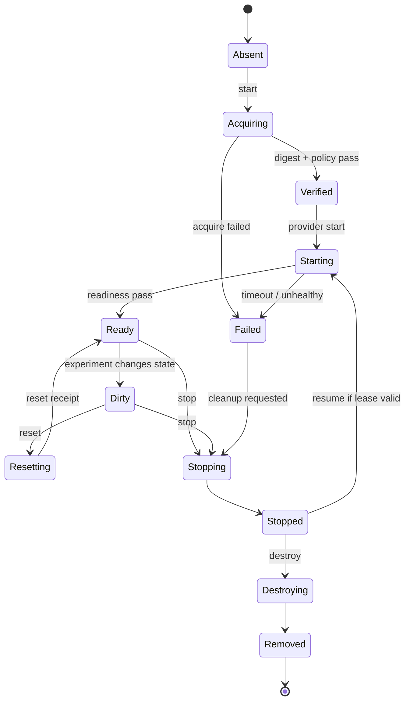
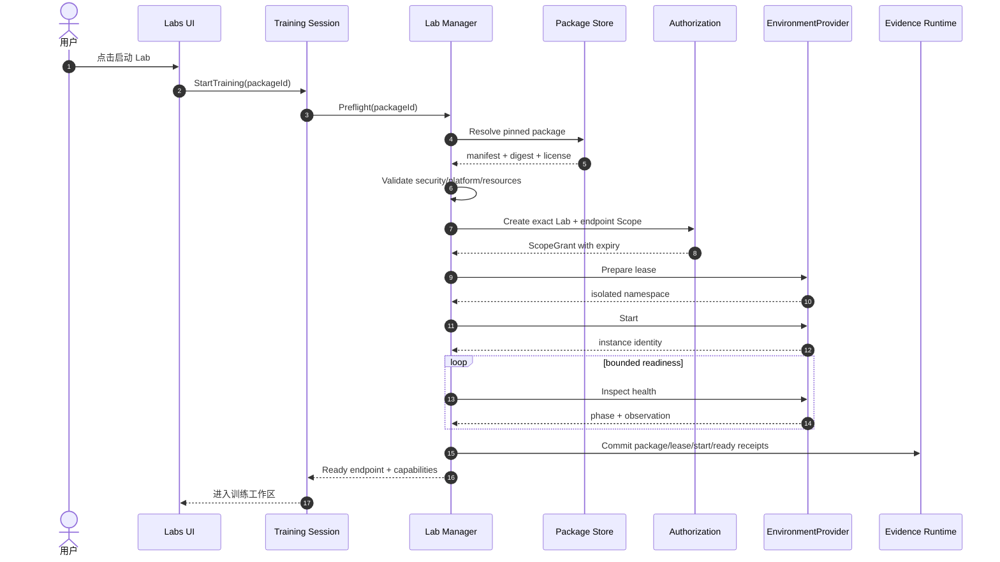

# CTF Labs：顶层与详细设计

> 状态：**Paused / Designed**。当前只保留设计，不启动环境、不接入真实平台、不计入 M3 完成声明。
>
> 产品位置：CTF 工作区的二级入口 `Labs`。

## 1. 目标

Labs 要提供接近 HTB/THM 的“选择一个环境就开始学习”体验，但首期只使用可审阅、可固定、
可自托管的训练内容：

- OWASP Juice Shop：挑战式 Web 学习环境；
- OWASP WebGoat：课程式 Web 学习房间；
- Vulhub：经过 MilkSU 白名单审查的 CVE 环境；
- 用户自定义：仅允许显式选择的本地 `LabPackage`，默认不执行未经审阅的 Compose。

用户不需要阅读部署 README、复制端口或手动运行 Docker。MilkSU 负责确定性生命周期，
Agent 负责教学、实验建议和证据解释。

## 2. 用户闭环



首屏主动作只有一个：

- 未启动：`启动 Lab`
- 启动中：显示确定性阶段和可取消状态
- 已就绪：`进入 Lab`
- 进行中：`继续训练`
- 已完成：`查看复盘`

架构、端口、镜像、网络和重置策略放入右侧“环境详情”，不要求普通用户选择。

## 3. 顶层组件



### 3.1 依赖原则

```text
Labs UI
  → Training Session Service
    → Lab Manager / Judge Coordinator
      → EnvironmentProvider / Evaluator
        → Docker、OCI、未来 VM
```

Agent 只能请求类型化动作；它不能获得 Docker socket、拼接 Compose 命令、指定任意镜像或
清理全局容器。

## 4. 领域模型



### 4.1 核心对象

| 对象 | 必要字段 |
| --- | --- |
| `LabPackage` | ID、版本、来源 revision/digest、许可证、平台、目标、Runtime、Endpoint、Readiness、Reset、Judge、Security |
| `LabLease` | Instance ID、Package ID/version、用户、创建/到期时间、Provider、隔离命名空间 |
| `LabInstance` | Phase、Endpoint、镜像 digest、资源占用、健康状态、恢复标记 |
| `TrainingAttempt` | 目标、模式、提示等级、Agent 会话、开始/结束、Judge 状态 |
| `InstanceEvent` | acquire/start/ready/reset/stop/destroy 事实与 Receipt |
| `JudgeReceipt` | Judge 版本、输入摘要、Verdict、证据引用、时间 |

现有 `LabPackage v1alpha1` 继续作为兼容起点；新增字段必须通过版本演进，不能直接改变已持久化
语义。

## 5. 生命周期



不变量：

1. `Ready` 只说明环境可访问，不说明训练完成；
2. `Stop`、`Reset`、`Destroy` 必须幂等；
3. 只清理具有当前 Lease 和 MilkSU label 的资源；
4. App 崩溃后实例先进入 `orphaned/recovery-pending`，经身份与健康核对后才能恢复；
5. Lease 到期后先停止访问，再按策略清理，不能悄悄续期。

## 6. 启动时序



任何一步失败都返回结构化原因和可执行的恢复动作，不把 Docker 原始日志直接丢给普通用户。

## 7. Agent 与教学

### 7.1 三种训练模式

| 模式 | 用户体验 | Agent 权限 |
| --- | --- | --- |
| 教练 | 用户自己操作，Agent 逐级提示 | 读取材料和已提交证据；不直接执行 |
| 搭档 | 用户与 Agent 轮流提出、执行实验 | 仅在当前 Lab Scope 内使用类型化工具 |
| 代理 | Agent 连续推进，用户看检查点并批准敏感步骤 | 有预算和停机条件；不能绕过 Judge/Scope |

### 7.2 Hint Ladder

1. 指出观察方向；
2. 提醒概念或相关材料；
3. 给出区分假设的下一实验；
4. 展示关键操作结构；
5. 完整演示后要求用户解释和迁移。

提示依赖、用户独立步骤、失败实验和复盘共同进入能力画像；仅“看到了答案”不能增加能力。

### 7.3 类型化工具

未来 Agent 只获得：

- `lab.status`
- `lab.reset`
- `lab.stop`
- `lab.open_endpoint`
- `lab.collect_artifact`
- `lab.submit_evidence`

`lab.start` 默认由用户主按钮触发；代理模式也只能提出请求。Docker/Compose/VM 命令不进入
模型工具目录。

## 8. UI 详细设计

### 8.1 Catalog

与 CTF 题库保持同一种列表结构：

```text
Labs  [来源 ▼] [分类 ▼] [搜索] [我的进度]

标题                    类型     难度   预计时间   环境       进度
OWASP Juice Shop        Web      入门   45 分钟    可用       2/12
WebGoat · SQL Injection Web      入门   30 分钟    可用       未开始
Vulhub · CVE-...        CVE Lab  中等   40 分钟    需下载     未开始
```

选择后右侧只显示：学习目标、前置知识、来源与许可证、预计资源、个人进度和主按钮。镜像 digest、
端口和网络策略折叠在“环境详情”。

### 8.2 Training Workspace

- 中间：任务步骤、浏览/终端/材料中的当前视图、Agent 对话；
- 底部：消息、模式、提示等级、模型；
- 右侧页面：
  - `环境`：Phase、Endpoint、剩余时间、Reset/Stop；
  - `目标`：当前学习目标与进度；
  - `证据`：实验、Artifact、Judge；
  - `协作`：Agent 角色和工具请求；
- 顶部不堆返回按钮；通过右侧页面和面包屑提供导航。

### 8.3 中断恢复

“继续训练”下拉按 Lab 分组，显示：

- 最近可靠检查点；
- 环境是 Ready、Stopped 还是需要恢复；
- 上次已完成的目标；
- 是否需要重新获取环境。

不展示模糊的“继续上次 / 下一步”。

## 9. 服务接口草案

```go
type LabCatalogService interface {
    List(ctx context.Context, query LabQuery) ([]LabSummary, error)
    Get(ctx context.Context, packageID string) (LabDetail, error)
}

type LabSessionService interface {
    Start(ctx context.Context, packageID string, mode TrainingMode) (TrainingSession, error)
    Resume(ctx context.Context, sessionID string) (TrainingSession, error)
    Reset(ctx context.Context, sessionID string) (LabInstance, error)
    Stop(ctx context.Context, sessionID string) error
    Submit(ctx context.Context, sessionID string, candidate Candidate) (JudgeReceipt, error)
}
```

Wails 只暴露 Application Service，不把 `docker compose` 参数或 Provider 实现暴露给 Vue。

## 10. 安全与供应链

- 来源必须固定 commit、release 或镜像 digest；
- Acquire 可联网，Run 默认断开外网；两个阶段使用不同权限；
- 所有 Endpoint 绑定 loopback 临时端口；
- 拒绝 privileged、host network、设备、Docker socket 和未批准主机挂载；
- Compose resolved config 必须先解析和审阅；
- 模型生成的 Dockerfile/Compose 不能直接执行；
- Provider 凭据、平台 Cookie 与题目目标网络上下文分离；
- Kernel、恶意软件和真实内核语义任务等待 VMProvider；
- 第三方包进入默认 Catalog 前完成许可证、架构、离线性、Judge 和清理测试。

## 11. 可观测性与指标

产品指标：

- 从点击启动到 Ready 的 P50/P95；
- 启动成功率、Reset 成功率、孤儿恢复率；
- 完成率、平均提示等级、独立实验数；
- 相同知识点变体题迁移成功率；
- Agent 错误成功声明率必须为 0。

系统事件：

```text
lab.package.resolved
lab.preflight.passed|failed
lab.lease.created|expired
lab.instance.starting|ready|dirty|reset|stopped|removed
lab.judge.received
lab.recovery.required|completed
```

## 12. 代码与持久化布局

### 12.1 Go 包边界

```text
internal/labapp/          Training Session Application Service
internal/labcatalog/      Catalog、Source Adapter、Package Resolution
internal/labmanager/      Lease、生命周期、恢复；保留现有核心并拆出 Facade
internal/labprovider/     Provider 接口
internal/labprovider/oci/ 固定 OCI Image 实现
internal/labprovider/compose/
internal/labjudge/        Flag / HTTP / Artifact / Manual Judge
internal/labpolicy/       resolved config 与平台/权限校验
```

现有 `internal/labmanager` 不删除重写；先把 Catalog、Provider、Judge 和 Wails 编排从 Manager
移出。`app.go` 只组合 `labapp.Service`，不继续增加 Docker 生命周期细节。

前端建议：

```text
app/src/features/labs/
├─ LabCatalogPage.vue
├─ LabDetailPanel.vue
├─ LabWorkspace.vue
├─ LabEnvironmentPanel.vue
├─ LabDebrief.vue
├─ useLabCatalog.ts
└─ useLabSession.ts
```

### 12.2 持久化

```text
<UserData>/labs/
├─ packages/<package-id>/<version>/   固定 manifest、license、digest receipt
├─ instances.sqlite3                  Lease、Instance identity、恢复状态
└─ private/<instance-id>/             仅该实例的 provider state

<UserData>/runtime/events.sqlite3     训练、实验、Judge 与恢复事实
<UserData>/runtime/artifacts/         日志、截图、导出和 Evidence
<UserData>/ctf/memory.sqlite3         用户确认后的学习记忆
```

现有 `state.json` 进入 SQLite 前提供一次幂等迁移；迁移失败时保留原文件并禁止自动清理未知实例。
Package Cache 可以重建，Runtime Event、Judge Receipt 和 Reflection 不可由 Cache 反推。

### 12.3 Wails Facade

首期只暴露类型化命令：

```text
ListLabCatalog / GetLabDetail
StartLabTraining / ResumeLabTraining
GetLabInstance / ResetLabInstance / StopLabInstance
SubmitLabCandidate / GetLabDebrief
```

返回值使用应用 DTO，不直接暴露 Docker/Compose 类型或私有访问凭据。

## 13. 解冻后的实施阶段

### L0 · 契约与假 Provider

- 冻结 `LabPackage v1beta1` 和迁移；
- 用不会启动容器的 FakeProvider 验状态、审批、恢复和 UI；
- 确保 CTF 普通会话看不到环境管理能力。

### L1 · Juice Shop 单纵切

- 固定 digest、Apple Silicon 实跑；
- 一键启动、Ready、Reset、Stop、Destroy；
- 一个确定性 Challenge Judge；
- 原生 App 崩溃恢复和孤儿清理。

### L2 · WebGoat 与教学模式

- 课程/章节进度；
- Hint Ladder 与用户独立步骤；
- 同知识点推荐和能力画像。

### L3 · Vulhub 白名单

- 只引入人工审阅的目录；
- CVE 元数据与环境包解耦；
- 不提供任意 Git URL 一键执行。

### L4 · VM 与高级环境

- 独立安全评审后才增加 VMProvider；
- 不因容器数量扩大而提前引入 Kubernetes。

## 14. 发布验收

首个用户可用 Labs 版本必须证明：

1. 全新 macOS arm64 机器一键启动固定 Lab；
2. 端口只绑定 loopback，运行期无默认外网；
3. Ready 与 Judge 在 UI 和数据模型中完全分离；
4. Reset 后状态和数据确实恢复；
5. 强制退出 App 后能够识别和恢复/清理孤儿；
6. Agent 无法访问 Docker socket或越过当前 Lab Scope；
7. 用户能完成一次训练、复盘并看到能力画像的可解释变化。
