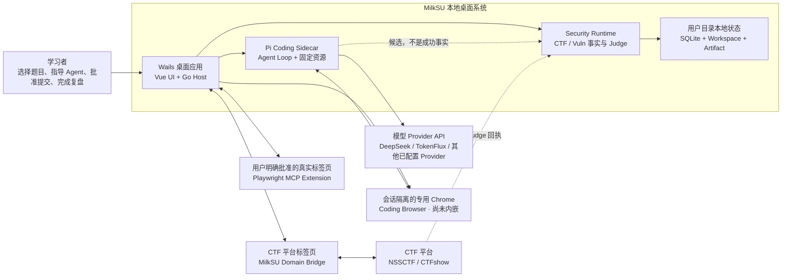
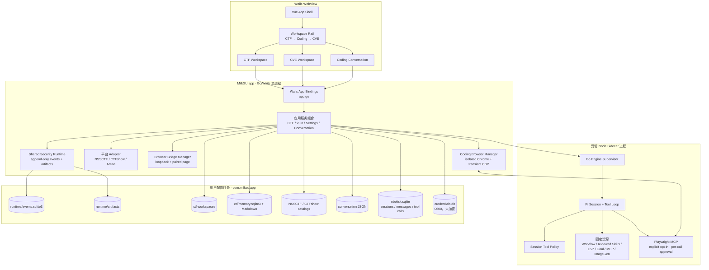
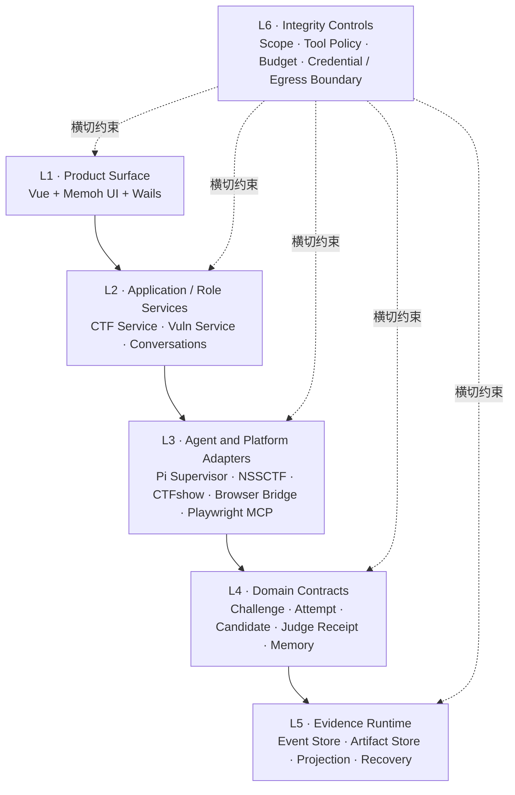
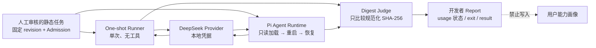

# 当前系统与分层

> 文档状态：Current
>
> 事实审计：2026-08-10，当前工作树
>
> 本页描述当前结构，不安排任务。动态进度和缺口以
> [当前开发目标](/developer/current-objectives)、代码、测试和真实验收为准。

## C4 · System Context



| 边界 | 状态 | 代码证据 |
| --- | --- | --- |
| Wails 本地桌面宿主 | **Implemented** | `main.go` 只绑定一个 `App`，静态资源来自 `app/dist`。 |
| Vue 产品表面 | **Implemented / Partial** | `app/src/App.vue` 组合 CTF、Coding、CVE 工作区与设置；左侧 rail 提供全局工作区、能力画像、设置和夜间/日间主题切换，日间模式的主工作区、桌面 chrome 与 rail 使用中性纯白底；Coding 采用中央会话、右侧动态页面、统一 Composer “+”能力入口和独立 Bottom Dock。顶部 Bottom Dock 开关位于右栏开关左侧；终端横跨中央会话与右栏下方，不属于右栏页面，两者可以同时打开或独立关闭。CTF 默认解题模式与复盘模式分离，CVE 已有学习/追踪与练习入口。 |
| Pi 通用 Agent | **Verified core / Partial extensions** | `bridge.js` 使用 Pi SessionManager、工具事件和持久会话；Plan/Go、权限档位、Archify、LSP、后台任务、Session Index、PR 交付和 Compaction 已有真实或专项证据。模型选择已收敛为单默认模型；Coding、CTF 和 sub-agent Sidecar 共用当前 Provider 注册，TokenFlux 是一等中转站，KouriChat 分支已移除。TokenFlux `grok-4.5` 打包 App 真看图已通过；真实 Grok 文档小纵切已跑通，功能代码/测试/恢复/Git 交付仍未覆盖。 |
| CTF Runtime | **Implemented** | `internal/ctf` 将 Challenge、Agent Turn、Candidate、Judge Receipt、Debrief 投影到共享 Runtime。 |
| 浏览器平台 Judge | **Implemented** | `internal/browsercap` 只接受明确配对页，NSSCTF/CTFshow 回执进入 Go Host。 |
| Composer 能力入口 | **Verified packaged UI slice** | “+”统一展示附件、Goal、Plan、沙箱浏览器、Browser/Computer Scope、已审核 Pi Skills 和项目 MCP；Scope/Skill 可删除且选择不会直接发送，Skill 复用 Pi `/skill:name`。Go 是未选择 Plan 时的默认，不另设 `/go`。 |
| Browser Use | **Implemented UI / live paired task pending** | 打包 App 已验可删除 Browser Use Scope 与右侧授权说明；发送后只为本轮加载固定版 `@playwright/mcp --extension`，用户在官方 Chrome/Edge 连接页选择准确标签页。尚缺一次真实标签页配对任务，MilkSU 不另造通用浏览器控制协议。 |
| 沙箱浏览器（Coding Browser） | **Verified backend / embedded UI pending** | `internal/browsercap` 由右侧页面或 Composer “+”显式打开独立 profile 的专用 Chrome；Go Host 向当前 Pi Session 注入瞬态 loopback 描述符，固定 Playwright MCP 已完成真实页面 E2E。当前仍是外部 Chrome 窗口，不得宣称右栏已内嵌 Chromium。 |
| Artifact Preview | **Verified / expandable** | Markdown、HTML 与图片使用工作区路径、类型、大小和 HTML 隔离策略；打包 App facade、真实 WebView 负向和原生 UI 三类型手动预览均已有证据，后续只做真实项目扩样。 |
| ImageGen | **Implemented / unverified provider** | 文生图、参考图编辑、项目资产和付费确认主链已接入；未在打包 App 中使用用户自行配置的真实 Provider 验收。 |
| Computer Use | **Verified slice / expandable** | 用户选择外部可见 App、PID 与 Window 的不可变 Scope；打包 App facade、WebView 启停、Calculator observe/click 和工具截图辅助视觉已有证据。Browser 与 Computer Use 仍分离。剩余更广 App 矩阵、权限失败路径和 Developer ID / TCC 复检。 |
| Session Index / 相关历史 | **Verified packaged UI slice** | `internal/sessionindex` 只索引 MilkSU 自有 Coding、CTF、CVE 历史。列表是可确认引用的检索结果；完整图谱按需复用当前 Pi/Provider 的无工具静默回合，把有界的 user/assistant 历史、Memory 摘要和正式 Evidence 摘要归纳成人类语义图。节点必须绑定来源，关系标为模型推断；图谱不读目标文档、不持久化、不写 Memory、不回填 Agent。固定 `@antv/g6@5.1.1` 仅在完整图谱视图懒加载。 |
| Grok / multimodal vision | **Verified packaged App slice** | TokenFlux 真实 `grok-4.5` 在打包 App 中经原生 image input 看图成功：中文识别任务列表、进度胶囊和输入栏，且未调用工具。`grok-4.3` 为 text-only；text-only 模型继续 OCR + 可选 auxiliary vision。 |
| Worktree / upstream sub-agent | **Verified isolation / interaction incomplete** | 隔离 worktree、写入边界、`.worktreeinclude` CoW、精确 submodule 已落地；writer 不读写主依赖。交互仍是 `CodingCollaborationPanel` 显式准备；会话不会自动拥有执行 worktree。实测缺口：Goal/输入框上方 Git 变更摘要看不到 writer 的三文件改动。下一纵切：会话自动 writer，并把活跃 writer diff 投影进 Goal/Composer；sub-agent 保持可选并行。 |
| Coding self-bootstrap | **Docs slice verified / full task incomplete** | 真实 Grok 小纵切已跑通：自然提示 → writer 只改 Current 文档 → reviewer 纠错返工。功能代码、测试、恢复、Git 交付和完整自然任务闭环仍未覆盖。 |
| 本地持久化 | **Implemented** | `internal/appdata`、`internal/securityruntime`、Catalog、Conversation、Memory 和 Credential Store；CTF Memory 直接保存 actor / assistance，旧无归因 pre-release 库明确不兼容。 |
| Managed Labs | **Paused design only** | 生产代码、Wails 绑定、Vue 入口和打包 Lab 资源已移除；长期设计不构成当前产品能力。 |
| CVE Learning / Tracking | **Implemented / Partial** | CVE 一级工作区已接入多源只读情报同步、来源快照、Vulhub 练习目录匹配、本地 Docker Compose 练习生命周期、资产验证、学习写回和 Coding 接力；资产与学习正式事实只来自 Vuln Runtime，localStorage 只留未提交草稿和 UI 偏好。CVE 纵深研究、真实漏洞复现、外部资产实验和披露流程后置。 |
| NYU CTF Bench | **Verified narrow developer baseline** | `internal/evalbench` 同时提供 one-shot Runner 与 `cmd/nyu-ctf-bench-agent-run` 两回合 Pi 只读 Runner；后者真实验证读取、强制重启、恢复、超时/格式失败分类和 Digest Judge。无产品 UI，也不代表完整 CTF Agent。 |

## C4 · Containers / Processes



### 进程边界的事实

- Go Host 持有配置、凭据和 Wails 命令；Provider Key 只在启动 Sidecar 时注入，不能经 Wails
  返回给 Vue。
- Node Sidecar 通过 JSONL 与 `internal/engine.Supervisor` 通讯。普通 Coding 与 CTF
  Workspace 共用 Pi 基座，但使用不同 Session Policy。
- WebView 没有假桌面数据层；缺少 Wails Runtime 时命令直接失败，浏览器预览不模拟设置、会话、
  CTF、CVE、Git、终端或 Feed 网络请求。
- 当前代码中的 Obelisk 是 `internal/sessionindex` 的 MilkSU 自有会话检索形态，不是 CTF
  Memory 插件，也不拥有 CTF 的 Evidence、Learning 或 attribution；两者不能混写成同一事实源。
  相关历史图只把该索引中的可见 user/assistant 历史、Memory 摘要和正式安全 Evidence 摘要作为
  有界材料，由当前 Pi/Provider 在无工具静默回合中归纳成人类可读语义图。工具消息不进入材料，
  模型节点必须绑定真实来源，关系只表示推断；Projection 不持久化、不写回 Memory，也不会自动进入
  Agent 上下文。
- Browser Bridge 是 loopback 本地桥，只处理用户明确配对的页面；Coding Browser 则由
  MilkSU 启动 Conversation 隔离的专用 Chrome。二者都不会把用户整个日常 Chrome Profile
  交给模型，且 Coding 的 CDP 描述符不会写入前端、SQLite 或项目配置。
- 通用 `/browser-use` 不复用上述 CTF Bridge：它加载固定版 Playwright MCP extension mode，
  由上游扩展显示标签页选择/批准并返回准确页面。CTF Bridge 继续拥有 NSSCTF/CTFshow 领域采集、
  附件和 Judge；这是“复用通用基础设施、保留安全领域能力”的边界。
- Composer “+”和 `/` 只是同一能力状态的两种入口。沙箱浏览器与项目 MCP 打开既有管理面；
  Browser/Computer Scope 与 Pi Skill 先成为可删除状态，发送时才进入 Runtime。菜单不会安装
  任意项目插件，也不会把 UI 中的“已选择”当成授权已经执行。
- Computer Use 已不再固定为 MilkSU 自身；当前实现按用户选择的外部 App、PID 和窗口建立
  不可变 Scope，并保留工具截图辅助视觉证据；浏览器窗口从候选中排除。后续按真实 App/模型/
  权限失败矩阵扩样。
- SQLite、工作区和制品均位于 `os.UserConfigDir()/com.milksu.app`，不写入应用包或源码目录。
- `credentials.db` 依赖当前 OS 用户和文件权限，不提供静态加密；这是已知产品权衡。

## 当前六层映射



| 层 | 当前实现 | 判定 |
| --- | --- | --- |
| L1 Product Surface | Vue 3、`WorkspaceRail`、`ContextSidebar`、CTF/Coding/CVE 页面、统一 Composer 能力入口、相关历史列表/人类语义图与设置 | **Partial**：主界面可用，左下全局 rail 已支持主题切换和本机持久化；CVE 学习/追踪 MVP 已存在；Composer 能力选择和相关历史人类语义图已通过原生 App UI 验收；验收协调器不进入生产启动、Wails 绑定或 Vue 入口；更多系统权限路径和发行 UI 矩阵仍需按当前目标验收。 |
| L2 Application / Role Services | 单一 `App` 组合 `ctf.Service`、`vuln.Service`、Catalog、Memory | **Implemented but concentrated**：接口可用，Facade 未拆。 |
| L3 Agent / Platform Adapters | Pi Supervisor、Security Supervisor、NSSCTF、CTFshow、Browser Bridge、Playwright MCP、ImageGen、Computer Use、Session Index | **Implemented / Partial**：NSSCTF 主链、隔离 Coding Browser、Computer Use 外部 App slice、MilkSU 自有 Session Index 列表与 Pi 语义 Projection、PR 交付已有验收；无产品入口的外部会话导入不在发行图。其余系统权限失败路径和跨平台 E2E 仍按台账跟踪。 |
| L4 Domain Contracts | CTF Challenge、RoleFact、AgentCandidate、JudgeReceipt、LearningRecord | **Implemented**。 |
| L5 Evidence Runtime | 追加式 SQLite Event Store、Artifact SHA-256、Projection、Recover | **Implemented**。 |
| L6 Integrity | Scope、CTF 工作区策略、预算、候选闸门、外部 Judge、资源白名单、精确 Endpoint Broker | **Partial**：HTTP/TCP/SSH 使用精确 Scope，通用 CTF Shell 默认无网络；宿主执行仍不是容器，真实六赛道负向回归尚未完成。 |

## 开发者评测边界

NYU safe-static 是仓库内的开发者 CLI，不是 `MilkSU.app` 用户流程。它有两个相互独立的
Harness：one-shot 用于纯模型基线；Agent Runtime 复用真实 Pi 会话与只读工具，但不进入
挑战执行链。



Agent Runtime 只暴露 `Plan + read-only` 工具面，拒绝命令、写文件、网络与审批；输出只会
被哈希比较，不会被执行或继续提交。完整 NYU challenge Runner、容器执行、作用型 Agent
工具和用户 UI 均不存在。这些结果不能被扩写成完整 benchmark 或 CTF Agent 成绩。

## 依赖方向

目标依赖方向是：

```text
Vue -> Wails Facade -> Application Service -> Domain / Runtime -> Infrastructure Adapter
```

当前主要偏差是 `app.go` 同时承担组合根、Facade 和跨产品编排；`CTFPage.vue` 同时承担页面
组合、平台状态和工作台交互。它们不是推翻架构的理由，但应该在保持现有 Wails 方法和领域
契约稳定的前提下逐步拆分。
