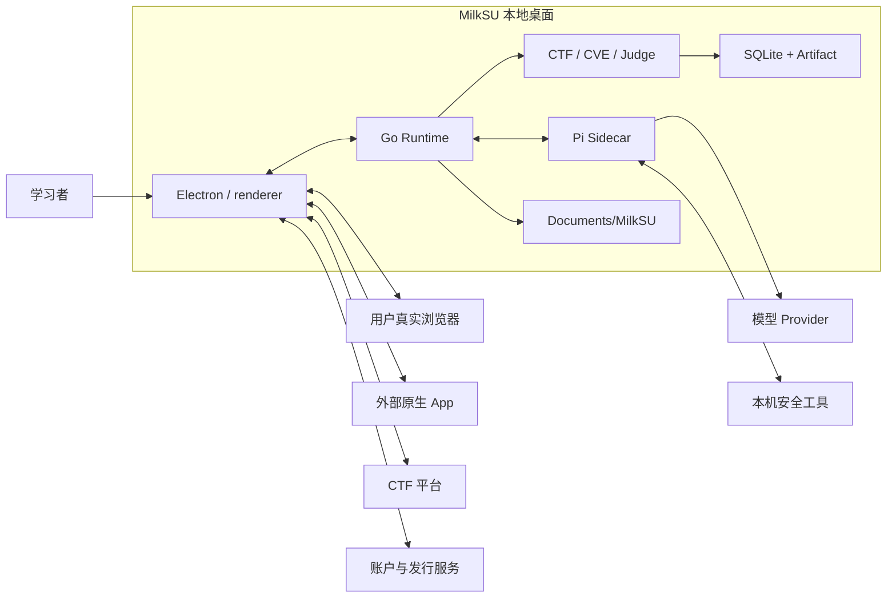
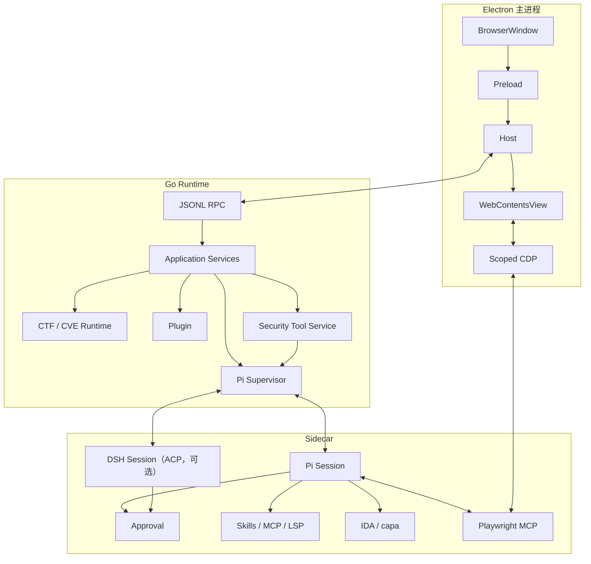

# 当前系统与分层

> 文档状态：Current
>
> 事实审计：2026-09-19。本页描述当前代码结构，不安排任务。
> 发行回执见 [当前开发目标](/developer/current-objectives)。产品 UI 只写在 `AGENTS.md`。

## 系统上下文



桌面壳是 Electron/Chromium：主 `BrowserWindow` 跑产品 renderer，右栏浏览器是同壳 `WebContentsView`。Go 是受管 Runtime，不拥有 GUI。产品 renderer 是 React + shadcn，见 `AGENTS.md`。

## 桌面执行表面

Pi 拥有会话、压缩和工具循环。桌面 GUI 把外部动作变成可见、可限定、可接管的表面。

| 表面 | 对象 | 边界 |
| --- | --- | --- |
| 浏览器 | 会话隔离 `WebContentsView` | 不是用户 Chrome |
| Browser Use | 用户明确选择的 Chrome/Edge 标签 | 不拿整个 Profile，不替代 Judge |
| Computer Use | macOS/Windows：可见 App/PID/Window；Linux GNOME：整桌面 Portal | 模型列窗 / 认窗 / 锁定；选窗器可选。不替代另外两面；Hyprland/Xorg unavailable |

面板显隐只改观察，不改执行 Session。停止、撤 Scope、任务结束或进程退出才终止。

## 当前能力

| 边界 | 状态 | 事实 |
| --- | --- | --- |
| 桌面壳 | packaged | `desktop/main.cjs` + Preload allowlist。macOS `hiddenInset`；Windows/Linux 画布色 overlay，系统按钮右上。macOS DMG 安装引导图为 1x + @2x HiDPI TIFF。桌宠悬浮窗是独立透明窗，只有角色本体和圆角手机对话两种互斥形态（默认工作区右下）；角色窗只包住精灵，拖动由壳跟着系统光标走。点角色或侧栏页脚打开手机并收起角色，关掉对话角色再出现。爪印在桌宠、手机、隐藏三种状态下分别是普通、选中和变淡；隐藏时点爪印直接打开手机，关上后角色回来。开合是竖向合页，关对话时窗口先保持手机尺寸再缩回角色；主窗口可以和其中一种形态同时开着；叠层低于系统输入法，右键菜单夹在显示器工作区内；右键、菜单栏、Dock / 托盘是同一组动作，应用菜单不放桌宠。窗口标题是「桌宠」。桌宠开着时菜单栏 / 托盘就有图标；关掉主窗口后 Dock / 任务栏仍保留 MilkSU。Wayland 不能自己贴悬浮窗坐标，仍开手机对话。角色皮肤合同见 [桌宠皮肤设计合同](/developer/companion-skin)；设置 → 桌宠可以导入文件夹或选用已启用的 `app.pet` 插件皮肤。 |
| Renderer | packaged | React + shadcn：CTF / CVE / 实验室 / Coding / 设置 / Composer / 右栏 / Bottom Dock。入口 `main.tsx`。 |
| 账户与模型 | packaged | GitHub PKCE；TokenFlux Key 只进 Go Credential Store，请求 `https://tokenflux.dev/v1`。账户目录优先，可安全回退个人来源。 |
| OTA | implemented | 已登录 Stable 轮询 Admin latest；侧栏打开进度框下载，下完后用户点安装并重启；macOS/Windows 走 electron-updater，Linux dpkg/tarball。GitHub Release 不上 OTA ZIP。 |
| Go Runtime | implemented | JSONL RPC。Sidecar 停靠保活；凭据轮换惰性、撤回立即停。退出登录、清掉账户密钥或撤回仍在使用的密钥会立刻停掉桌宠 sidecar，不让它继续用启动时注入的密钥。Pi `bash` 缺省 600 秒。 |
| 插件 | packaged | `milksu.plugin/v1`：签名包、发布者信任、六个主题表面。 |
| Agent 内核 | verified core | Pi 拥有 Session / Compaction / Tool Loop。Coding/CTF/CVE/实验室共用完整循环与 80% 自动压缩。`milksu_workspace`、`milksu_ask` 是产品工具。新对话可选 DSH（ACP，工作树钉 `0.1.6-alpha.1`）。出厂默认 kernel 是 Pi；设置里的默认运行时只决定新对话。短会话整理上下文不再失败；接到新会话铺上一会话原文或 harness 摘要。DSH 打 TokenFlux 保留 `prefix/model`。活着的子代理投影到 Working 短胶囊（折叠「进行中」或「进行中 · N」，点开才是列表）；DSH 模型自己拉起的 `subagent` 与 GUI Multitask 子会话走同一 roster，Pi 子代理仍阻塞父回合。 |
| 安全工具 | setup 已通 | 设置 → MCP：IDA / capa 可准备。CodeQL / Burp / Shannon 仅检测。 |
| 浏览器三面 | packaged / pairing pending | 隔离浏览器按会话；Browser Use 待桌面配对回执；Computer Use：模型列窗锁定，macOS/Windows 窗口 Scope + CUA `0.27.0`，Linux GNOME Portal。 |
| CTF / CVE / 实验室 | implemented | CTF 持题目、Evidence、Judge。CVE 点进档案复现。实验室起本机 Docker / AVD 或用户地址。CTF 本地房还不能引用环境经纪。 |
| Worktree | opt-in | 子 Agent 默认主工作区；writer 只在模型调用 `prepare_coding_worktree` 时准备。脏主区不进 writer。 |
| 持久化 | implemented | 产物在文档目录 `MilkSU`；Runtime、凭据、Obelisk、浏览器 Profile 在用户配置目录。 |
| 产品回归 | implemented | `npm run test:product-loop`，见 [产品回归循环](/developer/product-regression-loop)。默认按上手顺序走独立实例（登录 / 中转站密码框 → 主页 → 桌宠 → CTF/CVE/Lab → 桌面执行面 → 资料/更新 → 设置其余项），测完打印层级报告。CDP 可附着产品主窗和桌宠窗。`desktop-surface` 优先 Computer Use，不可用降级隔离浏览器。Settings「评测」是另一条。 |

## 进程与 IPC



Renderer 只经 `window.milksu.invoke`。Electron 不拥有 CTF/CVE 事实，Go 不拥有通用模型循环，Agent 内核不拥有桌面授权。

隔离浏览器的 Agent 控制走 `ScopedCDPProxy`：只公布当前一个 Target，拒绝创建 Target / Context 或关 Browser。

安全工具：设置页准备到 `ready + enabled` 后进入 Pi 目录。IDA 是 lazy MCP，capa 是原生工具。CodeQL / Burp / Shannon 不进描述符。

Beta 是独立 Bundle ID 与 userData，只用于明确要求的自举。Stable Computer Use 排除自身。

## 六层与依赖

```text
React → Electron Preload / Host → Desktop JSONL RPC → Go Application Service → Domain / Runtime → Adapter
```

| 层 | 判断 |
| --- | --- |
| L1 产品面 | 主面可用；三端权限与发行 UI 仍需扩样 |
| L2 桌面边界 | Preload + JSONL；`app.go` 仍集中 |
| L3 Agent / 平台 | Pi、Playwright、Computer Use 已接；其余安全工具在准入队列 |
| L4 领域 | 模型不能越过 Judge / 正式事实 |
| L5 Evidence | 事件、Artifact、Projection、Recovery 已实现 |
| L6 完整性 | 工作区、审批、凭据边界在；宿主不是容器 |

触碰 `app.go`、`CTFPage.tsx`、`bridge-policy.js`、`browsercap/manager.go` 或 Runner/Recovery 时，随纵切抽出职责，不另开纯架构清理。

## 发行

干净已推送的 `main` 上跑一次 canonical 验证，再三端 `workflow_dispatch`。macOS DMG 用 `macos-release` 签名公证；Windows x64 EXE 目前未代码签名；Linux 发共用 x64 DEB 与 tarball 两份包。正式包装 OTA 到私有 R2 并发布 current pointer。GitHub Release 只上用户安装包。三端回执不等于功能等价。
