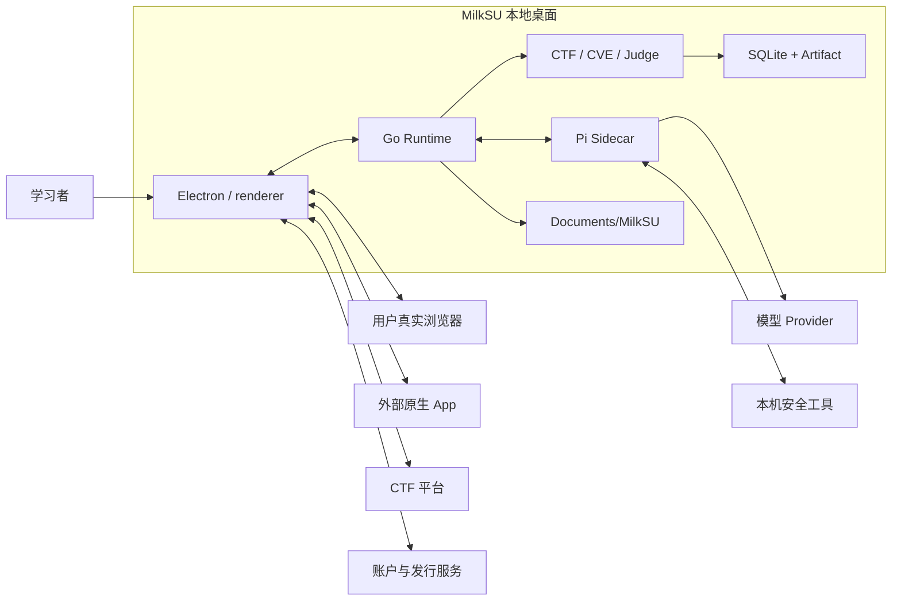
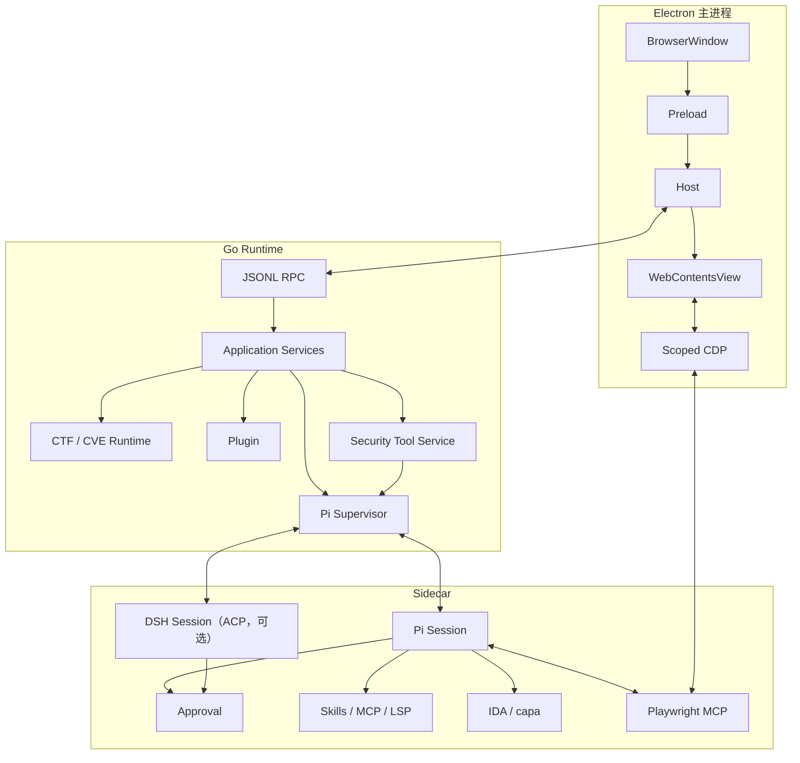
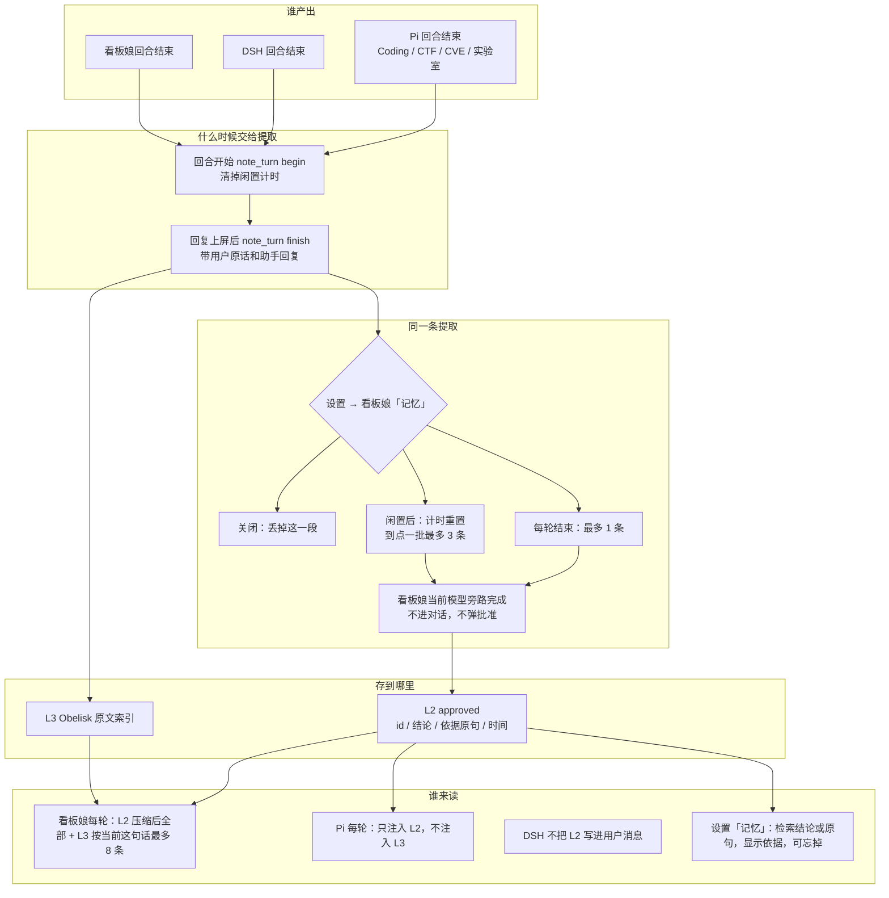

```mermaid
flowchart TB
  subgraph ctf["CTF"]
    ctfSave["用户保存训练记忆"]
    ctfStore["ctf/memory.sqlite3<br/>ctf/memories/*.md"]
    ctfRecall["PrepareCTFAgentWorkspace<br/>RecallForChallenge"]
    ctfFile["题目工作区 MEMORY.md"]
  end

  subgraph cve["CVE"]
    cveSave["档案页记下或忘掉一条复盘"]
    cveStore["该 CVE 作业投影上的 learning 事实"]
    cveRecall["解析研究工作区，或刚记下一条且工作区已在"]
    cveFile["研究工作区 LEARNING.md"]
  end

  subgraph person["个人"]
    habit["做题习惯和要求"]
    l2habit["L2 长期记忆<br/>可更新、可忘掉"]
  end

  ctfSave --> ctfStore --> ctfRecall --> ctfFile
  cveSave --> cveStore --> cveRecall --> cveFile
  habit --> l2habit
```

# 当前系统与分层

> 文档状态：Current
>
> 事实审计：2026-09-19。本页描述当前代码结构，不安排任务。
> 发行回执见 [当前开发目标](/developer/current-objectives)。产品 UI 只写在 `AGENTS.md`。

## 系统上下文



桌面壳是 Electron/Chromium：主 `BrowserWindow` 跑产品 renderer，右栏浏览器是同壳 `WebContentsView`。Go 是受管 Runtime，不拥有 GUI。产品 renderer 是 React + shadcn，见 `AGENTS.md`。

## 桌面执行表面

Pi 拥有会话、压缩和工具循环。桌面 GUI 把外部动作变成可见、可限定、可接管的表面。

| 表面 | 对象 | 边界 |
| --- | --- | --- |
| 浏览器 | 会话隔离 `WebContentsView` | 不是用户 Chrome |
| Browser Use | 用户明确选择的 Chrome/Edge 标签 | 不拿整个 Profile，不替代 Judge |
| Computer Use | macOS/Windows：可见 App/PID/Window；Linux GNOME：整桌面 Portal | 模型列窗 / 认窗 / 锁定；选窗器可选。不替代另外两面；Hyprland/Xorg unavailable |

面板显隐只改观察，不改执行 Session。停止、撤 Scope、任务结束或进程退出才终止。

## 当前能力

| 边界 | 状态 | 事实 |
| --- | --- | --- |
| 桌面壳 | packaged | `desktop/main.cjs` + Preload allowlist。macOS `hiddenInset`；Windows/Linux 画布色 overlay，系统按钮右上。macOS DMG 安装引导图为 1x + @2x HiDPI TIFF。看板娘悬浮窗是独立透明窗，只有角色本体和圆角手机对话两种互斥形态（默认工作区右下）；角色窗只包住精灵，拖动由壳跟着系统光标走，可以跨到另一块显示器，松手后夹进离窗口中心最近的工作区。点角色或侧栏页脚打开手机并收起角色，关掉对话角色再出现。侧栏页脚的星标在看板娘、手机、隐藏三种状态下分别是普通、选中和变淡；隐藏时点星标直接打开手机，关上后角色回来。开合是竖向合页，关对话时窗口先保持手机尺寸再缩回角色；主窗口可以和其中一种形态同时开着；叠层低于系统输入法，右键菜单夹在显示器工作区内；右键、菜单栏、Dock / 托盘是同一组动作，应用菜单不放看板娘。窗口标题是「看板娘」。看板娘开着时菜单栏 / 托盘就有图标；关掉主窗口后 Dock / 任务栏仍保留 MilkSU。Wayland 不能自己贴悬浮窗坐标，仍开手机对话。角色皮肤合同见 [看板娘皮肤设计合同](/developer/companion-skin)；设置 → 看板娘可以导入文件夹或选用已启用的 `app.pet` 插件皮肤。 |
| Renderer | packaged | React + shadcn：CTF / CVE / 实验室 / Coding / 设置 / Composer / 右栏 / Bottom Dock。入口 `main.tsx`。 |
| 账户与模型 | packaged | GitHub PKCE；TokenFlux Key 只进 Go Credential Store，请求 `https://tokenflux.dev/v1`。账户目录优先，可安全回退个人来源。 |
| OTA | implemented | 已登录 Stable 轮询 Admin latest；侧栏打开进度框下载，下完后用户点安装并重启；macOS/Windows 走 electron-updater，Linux dpkg/tarball。GitHub Release 不上 OTA ZIP。 |
| Go Runtime | implemented | JSONL RPC。Sidecar 停靠保活；凭据轮换惰性、撤回立即停。退出登录、清掉账户密钥或撤回仍在使用的密钥会立刻停掉看板娘 sidecar，不让它继续用启动时注入的密钥。Pi `bash` 缺省 600 秒。 |
| 插件 | packaged | `milksu.plugin/v1`：签名包、发布者信任、六个主题表面。 |
| Agent 内核 | verified core | Pi 拥有 Session / Compaction / Tool Loop。Coding/CTF/CVE/实验室共用完整循环与 80% 自动压缩。`milksu_workspace`、`milksu_ask` 是产品工具。新对话可选 DSH（ACP，工作树钉 `0.1.6-alpha.1`）。出厂默认 kernel 是 Pi；设置里的默认运行时只决定新对话。短会话整理上下文不再失败；接到新会话铺上一会话原文或 harness 摘要。DSH 打 TokenFlux 保留 `prefix/model`。活着的子代理投影到 Working 短胶囊（折叠「进行中」或「进行中 · N」，点开才是列表）；DSH 模型自己拉起的 `subagent` 与 GUI Multitask 子会话走同一 roster。Pi 后台子代理由 `pi-subagents` 0.70.1 脱离父工具，并带上父会话已注册的模型；Pi 0.87.0 本身没有这条并行。点开子代理是只读记录，引用回到父对话。 |
| 安全工具 | setup 已通 | 设置 → MCP：IDA / capa 可准备。CodeQL / Burp / Shannon 仅检测。 |
| 浏览器三面 | packaged / pairing pending | 隔离浏览器按会话；Browser Use 待桌面配对回执；Computer Use：模型列窗锁定，macOS/Windows 窗口 Scope + CUA `0.27.0`，Linux GNOME Portal。 |
| CTF / CVE / 实验室 | implemented | CTF 持题目、Evidence、Judge。CVE 点进档案复现。实验室起本机 Docker / AVD 或用户地址。CTF 本地房还不能引用环境经纪。 |
| Worktree | opt-in | 子 Agent 默认主工作区；writer 只在模型调用 `prepare_coding_worktree` 时准备。脏主区不进 writer。 |
| 持久化 | implemented | 产物在文档目录 `MilkSU`；Runtime、凭据、Obelisk、浏览器 Profile 在用户配置目录。 |
| 产品回归 | implemented | `npm run test:product-loop`，见 [产品回归循环](/developer/product-regression-loop)。默认按上手顺序走独立实例（登录 / 中转站密码框 → 主页 → 看板娘 → CTF/CVE/Lab → 桌面执行面 → 资料/更新 → 设置其余项），测完打印层级报告。CDP 可附着产品主窗和看板娘窗。`desktop-surface` 优先 Computer Use，不可用降级隔离浏览器。Settings「评测」是另一条。 |

## 进程与 IPC



Renderer 只经 `window.milksu.invoke`。Electron 不拥有 CTF/CVE 事实，Go 不拥有通用模型循环，Agent 内核不拥有桌面授权。

隔离浏览器的 Agent 控制走 `ScopedCDPProxy`：只公布当前一个 Target，拒绝创建 Target / Context 或关 Browser。

安全工具：设置页准备到 `ready + enabled` 后进入 Pi 目录。IDA 是 lazy MCP，capa 是原生工具。CodeQL / Burp / Shannon 不进描述符。

Beta 是独立 Bundle ID 与 userData，只用于明确要求的自举。Stable Computer Use 排除自身。

## 用户记忆

用户是谁、说过什么、这道题或这个作业留下什么，是四条线。长期结论只有一份，原文索引只有一份，仓库规矩留在项目里。领域结论留在对应作业里，不进用户长期记忆。

```text
L1 会话抄本     Pi / DSH / 看板娘 jsonl。Pi 自己压缩。不写出跨会话结论。
L2 用户长期记忆  companion/state.json 的 approved。全应用一份。只记这个人。
L3 情景原文     companion/obelisk.sqlite。只存其他会话的原文，不存结论。
L4 领域记忆     按 CTF、CVE、实验室分开。不进 L2，也不进 L3。
旁路            session-index/obelisk.sqlite 只在归档、恢复、删除时重写，不进模型。
```



探针会话和看板娘转达不进入提取。仓库、项目和分支的规矩也不写入 L2。

触发按时间顺序：

| 时刻 | 动作 | 落点 |
| --- | --- | --- |
| 用户发送，回合开始 | Pi / DSH 发出 `user_memory_turn begin`。看板娘 sidecar 已在跑时，清掉闲置计时。看板娘自己的回合直接清。 | 不写盘 |
| 回复已经上屏，回合结束 | Pi / DSH 发出 `finish`，带用户原话。Go 不把这段画进对话。看板娘 sidecar 不在就先拉起，再用看板娘当前模型提取。失败不打断对话，下一次合格时机重试一次。 | 候选还在内存 |
| 提取结果对得上用户原句 | `Commit` 写入或更新同一条。改口保留原来的时间。版本加一，旧快照不能把刚忘掉的写回去。 | L2 `companion/state.json` |
| 同一时刻，情景检索开着 | 刷新有变化的会话原文。看板娘下一次检索前也会再刷新。结论不写进这里。 | L3 `companion/obelisk.sqlite` |
| 下一次 Pi 模型请求 | `context` 钩子把 L2 压进请求副本，不写回抄本。装不下就缩短每一条，不整条丢掉。 | 只在这一次请求里 |
| 下一次看板娘模型请求 | 同一份 L2，再加上按当前这句话搜到的 L3 摘录。看板娘自己的会话不参与这次检索。 | 只在这一次请求里 |
| 设置里忘掉 | 从 L2 删除，并推给正在跑的 Pi。 | L2 |

闲置计时只有看板娘 sidecar 里的那一个。Coding 和 DSH 的新回合会把它清掉，未提取的那段留到下一次安静时间。应用关掉时不补跑。

提取会留下这个人做 CTF、CVE、实验室时的习惯和要求。改口就更新同一条。某一道题、某一个 CVE 或某一次实验室作业的结论和 Flag 留在对应作业里。

## 领域记忆

L4 不另做一套提取。模型结论不会自动写进来。旧题结论和这个 CVE 上保存过的学习，在工作区被解析时写成一份先验文件。个人做题习惯走 L2，可以改口，不写成不可修改的证据。

```text
个人习惯  做 CTF、CVE、实验室时一直成立的习惯和要求
          写入 L2。可以改口更新，可以忘掉。不是证据账本。
CTF       用户显式保存的旧题结论
          ctf/memory.sqlite3 + ctf/memories/*.md
          准备题目工作区时按分类召回最多 5 条，排除本题，写成 MEMORY.md
CVE       档案页记下一条复盘，或忘掉一条
          RecordLearning / ForgetLearning 记在这个 CVE 的作业投影上
          解析研究工作区时写成 LEARNING.md；没有记录就删掉文件
实验室    作业要求留在 lab-jobs/<id>.json，结果留在 report.md
          不另写一份记忆文件
```



| 时刻 | 动作 | 落点 |
| --- | --- | --- |
| CTF 用户保存训练记忆 | `SaveFromProjection`。要有证据，脱敏 Flag 和密钥。一题一条。 | `ctf/memory.sqlite3` 与 `ctf/memories/*.md` |
| CTF 准备 Agent 工作区 | 同分类召回，排除本题，最多 5 条。 | 题目工作区 `MEMORY.md` |
| CVE 档案页记下一条复盘 | 没有追踪作业就先建。`RecordLearning` 写角色事实。不创建研究目录。 | 漏洞作业投影 |
| CVE 档案页忘掉一条 | 再记一条忘掉事实，投影里不再列出。工作区已经在就重写文件，一条不剩就删除。 | 同一份投影和 `LEARNING.md` |
| CVE 工作区被解析 | 按 CVE id 读还留着的学习记录。有则重写文件，没有则删除。工作区不在产物目录里就不写。 | 研究工作区 `LEARNING.md` |
| CVE 又记下或忘掉一条，工作区已经存在 | 同一份文件重写。工作区还没有就只留在投影里。 | `LEARNING.md` |
| 用户说出一直成立的做题习惯 | 同一条用户记忆提取。对得上原句就写入或更新。不必先证明它不可更改。 | L2 |
| 下一次 Pi 回合，包括下一道 CTF | 请求里带上 L2。解题工作区同时能读到 `MEMORY.md`。 | 习惯在 L2，旧题结论在 `MEMORY.md` |
| 看板娘提取 | 习惯写入 L2。某一道作业的结论不写入。 | L2 |

个人习惯不走 CTF 训练记忆那套验证等级、贡献归属和不可覆盖文件。那套只服务旧题结论：保存时要有题目投影上的证据，召回到下一道同分类题时写成 `MEMORY.md`，采用前用本题材料核对。归档后不再召回。它不并进 L2，因为一条旧题结论不是这个人的习惯。

CVE 档案页可以记下一条复盘，也可以忘掉。没有跨 CVE 召回。没有记录时删掉 `LEARNING.md`。实验室不另写记忆文件，作业要求留在作业上，观察留在 `report.md` 和会话抄本。渲染器里的 CVE 研究草稿不是 `LEARNING.md`。DSH 不另加一条领域提示，文件仍在工作区里。写文件失败不挡住打开工作区。

## 六层与依赖

```text
React → Electron Preload / Host → Desktop JSONL RPC → Go Application Service → Domain / Runtime → Adapter
```

| 层 | 判断 |
| --- | --- |
| L1 产品面 | 主面可用；三端权限与发行 UI 仍需扩样 |
| L2 桌面边界 | Preload + JSONL；`app.go` 仍集中 |
| L3 Agent / 平台 | Pi、Playwright、Computer Use 已接；其余安全工具在准入队列 |
| L4 领域 | 模型不能越过 Judge / 正式事实 |
| L5 Evidence | 事件、Artifact、Projection、Recovery 已实现 |
| L6 完整性 | 工作区、审批、凭据边界在；宿主不是容器 |

触碰 `app.go`、`CTFPage.tsx`、`bridge-policy.js`、`browsercap/manager.go` 或 Runner/Recovery 时，随纵切抽出职责，不另开纯架构清理。

## 发行

干净已推送的 `main` 上跑一次 canonical 验证，再三端 `workflow_dispatch`。macOS DMG 用 `macos-release` 签名公证；Windows x64 EXE 目前未代码签名；Linux 发共用 x64 DEB 与 tarball 两份包。正式包装 OTA 到私有 R2 并发布 current pointer。GitHub Release 只上用户安装包。三端回执不等于功能等价。
