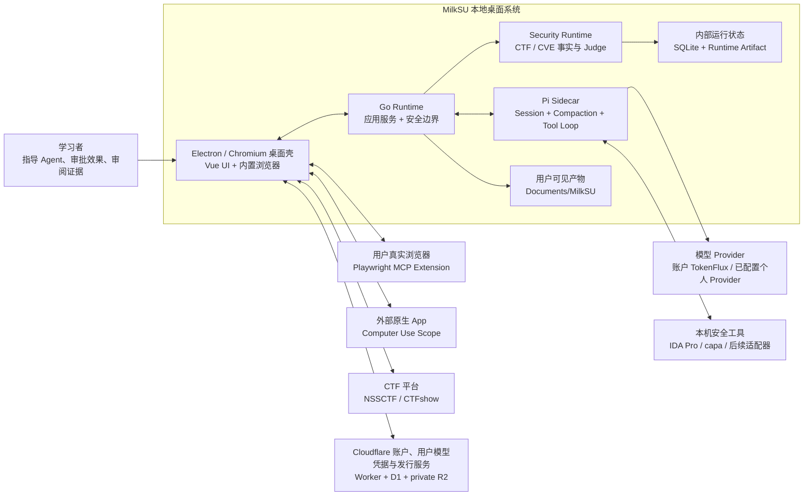
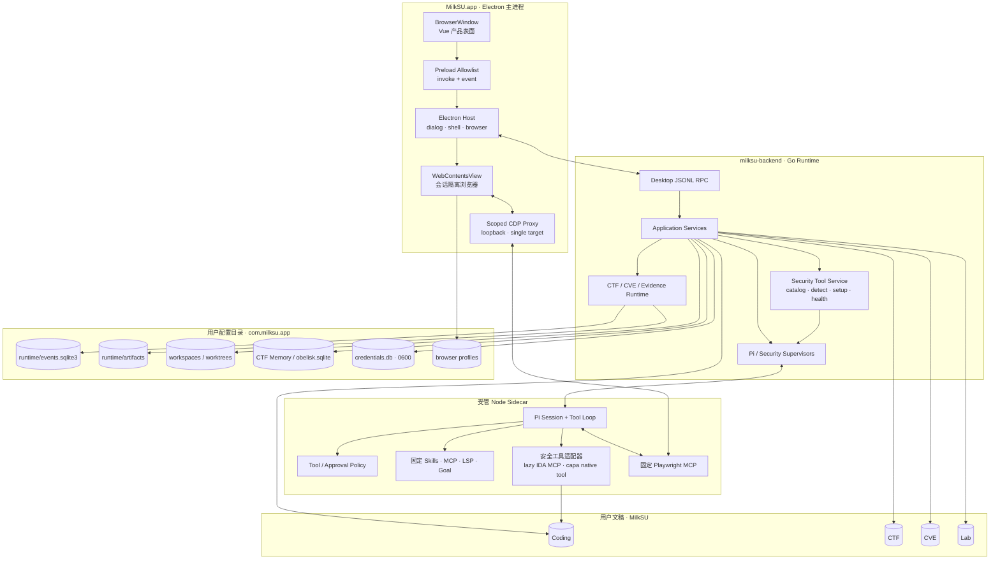
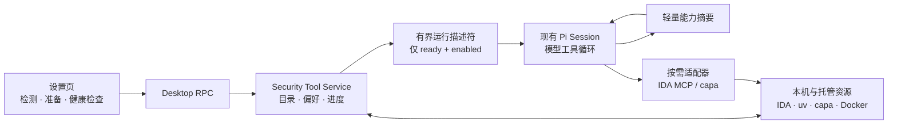
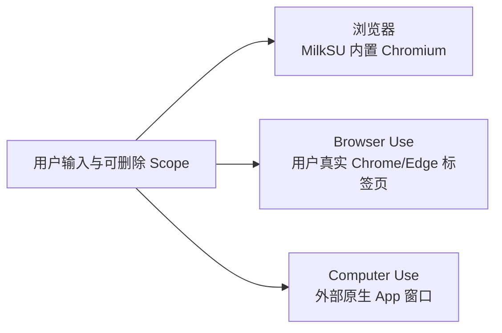
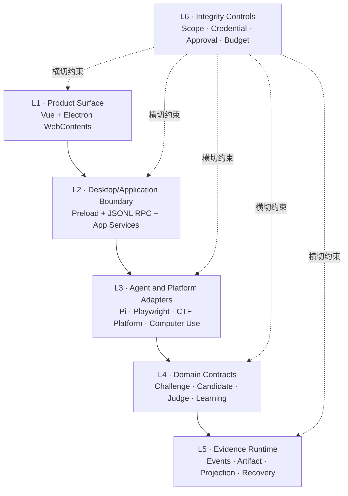

# 当前系统与分层

> 文档状态：Current
>
> 事实审计：2026-08-23；正式发行基线为 `v26.823.1 / efeda10`。文档收口提交不移动该 tag。
> 2026-08-20 去掉把「尚未实现」写成禁令的口径；发行回执以 `efeda10` 为准。
>
> 本页描述当前结构，不安排任务。动态进度、已发行与未发版分界以
> [当前开发目标](/developer/current-objectives)、代码、测试和真实验收为准。

## 系统上下文



MilkSU 当前不是“Wails 中嵌一个浏览器”。整个桌面壳已经建立在 Electron/Chromium 上：Vue
产品表面运行在主 `BrowserWindow`，右栏浏览器是同一壳中的 `WebContentsView`；Go 作为受管本地
Runtime 进程运行，不拥有 GUI。

## 桌面 GUI 的执行表面

MilkSU 的桌面壳不是通用 Agent Loop 的另一份实现。Pi 仍负责会话、上下文和工具循环；桌面 GUI
负责把模型的外部动作变成用户可见、可限定、可接管的执行表面。相比只在终端里输出工具日志，
这里的产品差异是：人和 Agent 可以观察并操作同一对象，授权绑定到准确对象，而不是绑定到一句
模糊的“允许控制电脑”。

| 表面 | Agent 操作的对象 | 用户可见与可控状态 | 不应混淆的边界 |
| --- | --- | --- | --- |
| 浏览器 | MilkSU 管理的会话隔离 `WebContentsView` | 同一页面、地址、导航、当前会话与停止动作 | 不是外部 Chrome，不复用用户日常登录态 |
| Browser Use | 用户真实 Chrome/Edge 中明确选择的标签页 | Composer 中可删除的标签页 Scope、配对状态与撤销入口 | 不获得整个 Profile，也不替代 CTF 平台 Judge |
| Computer Use | 明确选择的外部 App / PID / Window，含用户真实浏览器窗口 | 可见窗口 Scope、系统权限状态、运行轨迹与停止动作 | 像素级窗口操作不替代隔离浏览器或 Browser Use 的结构化标签页控制 |

三种表面还共享一个生命周期不变量：**面板显隐只改变观察视图，不改变执行 Session**。右栏折叠、
切换页面或用户回到聊天区时，已授权任务不应因此停止；用户重新展开后应看到同一会话的最新状态。
显式停止、撤销 Scope、任务结束、进程退出或策略拒绝才终止能力。这个不变量必须用打包 App 的
真实任务验收，不能由按钮存在、模型自述或单张截图代替。

## 当前能力事实

| 边界 | 状态 | 当前证据与限制 |
| --- | --- | --- |
| Electron/Chromium 桌面壳 | **Implemented / packaged** | `desktop/main.cjs` 创建主窗口、注册 `milksu://app`、监管 Go Runtime 并承载右栏 `WebContentsView`；`desktop/preload.cjs` 只暴露调用与事件订阅。旧 Wails 配置、绑定和 CEF 原型已从生产链删除。 |
| Vue 产品表面 | **Implemented / partial** | CTF、CVE、实验室、Coding、设置、Composer、右栏与 Bottom Dock 均复用现有 Vue。CVE 点进档案后复现，实验室是独立一级入口；两者共用可拖放对话小窗和 `report.md`。视觉走 ak-ui token / 场景 CSS（石墨、纸面、青、金），行为走 Felinic。旧战术档案 / 酸绿契约已删除。单会话“相关历史”、搜索、过滤和图谱前端已移除；生产前端只接受 Preload API，Vitest mock 隔离在测试入口。 |
| 个人资料 | **Implemented / packaged** | 左上角用户头像打开个人菜单；个人页按本机任务活动展示活跃格、CTF/CVE/Coding 模糊阶段和最近活动。工具调用不单独计数，全局六维雷达不再挂载。当前阶段不是独立能力评分；Obelisk 只提供历史线索，尚未成为可归因成长事实源。 |
| 内测账户与模型来源 | **Deployed / desktop verified** | 系统浏览器 GitHub PKCE、稳定/测试版独立回调和 `0600` 本地不透明会话已实现；打包客户端指向 `accounts.milksu.org`。Admin 为每个用户保存一份加密的 TokenFlux 凭据，Electron 用账户会话取得后只交给 Go，Go 写入现有 `credentials.db`；Key 不返回 renderer，不进入日志、模型上下文或普通配置文件。模型请求直接发往 `https://tokenflux.dev/v1`，MilkSU 不再承载余额、价格映射、扣费流水、超限或代理计费。Go Model Catalog 获取与当前 Key 分组一致的模型并以 `0600` last-known-good 同时驱动设置、Composer 与 Pi；运行时隐藏未配置的原厂 Provider，并把旧 `x-ai/grok-4.6` 选择对齐为目录中的 `grok-4.6`。2026-08-15 本地 Stable 包经 Computer Use 使用账户分配模型完成真实 Coding 回合；非分组模型请求得到 `404 model_not_found`。用户仍可在设置中配置各原厂 Provider 或简单 OpenAI-compatible 中转站，元数据进入 `providers`，各 Key 进入同一 Credential Store；未配置的来源不进入任务模型列表。Admin 对应提交 `89b2037`，客户端链路已进入 `v26.817.1 / main@783679f` 正式内测发行。 |
| 双来源模型路由 | **Implemented / packaged in 26.817.1, catalog rules in 26.818.1** | `milksu-route` 只负责账户与个人来源的选择和安全回退；外层占位认证不得进入具体 Provider。2026-08-16 修复转发时覆盖真实来源凭据的 `401`：路由在调用来源前移除外层 `apiKey` 与 `Authorization`，让 Pi 按所选来源重新解析凭据。两个来源的只读目录请求均为 `200`，真实 `grok-4.5` 双来源调用选择 `account` 并返回 `MILKSU_ROUTE_OK`；该修复已进入 `26.817.1 / main@783679f`。账户模型权限边界随后合入 `main`（东云，PR #3）：账户凭据优先产生带 `credential_source` 的权威目录，缺失模型在请求前跳过；目录未知时仍尝试来源，并在首个内容输出前把 TokenFlux `model_not_found` / `not supported by any configured account` 分类为安全回退。设置页与 Coding 共用同一可调用目录。这些目录规则已进入 `26.818.1` 正式内测包。 |
| OTA 更新 | **Implemented / production upgrade pending** | Stable Electron 主进程在窗口可用后异步检查更新；只有账户会话有效时才把 Bearer header 交给 electron-updater，Vue 只接收版本、进度和可执行动作。Admin D1 保存草稿/当前/历史/暂停状态，Worker 验证账户仍受邀且访问正常后生成 feed 或从私有 R2 流式返回 ZIP/DMG；R2 key 不返回客户端。CI 已实现签名后上传、回读验哈希和建草稿，Admin 人工发布才改变 current pointer。`26.823.1` 的 macOS 签名、公证和三端 GitHub prerelease 已完成；本次显式不上传 OTA，R2/Admin current pointer 未改变。Beta 不启用 updater。 |
| Go Runtime | **Implemented / concentrated** | `cmd/milksu-backend/main.go` 启动应用组合根和 JSONL RPC；同目录的 `desktop_rpc.go` 分派现有 App 方法并传递事件，`desktop_host.go` 把文件对话框、外链和浏览器宿主能力反向委托给 Electron。`app.go` 仍较集中，触碰时按纵切拆分。 |
| Pi 通用 Agent | **Verified core / partial extensions** | Pi 继续拥有 Session、Compaction、模型、自然语言理解和通用 Tool Loop；MilkSU 监管 Sidecar、注入当前 Provider、投影事件并实施工作区/审批边界。MilkSU 不从普通 prompt 的关键词或格式推断 Agent 意图：GUI 一键动作和内部无工具投影分别使用 typed product action / typed turn policy。每回合向 Pi 注入无凭据的真实 OS、架构、路径和实际命令解释器事实；Windows 保持 Pi 上游 Bash backend，需要原生 cmdlet 时显式调用 `powershell.exe`。已审核 Coding Skill 只向 Pi 常驻名称与用途，完整内容按任务或显式选择加载；设置只能停用审核目录。CTF / CVE / 实验室在 Pi Coding loop 之上叠加领域工具与 Judge，不再按角色关掉后台任务、Goal、LSP、Computer Use、终端或 `milksu_workspace`。Coding/CTF/CVE/实验室都强制 Pi 自动压缩，任务 UI `/compact` 不再按角色拒绝；工具结果进模型前截到 Pi 的 50KB/2000 行。CVE/实验室保留 `cve-research` / `lab-job` 角色。题目工作区绑定、未授权目标和独立 Judge 仍有效。图片输入按当前模型能力自动路由：image input 原生透传，否则本地 OCR，不存在用户配置的辅助视觉会话。实时网页查证复用固定 Pi Web Extension 的 `web_search` / `web_fetch`，MilkSU 只把工具注册进当前会话与现有工具档位，不再维护第二套搜索决策；真实联网测试已先搜索再读取 xAI 官方 Grok 4.5 文档。`26.818.2` 起 Coding 另暴露类型化 `milksu_workspace`（标签、产物、环境/变更/终端）和 `compact_context`；上下文用量达到窗口约 85% 且 Session 空闲时自动走 Pi `/compact` 同一路径，用户 `/compact` 与 `compact_context` 立即排队该路径、不受 85% 限制。`替我审批` 自动执行隔离浏览器；可授权工具支持本对话始终允许。TokenFlux `grok-4.5` 多模态和一次真实文档自举已验；完整功能自举仍未完成。 |
| 安全工具目录 | **Verified setup chain / real binary task pending** | “设置 → 安全工具”使用真实 Desktop RPC 检测与持久化。IDA Pro/idalib 和 capa 具备可准备的固定版本适配器；就绪且启用后进入普通 Coding 的模型可选目录。“在 Coding 中配置”挂未发送草稿并预置 `Go · 完全访问`，发送后可准备用户级软件；本机 Stable 已安装 uv 与固定 idalib MCP、通过非交互健康检查并回到“可用”。CodeQL、Burp Suite、Shannon 目前仅做本机/前提检测，不会被误报为模型可用。尚未用真实 crackme/二进制完成任务回执。当前也还没接到 CTF/CVE；需要时按切片接入，不必先等 Coding 回执再开会决定。 |
| 内置浏览器 | **Verified packaged tasks; multi-tab in 26.818.2; Go auto-start removed in 26.819.1** | 产品 UI 只显示“浏览器”。每次 Coding 会话使用独立 `session.fromPath`，默认拒绝页面权限。`26.817.1` 起已有打包任务：Grok 只用浏览器完成顺序点击、表单提交和公开文档调研，右栏折叠后继续并保留同一页面终态。`26.818.2` 起标签栏 `+` 在启动前可见；每个标签是独立 `WebContentsView`，切换换页并更新地址。`26.819.1` 起隔离浏览器只在用户打开右栏或模型调用类型化 `milksu_workspace` 浏览器动作时启动；普通 Go 问候不再 `EnsureCodingBrowser`。`ScopedCDPProxy` 仍只公布当前一个 Target。 |
| Browser Use | **Implemented UI / live pairing pending** | 真实用户 Chrome/Edge 复用固定 `@playwright/mcp --extension`，由用户选择准确标签页；不复用内置浏览器 profile。 |
| Computer Use | **Verified self-bootstrap slice; Windows bounded driver packaged in 26.818.2** | 只接受外部可见 App/PID/Window Scope，含用户真实浏览器窗口；Calculator 与 Stable → MilkSU Beta 的 branch/commit/tracking 核验、click/scroll 及 CTF/CVE 任务连续性全程已验。Stable 排除自身；隔离浏览器与 Browser Use 仍是独立表面。任务授权可恢复，明确请求且只有一个合格目标时自动启动，准备期间的提交在就绪后自动续发，多目标仍需准确选择。右栏诊断和操作证据默认折叠。`26.818.2` Windows 包打入有界会话、宿主 PID 排除和审阅过的 `cua-driver 0.14.2`。Driver 先走安装包/Sidecar；缺失时由类型化 `prepare_computer_use_driver` 准备 MilkSU 审阅副本，不走 Cua 官方安装脚本。 |
| CTF Runtime | **Implemented / Daily receipt partial** | `internal/ctf` 持有 Challenge、Evidence、Candidate、Judge Receipt、Recovery、Memory 与学习事实；模型候选不能建立成功事实。CTF 通用文件与 Shell 复用 Pi 原生工具及用户系统权限，不再复制 workspace-only 沙箱；MilkSU 只保留题目域工具、精确站点能力、凭据隔离、Judge 和证据投影。模型输出达到长度上限时通过 Pi `agent_end` / `followUp` 扩展点继续。Daily 由规则筛选未完成候选，再复用 Pi 结合近期题目、关联 Coding 对话、已确认事实和 Memory 选择并解释；结果按本地日期固定并允许主动换题，模型不可用时规则兜底。代码与自动化已回归，真实签名包用户视角仍待复验。 |
| CVE Learning / Tracking | **Verified signed tracking slice; reproduction dossier in 26.822.1; public feeds in 26.823.1** | 用户界面只显示明确加入的公开 CVE、手工状态，默认文案为“想研究”。添加入口通过只读 Desktop RPC 搜索 NVD，用户选中后直接把当前结果和来源元数据写入本地追踪，不做第二次网络请求；参考资料按机构去重，完整集合仍由 NVD 承载。三个薄学习专题直接查询公共 NVD 数据；最终签名 App 已返回真实专题搜索结果。`26.822.1` 点进档案后复现：Agent 编辑 `report.md`，对话留在右下角小窗。`26.823.1` 起「同步公开源」写入的 CISA KEV 条目会进入列表。不以「复现成功 / 没复现上」当完成面。披露草稿还没做，不是禁令。 |
| Obelisk / 记忆底座 | **Implemented backend / UI deferred** | MilkSU 自有索引仍只处理本机 Coding/CTF/CVE 会话；当前产品不展示单会话历史面板或图谱。后续学习记录/记忆系统应作为独立页面进入，不移除或混写 Obelisk 与 CTF Memory 底层事实。 |
| Worktree / 自举 | **Automatic isolation / product loop partial** | 干净 Git 任务首次 effectful 回合自动准备内部 writer；`.worktreeinclude` CoW、精确 submodule、写入边界和释放条件已有。用户不再配置 worktree/writer；Git 摘要可列出文件并跳到“变更”。Stable → Beta 可见验收已通过，完整自然功能任务的自治 Git 交付仍待扩样。 |
| 本地持久化 | **Implemented** | 用户可见 Coding/CTF/CVE/Lab 产物位于平台文档目录的 `MilkSU`；无项目 Coding 临时工作区位于用户配置目录的 `agent-workspaces` 并统一显示为“无项目任务”，不再制造用户可见的哈希项目目录。选择、粘贴和拖放的普通文件统一导入受管附件区并以哈希描述进入 Pi；普通文件与 Shell 恢复 Pi 内置工具和当前系统用户权限语义，MilkSU 不再持久化另一套 workspace-only 授权根或文件工具。Runtime Artifact、CTF Memory、Catalog、Conversation、Obelisk Session Index、Browser Profile 和 Credential Store 位于用户配置目录。开发分支的会话归档存入 Conversation 目录下的独立归档区，恢复保留 Pi 上下文，永久删除才清理会话正文、Pi 持久化文件和索引副本；正式发行包尚未包含该纵切。凭据不经桌面 RPC 返回 Vue，也不进入模型上下文。 |
| 实验室 | **Implemented / packaged in 26.822.1** | 主导航「实验室」是未知漏洞探测作业：用户给出协议和地址，Agent 把过程写进 `Documents/MilkSU/Lab` 下的 `report.md`。对话是可拖放小窗，不是整页 Coding。不是 Kali 应用商店，不整包接入 HexStrike MCP。 |
| CTF Managed Labs | **Not shipped** | Juice Shop / WebGoat / Vulhub 一类可重置训练环境仍未进生产。这与主导航「实验室」不是同一件事。 |

## 进程与 IPC



### 安全工具能力目录



这里不增加第二套 Planner 或 Agent Harness。设置页负责把本机能力准备到可用状态；“在 Coding 中配置”
只生成草稿并预置该本机安装任务所需的 `Go · 完全访问`，用户发送后仍复用当前 Coding/Pi 来执行检测、
安装和非交互健康检查。Go 在发送普通 Coding 回合前重新计算 `ready + enabled` 描述符；Pi 只看到短名称、
用途和调用提示，由当前模型自行选择。IDA
以保留名称的 lazy MCP Server 加载只读 Schema，capa 以一个工作区相对路径的原生工具进入现有工具集。
目录发生变化时才重建 Pi Session，因此用户无需在每个任务里手动选择工具，也不会把未配置工具写进
模型上下文。CodeQL、Burp Suite 和 Shannon 当前只有检测事实，不进入描述符。

### 桌面边界

- Vue 只能通过 `window.milksu.invoke` 和事件订阅进入桌面边界。Preload 使用
  `contextIsolation`，页面没有 Node Integration；生产环境不存在 Wails 全局或假桌面后端。
- Electron 主进程只接受受限方法名和来自主 renderer 的 IPC；文件对话框、外链和浏览器宿主请求
  由 Go 通过反向 `host_request` 发起。
- Go Runtime 和 Electron Host 之间使用有大小上限的 JSONL 消息；Sidecar 仍使用独立、版本化的
  JSONL 协议。桌面壳迁移没有把 Pi 类型泄漏进领域层。
- Beta 使用独立产品名 `MilkSU Beta`、Bundle ID `com.milksu.app.beta`、图标标记、Electron
  `userData` 和 Runtime 数据根；设置页固定显示 branch、40 位 commit、clean/dirty、build time 与
  tracking ID。Stable Computer Use 排除自身，只能选择 Beta 等外部 App。Accessibility 与 Screen
  Recording 绑定操作者 Stable 的 TCC 身份，Beta 作为被控目标不接收这两项授权；本机 ad-hoc Stable
  只用于开发预览，不能进入 Computer Use 权限或自举验收。权限设置使用两个准确的 macOS 隐私面板，
  返回 App 后自动复检，屏幕录制授权触发的退出由 Electron 安排重新启动。私有 GitHub Actions 已实现
  临时 Keychain、Developer ID、hardened runtime、公证、staple 与 Gatekeeper
  验证；`main@cfc9a102408b8e2017f339ddce08f246b6b67c02` 的 workflow `31676876645` 已取得真实
  正式包与隔离首次启动回执。

### 浏览器三面



- **浏览器**：产品面只用这个名称。内部是会话隔离的 Chromium profile。`26.817.x` 打包任务里
  打开、后退、前进、刷新、地址输入和关闭作用于右栏当前页面。开发版本线上每个标签是独立
  `WebContentsView`，切换会换页并更新地址；普通 Coding Go 或打开右栏会自动就绪，不要求设置
  或批准。它既是用户可交互页面，也是 Agent 经限定 Target 控制的执行表面；隐藏右栏不会销毁
  Target 或 Profile。裸域名按 HTTPS 导航，非 URL 文本按搜索处理。模型要找标签或切到产物/终端
  时走 `milksu_workspace`，不扫描用户句子，也不能用 Playwright 枚举任意内置产品页。
- **Browser Use**：加载固定 Playwright MCP extension mode，复用用户明确选择的真实标签页和登录态。
- **Computer Use**：视觉控制用户授权的可见 App/Window，包括用户真实浏览器窗口；不拿它操作
  MilkSU 内置隔离浏览器，也不因右栏显隐扩大或缩小已授权 Window Scope。结构化标签页控制仍走
  隔离浏览器或 Browser Use。
- **CTF Browser Bridge**：继续承担 NSSCTF/CTFshow 的题面、附件和独立 Judge 领域语义，不被通用
  Browser Use 取代。

内置浏览器的 Agent 控制不是把 Electron 全局 DevTools 端口交给模型。`ScopedCDPProxy` 只公布当前
会话的一个 Target，过滤其他 Target/Session，并拒绝创建 Target、创建/销毁 BrowserContext 和
关闭 Browser。CDP 描述符是瞬态 loopback 数据，不写前端状态、SQLite 或项目配置。

## 六层映射



| 层 | 当前判断 |
| --- | --- |
| L1 Product Surface | 主产品面可用；多平台、系统权限失败和发行 UI 矩阵仍需扩样。 |
| L2 Desktop / Application | Preload 与 JSONL RPC 已替代 Wails Binding；`cmd/milksu-backend/app.go` 仍是主要集中点。 |
| L3 Agent / Platform | Pi、Playwright、Platform Bridge、ImageGen、Computer Use、Session Index 已接入；IDA lazy MCP 与 capa 原生工具进入普通 Coding 的首条安全工具纵切，其余候选仍在准入队列。 |
| L4 Domain | CTF/CVE 当前领域契约成立；模型不能越过 Judge/正式事实源。 |
| L5 Evidence | 追加式事件、Artifact 哈希、Projection 和 Recovery 已实现。 |
| L6 Integrity | 工作区、审批、精确 Browser Target 与 Credential 边界存在；宿主执行仍非容器，跨平台负向矩阵未完成。 |

## 依赖方向

当前目标依赖方向是：

```text
Vue Renderer
  -> Electron Preload / Host
  -> Desktop JSONL RPC
  -> Go Application Service
  -> Domain / Runtime
  -> Infrastructure Adapter
```

Electron 不拥有 CTF/CVE 事实，Go 不拥有通用模型循环，Pi 不拥有桌面授权。后续触碰
`cmd/milksu-backend/app.go`、`CTFPage.vue`、`sidecar/pi/bridge-policy.js`、
`internal/browsercap/manager.go` 或 Runner/Recovery 时，应随真实纵切
抽出所触及职责，不另开无产品结果的纯架构清理里程碑。

## 发行边界

当前 macOS ARM64 `.app` 由 `npm run desktop:build` 构建，Electron Builder 生成壳，随后固定 Sidecar
安装器写入 Node/Pi/Playwright 资源并重新签名。普通本机构建显式使用 ad-hoc，不枚举 Developer ID。
正式发行先在干净、已推送的 `main` 上运行一次 canonical 全仓验证并生成绑定完整 commit/版本的本地回执，
再由三个私有 workflow 并行完成各平台构建与原生安装包验收。macOS job 不重复全仓测试，只完成
hardened runtime / Developer ID 签名、App/DMG 公证、staple、Gatekeeper 和 DMG 布局验证。默认
GitHub-only 模式不生成 updater ZIP 或元数据；显式选择 OTA 上传时，macOS 同一轮才额外生成二者，
CI 通过 rclone 把 ZIP、DMG 和元数据写到私有 R2 的不可变版本路径，逐个回读校验 SHA-256，再用窄
publisher token 在 Admin 建草稿；管理员发布后，已登录且访问正常的 Stable 客户端才可经 Worker 获取
feed 和安装包。R2 没有公共下载地址，账户 Bearer token 只由 Electron 主进程持有。正式内测发行基线是
`v26.823.1 / efeda10af4f1e2cf55c4a8db1761cdbb486055a2`。仓库开发版本号是 `26.823.1`，与该回执一致。
文档收口提交不改变该 tag，不能把后续 HEAD 写成已发版。打包后的
Go Runtime 以自身所在 `resources` 目录直接定位同级 `milksu-sidecar/node.exe` 与 `chat-bridge.cjs`，
不再把开发仓库根定位混入安装版资源查找。macOS
ARM64 DMG 已完成 Developer ID 签名、Apple 公证、stapler、Gatekeeper 与本机下载后复验；Windows x64
安装程序已在原生 Windows 完成打包 Runtime 与首次启动检查，但当前没有 Windows 代码签名；Linux x64
DEB 已在原生 Ubuntu 完成包结构、Node/Pi Sidecar、Go Runtime 与 Xvfb Electron 启动检查。GitHub
prerelease 只提供 DMG、EXE 与 DEB，没有 OTA ZIP。纯文档提交不改变 `v26.823.1` 的 source commit。
后续正式包应走 `release:verify` → 云端 Win/Linux + 本机 macOS → `release:github` 创建 Release 页。

Linux 包已包含当前 CTF/CVE 与通用 Coding 的 Pi Runtime 收敛，但仍是试用边界：不接 Secret Service、
Computer Use 或本地 OCR 降级。Windows 未签名和 Linux 缺失能力必须在下载说明中明确，不能把三端构建
回执外推为三个平台功能等价。OTA 的私有 R2/Admin current pointer 本次没有发布。
