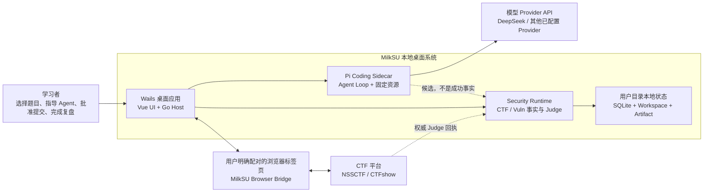
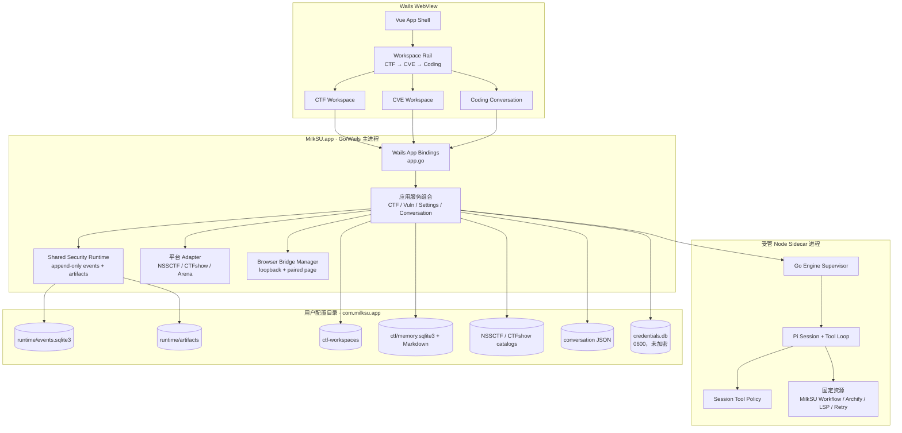
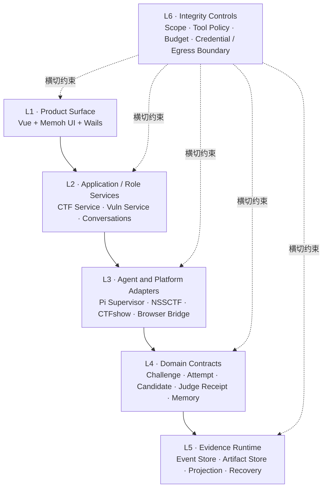

# 当前系统与分层

> 状态：当前代码快照。图中的状态以仓库证据为准，不代表所有模块都已通过 R0.4 发布门。

## C4 · System Context



| 边界 | 状态 | 代码证据 |
| --- | --- | --- |
| Wails 本地桌面宿主 | **Implemented** | `main.go` 只绑定一个 `App`，静态资源来自 `app/dist`。 |
| Vue 产品表面 | **Implemented / Partial** | `app/src/App.vue` 组合 CTF、CVE、Coding 与设置；全页面 Markdown 和原生视觉回归仍待冻结。 |
| Pi 通用 Agent | **Implemented / Partial** | `bridge.js` 使用 Pi SessionManager、工具事件和持久会话；插件真实任务验收仍待完成。 |
| CTF Runtime | **Implemented** | `internal/ctf` 将 Challenge、Agent Turn、Candidate、Judge Receipt、Debrief 投影到共享 Runtime。 |
| 浏览器平台 Judge | **Implemented** | `internal/browsercap` 只接受明确配对页，NSSCTF/CTFshow 回执进入 Go Host。 |
| 本地持久化 | **Implemented** | `internal/appdata`、`internal/securityruntime`、Catalog、Conversation、Memory 和 Credential Store。 |
| Managed Labs | **Paused** | 工作区存在实验代码，但已从当前交付范围移除，不是已发布系统能力。 |
| NYU CTF Bench | **Implemented / Partial** | `internal/evalbench` 已有固定 revision 的只读 Catalog、摘要 Run Record 与确定性 Report；Runner、Judge 和产品 UI 不存在。 |

## C4 · Containers / Processes



### 进程边界的事实

- Go Host 持有配置、凭据和 Wails 命令；Provider Key 只在启动 Sidecar 时注入，不能经 Wails
  返回给 Vue。
- Node Sidecar 通过 JSONL 与 `internal/engine.Supervisor` 通讯。普通 Coding 与 CTF
  Workspace 共用 Pi 基座，但使用不同 Session Policy。
- Browser Bridge 是 loopback 本地桥，只处理用户明确配对的页面；它不是把整个 Chrome
  Profile 交给模型。
- SQLite、工作区和制品均位于 `os.UserConfigDir()/com.milksu.app`，不写入应用包或源码目录。
- `credentials.db` 依赖当前 OS 用户和文件权限，不提供静态加密；这是已知产品权衡。

## 当前六层映射



| 层 | 当前实现 | 判定 |
| --- | --- | --- |
| L1 Product Surface | Vue 3、`WorkspaceRail`、`ContextSidebar`、CTF/CVE/Coding 页面 | **Partial**：安全 Markdown 组件和测试已存在，原生多状态视觉回归尚未冻结。 |
| L2 Application / Role Services | 单一 `App` 组合 `ctf.Service`、`vuln.Service`、Catalog、Memory | **Implemented but concentrated**：接口可用，Facade 未拆。 |
| L3 Agent / Platform Adapters | Pi Supervisor、Security Supervisor、NSSCTF、CTFshow、Browser Bridge | **Implemented / Partial**：NSSCTF 主链已验，CTFshow 真实账号 E2E 仍需持续回归。 |
| L4 Domain Contracts | CTF Challenge、RoleFact、AgentCandidate、JudgeReceipt、LearningRecord | **Implemented**。 |
| L5 Evidence Runtime | 追加式 SQLite Event Store、Artifact SHA-256、Projection、Recover | **Implemented**。 |
| L6 Integrity | Scope、CTF 工作区策略、预算、候选闸门、外部 Judge、资源白名单 | **Partial**：宿主 Shell 不是容器，动态网络精确内核 allowlist 未完成。 |

## 依赖方向

目标依赖方向是：

```text
Vue -> Wails Facade -> Application Service -> Domain / Runtime -> Infrastructure Adapter
```

当前主要偏差是 `app.go` 同时承担组合根、Facade 和跨产品编排；`CTFPage.vue` 同时承担页面
组合、平台状态和工作台交互。它们不是推翻架构的理由，但应该在保持现有 Wails 方法和领域
契约稳定的前提下逐步拆分。
