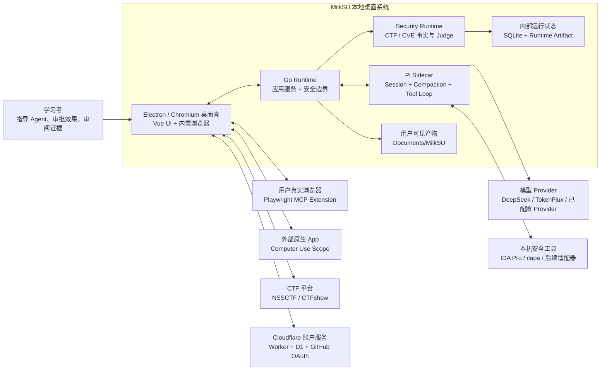
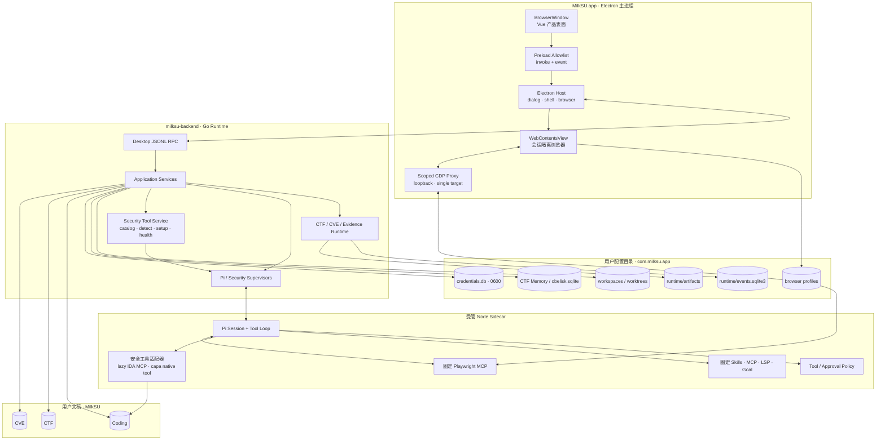
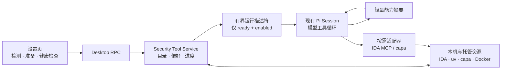
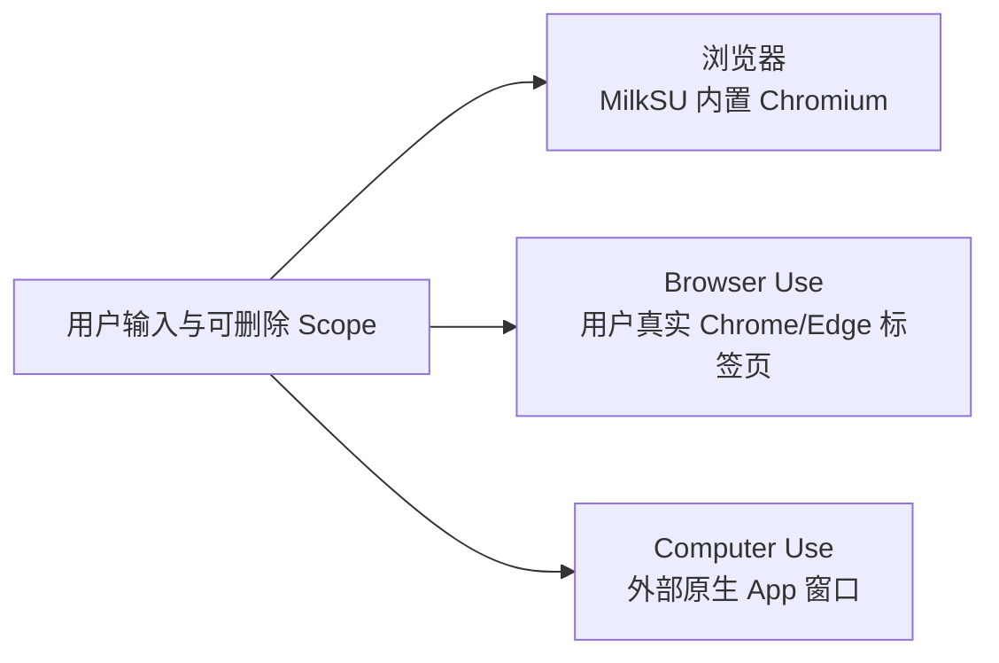
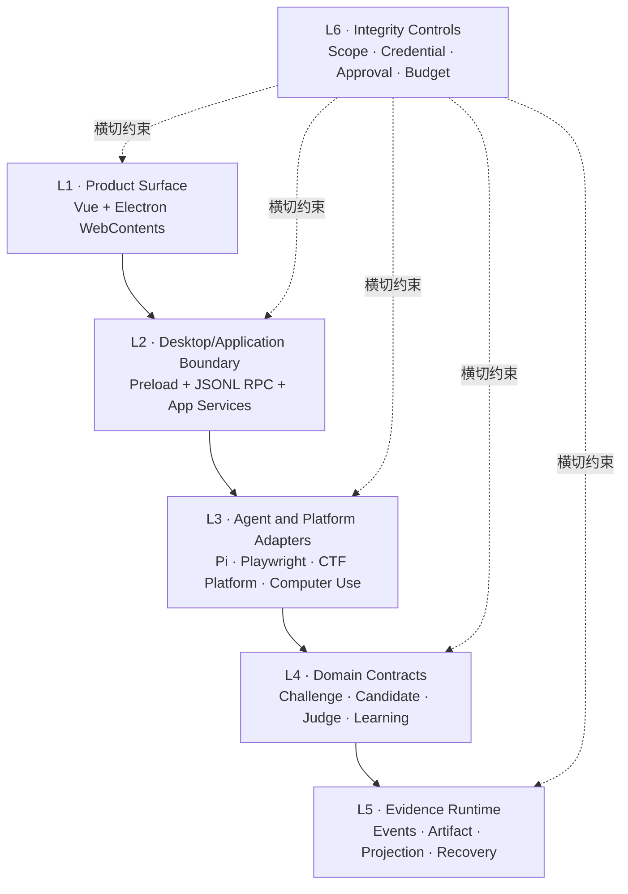

# 当前系统与分层

> 文档状态：Current
>
> 事实审计：2026-08-13，`main@cfc9a10` 正式签名基线
>
> 本页描述当前结构，不安排任务。动态进度和缺口以
> [当前开发目标](/developer/current-objectives)、代码、测试和真实验收为准。

## 系统上下文



MilkSU 当前不是“Wails 中嵌一个浏览器”。整个桌面壳已经建立在 Electron/Chromium 上：Vue
产品表面运行在主 `BrowserWindow`，右栏浏览器是同一壳中的 `WebContentsView`；Go 作为受管本地
Runtime 进程运行，不拥有 GUI。

## 桌面 GUI 的执行表面

MilkSU 的桌面壳不是通用 Agent Loop 的另一份实现。Pi 仍负责会话、上下文和工具循环；桌面 GUI
负责把模型的外部动作变成用户可见、可限定、可接管的执行表面。相比只在终端里输出工具日志，
这里的产品差异是：人和 Agent 可以观察并操作同一对象，授权绑定到准确对象，而不是绑定到一句
模糊的“允许控制电脑”。

| 表面 | Agent 操作的对象 | 用户可见与可控状态 | 不应混淆的边界 |
| --- | --- | --- | --- |
| 浏览器 | MilkSU 管理的会话隔离 `WebContentsView` | 同一页面、地址、导航、当前会话与停止动作 | 不是外部 Chrome，不复用用户日常登录态 |
| Browser Use | 用户真实 Chrome/Edge 中明确选择的标签页 | Composer 中可删除的标签页 Scope、配对状态与撤销入口 | 不获得整个 Profile，也不替代 CTF 平台 Judge |
| Computer Use | 明确选择的外部 App / PID / Window | 可见窗口 Scope、系统权限状态、运行轨迹与停止动作 | 不拿桌面视觉点击代替可结构化控制的浏览器或 MCP |

三种表面还共享一个生命周期不变量：**面板显隐只改变观察视图，不改变执行 Session**。右栏折叠、
切换页面或用户回到聊天区时，已授权任务不应因此停止；用户重新展开后应看到同一会话的最新状态。
显式停止、撤销 Scope、任务结束、进程退出或策略拒绝才终止能力。这个不变量必须用打包 App 的
真实任务验收，不能由按钮存在、模型自述或单张截图代替。

## 当前能力事实

| 边界 | 状态 | 当前证据与限制 |
| --- | --- | --- |
| Electron/Chromium 桌面壳 | **Implemented / packaged** | `desktop/main.cjs` 创建主窗口、注册 `milksu://app`、监管 Go Runtime 并承载右栏 `WebContentsView`；`desktop/preload.cjs` 只暴露调用与事件订阅。旧 Wails 配置、绑定和 CEF 原型已从生产链删除。 |
| Vue 产品表面 | **Implemented / partial** | CTF、Coding、CVE、设置、相关历史、Composer、右栏与 Bottom Dock 均复用现有 Vue。生产前端只接受 Preload API；Vitest mock 隔离在测试入口。 |
| 个人资料 | **Implemented / packaged** | 左上角用户头像打开个人菜单；个人页按本机任务活动展示活跃格、CTF/CVE/Coding 模糊阶段和最近活动。工具调用不单独计数，全局六维雷达不再挂载。当前阶段不是独立能力评分；Obelisk 只提供历史线索，尚未成为可归因成长事实源。 |
| 内测账户与模型来源 | **Deployed / desktop linked** | 系统浏览器 GitHub PKCE、稳定/测试版独立回调、`0600` 本地不透明会话、账户额度与本机 Key 顺序及对话级偏好已实现；打包客户端指向 `accounts.milksu.org`。Go Model Catalog 在每次应用启动时异步刷新 TokenFlux，并以 `0600` last-known-good 同时驱动设置、Composer 和 Pi；远端失败保留缓存或内置最小目录，不改写用户已选模型。本机 Stable 已取得 200 个模型、显示 `x-ai/grok-4.6` 并通过重启恢复。会话不使用 macOS Keychain，也不进入 renderer、日志或模型上下文；同一系统用户下的本地恶意进程仍是明确风险。真实 GitHub 登录、邀请兑换、访问开通、¥5.00 余额和初始额度流水已在 Admin 与桌面端联动验证。账户 Team Key 尚未连接，TokenFlux 扣费与明细同步不属于已验收事实。 |
| Go Runtime | **Implemented / concentrated** | `cmd/milksu-backend/main.go` 启动应用组合根和 JSONL RPC；同目录的 `desktop_rpc.go` 分派现有 App 方法并传递事件，`desktop_host.go` 把文件对话框、外链和浏览器宿主能力反向委托给 Electron。`app.go` 仍较集中，触碰时按纵切拆分。 |
| Pi 通用 Agent | **Verified core / partial extensions** | Pi 继续拥有 Session、Compaction、模型和通用 Tool Loop；MilkSU 监管 Sidecar、注入当前 Provider、投影事件并实施工作区/审批边界。已审核 Coding Skill 只向 Pi 常驻名称与用途，完整内容按任务或显式选择加载；设置只能停用审核目录，CTF 角色不加载 Coding Skill。TokenFlux `grok-4.5` 多模态和一次真实文档自举已验，完整功能自举仍未完成。 |
| 安全工具目录 | **Verified setup chain / real binary task pending** | “设置 → 安全工具”使用真实 Desktop RPC 检测与持久化。IDA Pro/idalib 和 capa 具备可准备的固定版本适配器；就绪且启用后进入普通 Coding 的模型可选目录。“在 Coding 中配置”挂未发送草稿并预置 `Go · 完全访问`，发送后可准备用户级软件；本机 Stable 已安装 uv 与固定 idalib MCP、通过非交互健康检查并回到“可用”。CodeQL、Burp Suite、Shannon 目前仅做本机/前提检测，不会被误报为模型可用。尚未用真实 crackme/二进制完成任务回执，也未进入 CTF/CVE。 |
| 内置浏览器 | **Verified packaged tasks** | 产品 UI 只显示“浏览器”。每次 Coding 会话使用独立 `session.fromPath`，默认拒绝页面权限；用户与 Agent 共用同一 `WebContentsView`。打包 App 中 Grok 只用浏览器完成顺序点击挑战、表单提交和 Electron 官方文档调研，三项均在右栏折叠后继续并保留同一页面终态，未回退 Shell。 |
| Browser Use | **Implemented UI / live pairing pending** | 真实用户 Chrome/Edge 复用固定 `@playwright/mcp --extension`，由用户选择准确标签页；不复用内置浏览器 profile。 |
| Computer Use | **Verified self-bootstrap slice** | 只接受外部可见 App/PID/Window Scope；Calculator 与 Stable → MilkSU Beta 的 branch/commit/tracking 核验、click/scroll 及 CTF/CVE 任务连续性全程已验。Stable 排除自身，浏览器窗口不进入该 Scope；右栏诊断和操作证据默认折叠。 |
| CTF Runtime | **Implemented / Daily receipt partial** | `internal/ctf` 持有 Challenge、Evidence、Candidate、Judge Receipt、Recovery、Memory 与学习事实；模型候选不能建立成功事实。Daily 由规则筛选未完成候选，再复用 Pi 结合近期题目、关联 Coding 对话、已确认事实和 Memory 选择并解释；结果按本地日期固定并允许主动换题，模型不可用时规则兜底。代码、测试与最终包表面已回归，真实模型选择回执仍待有可用题库与模型的内测环境补齐。 |
| CVE Learning / Tracking | **Verified signed tracking slice** | 用户界面只显示明确加入的公开 CVE、手工状态和关联 Coding 对话，默认文案为“想研究”。添加入口通过只读 Desktop RPC 搜索 NVD，用户选中后直接把当前结果和来源元数据写入本地追踪，不做第二次网络请求；参考资料按机构去重，完整集合仍由 NVD 承载。三个薄学习专题直接查询公共 NVD 数据；最终签名 App 已返回真实专题搜索结果。外部资产实验、真实复现和披露仍后置。 |
| Session Index / 相关历史 | **Verified packaged slice** | MilkSU 自有索引只处理本机 Coding/CTF/CVE 会话；完整图谱由当前模型按需把有界会话、Memory 摘要和正式 Evidence 归纳成人类语义图，不读取目标文档、不持久化图谱、不写回 Memory。 |
| Worktree / 自举 | **Automatic isolation / product loop partial** | 干净 Git 任务首次 effectful 回合自动准备内部 writer；`.worktreeinclude` CoW、精确 submodule、写入边界和释放条件已有。用户不再配置 worktree/writer；Git 摘要可列出文件并跳到“变更”。Stable → Beta 可见验收已通过，完整自然功能任务的自治 Git 交付仍待扩样。 |
| 本地持久化 | **Implemented** | 用户可见 Coding/CTF/CVE 产物位于 `~/Documents/MilkSU`；Runtime Artifact、CTF Memory、Catalog、Conversation、Obelisk Session Index、Browser Profile 和 Credential Store 位于用户配置目录。凭据不经桌面 RPC 返回 Vue，也不进入模型上下文。 |
| Managed Labs | **Paused** | 不在生产启动、桌面 RPC、Vue 入口或当前完成条件中。 |

## 进程与 IPC



### 安全工具能力目录



这里不增加第二套 Planner 或 Agent Harness。设置页负责把本机能力准备到可用状态；“在 Coding 中配置”
只生成草稿并预置该本机安装任务所需的 `Go · 完全访问`，用户发送后仍复用当前 Coding/Pi 来执行检测、
安装和非交互健康检查。Go 在发送普通 Coding 回合前重新计算 `ready + enabled` 描述符；Pi 只看到短名称、
用途和调用提示，由当前模型自行选择。IDA
以保留名称的 lazy MCP Server 加载只读 Schema，capa 以一个工作区相对路径的原生工具进入现有工具集。
目录发生变化时才重建 Pi Session，因此用户无需在每个任务里手动选择工具，也不会把未配置工具写进
模型上下文。CodeQL、Burp Suite 和 Shannon 当前只有检测事实，不进入描述符。

### 桌面边界

- Vue 只能通过 `window.milksu.invoke` 和事件订阅进入桌面边界。Preload 使用
  `contextIsolation`，页面没有 Node Integration；生产环境不存在 Wails 全局或假桌面后端。
- Electron 主进程只接受受限方法名和来自主 renderer 的 IPC；文件对话框、外链和浏览器宿主请求
  由 Go 通过反向 `host_request` 发起。
- Go Runtime 和 Electron Host 之间使用有大小上限的 JSONL 消息；Sidecar 仍使用独立、版本化的
  JSONL 协议。桌面壳迁移没有把 Pi 类型泄漏进领域层。
- Beta 使用独立产品名 `MilkSU Beta`、Bundle ID `com.milksu.app.beta`、图标标记、Electron
  `userData` 和 Runtime 数据根；设置页固定显示 branch、40 位 commit、clean/dirty、build time 与
  tracking ID。Stable Computer Use 排除自身，只能选择 Beta 等外部 App。本机开发包仍是 ad-hoc；
  私有 GitHub Actions 已实现临时 Keychain、Developer ID、hardened runtime、公证、staple 与 Gatekeeper
  验证；`main@cfc9a102408b8e2017f339ddce08f246b6b67c02` 的 workflow `31676876645` 已取得真实
  正式包与隔离首次启动回执。

### 浏览器三面



- **浏览器**：产品面只用这个名称。内部是会话隔离的 Chromium profile；打开、后退、前进、刷新、
  地址输入和关闭都作用于右栏同一页面。它既是用户可交互页面，也是 Agent 经限定 Target 控制的
  执行表面；隐藏右栏不会销毁 Target 或 Profile，已经由点击、表单和公开资料调研三类打包 App
  任务验证。裸域名按 HTTPS 导航，非 URL 文本按搜索处理。
- **Browser Use**：加载固定 Playwright MCP extension mode，复用用户明确选择的真实标签页和登录态。
- **Computer Use**：视觉控制没有更成熟结构化接口的外部 App；不拿它操作内置浏览器，也不因
  右栏显隐扩大或缩小已授权 Window Scope。
- **CTF Browser Bridge**：继续承担 NSSCTF/CTFshow 的题面、附件和独立 Judge 领域语义，不被通用
  Browser Use 取代。

内置浏览器的 Agent 控制不是把 Electron 全局 DevTools 端口交给模型。`ScopedCDPProxy` 只公布当前
会话的一个 Target，过滤其他 Target/Session，并拒绝创建 Target、创建/销毁 BrowserContext 和
关闭 Browser。CDP 描述符是瞬态 loopback 数据，不写前端状态、SQLite 或项目配置。

## 六层映射



| 层 | 当前判断 |
| --- | --- |
| L1 Product Surface | 主产品面可用；多平台、系统权限失败和发行 UI 矩阵仍需扩样。 |
| L2 Desktop / Application | Preload 与 JSONL RPC 已替代 Wails Binding；`cmd/milksu-backend/app.go` 仍是主要集中点。 |
| L3 Agent / Platform | Pi、Playwright、Platform Bridge、ImageGen、Computer Use、Session Index 已接入；IDA lazy MCP 与 capa 原生工具进入普通 Coding 的首条安全工具纵切，其余候选仍在准入队列。 |
| L4 Domain | CTF/CVE 当前领域契约成立；模型不能越过 Judge/正式事实源。 |
| L5 Evidence | 追加式事件、Artifact 哈希、Projection 和 Recovery 已实现。 |
| L6 Integrity | 工作区、审批、精确 Browser Target 与 Credential 边界存在；宿主执行仍非容器，跨平台负向矩阵未完成。 |

## 依赖方向

当前目标依赖方向是：

```text
Vue Renderer
  -> Electron Preload / Host
  -> Desktop JSONL RPC
  -> Go Application Service
  -> Domain / Runtime
  -> Infrastructure Adapter
```

Electron 不拥有 CTF/CVE 事实，Go 不拥有通用模型循环，Pi 不拥有桌面授权。后续触碰
`cmd/milksu-backend/app.go`、`CTFPage.vue`、`sidecar/pi/bridge-policy.js`、
`internal/browsercap/manager.go` 或 Runner/Recovery 时，应随真实纵切
抽出所触及职责，不另开无产品结果的纯架构清理里程碑。

## 发行边界

当前 macOS ARM64 `.app` 由 `npm run desktop:build` 构建，Electron Builder 生成壳，随后固定 Sidecar
安装器写入 Node/Pi/Playwright 资源并重新签名。普通本机构建显式使用 ad-hoc，不枚举 Developer ID。
正式发行由 `macOS signed release` 私有 workflow 完成测试、hardened runtime / Developer ID 签名、
DMG、公证、staple 与 Gatekeeper 验证。`main@cfc9a102408b8e2017f339ddce08f246b6b67c02`
的 workflow `31676876645` 已生成当前正式 DMG；下载产物的公证票据、stapler、Gatekeeper、严格签名
与隔离首次启动均通过，设置页核对 tracking ID
`6adfa291a021387f7cb40800012941a51f051bec90036b78353c68a4c57d58ff`。每个新的功能发行 HEAD 仍需重跑
同一流程；纯文档提交不改变已签名 App 的来源提交。升级与全新机器仍属于 RC。
