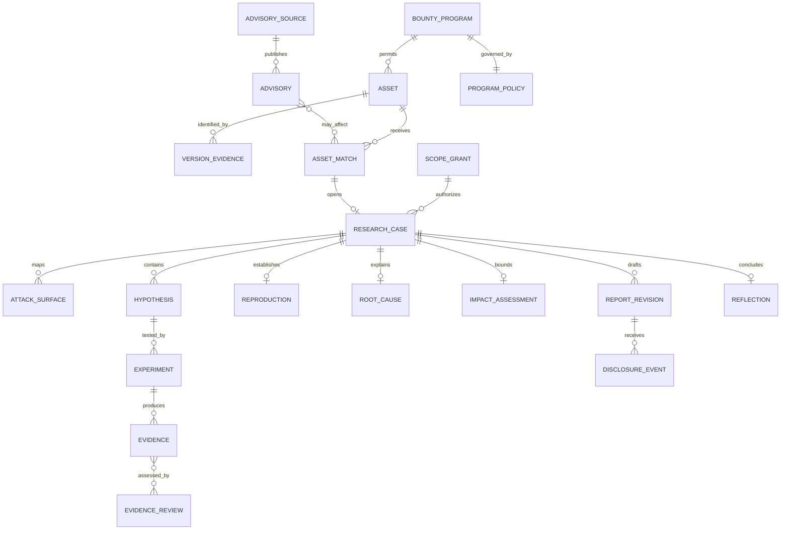
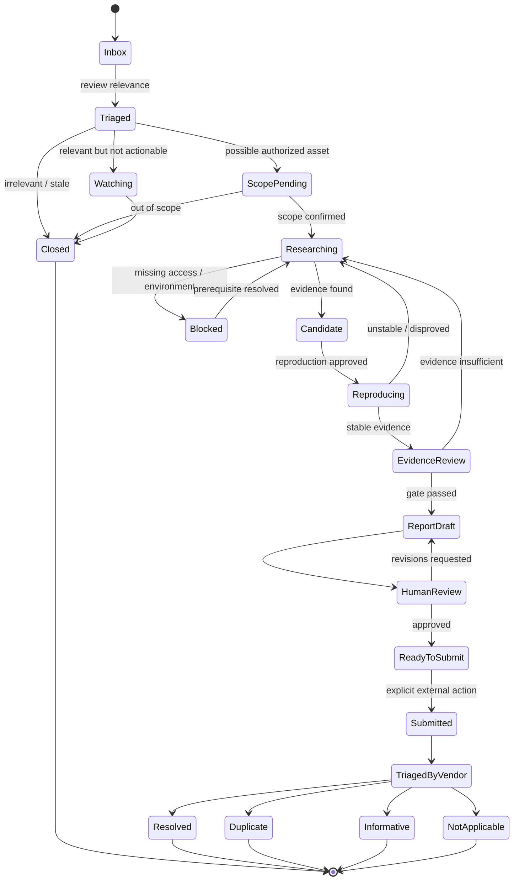
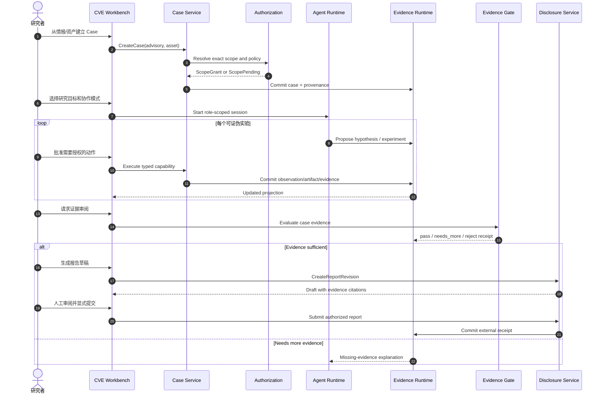

# CVE 研究工作台：顶层与详细设计

> 状态：**Long-term Design / Partially Implemented**。CVE 一级菜单已经有学习/追踪 MVP：
> 多源只读情报同步、来源快照、Vulhub 练习目录匹配、资产验证、学习写回和 Coding 接力。
> 本文描述的是更完整的 CVE 纵深研究与披露工作台；真实漏洞复现、外部资产实验、触发输入和
> 自动提交报告仍暂停，恢复必须由[当前目标](/developer/current-objectives)重新授权。

## 1. 产品定位

CVE 模块不是一个“最新漏洞新闻列表”，也不是互联网批量扫描器。它是赏金猎人和安全研究者的
日常工作台，把以下工作连成一条可以长期积累的证据链：

```text
情报 → 项目/资产范围 → 研究优先级 → 攻击面 → 假设
→ 授权实验 → 稳定复现 → 根因/影响 → 报告 → 披露状态 → 学习
```

AI 可以快速生成候选和摘要，但不能替代授权判断、证据充分性、稳定复现和披露责任。MilkSU
的差异化价值是让“为什么研究、做过什么、证据够不够、下一步是什么”始终可见。

## 2. 日常入口

```text
CVE
├─ 收件箱：CVE、Vendor Advisory、GitHub Advisory、关注项目更新
├─ 我的研究：按状态管理 Research Case
├─ 项目与资产：赏金项目、Scope、版本和所有权
├─ 报告：草稿、待审阅、已提交和平台反馈
└─ 知识：根因模式、失败实验、复盘和能力画像
```

默认首页不是四张演示卡片，而是一个可执行优先队列：

| 列 | 含义 |
| --- | --- |
| 情报 | CVE/Advisory 标题、来源和更新时间 |
| 相关性 | 命中哪个已授权项目、资产或技术栈 |
| 置信度 | 版本证据和匹配依据 |
| 紧急度 | 严重度、可利用信号、公开程度、修复窗口 |
| 研究状态 | 未分流、待确认范围、研究中、等待复核、已关闭 |
| 下一动作 | 检查版本、建立 Case、继续实验、审阅报告 |

没有项目或资产范围时，情报只能收藏和学习，不能出现“开始攻击”。

## 3. 顶层组件

```mermaid
flowchart TB
    subgraph ui["CVE Workspace"]
        inbox["Research Inbox"]
        cases["Research Cases"]
        assets["Programs + Assets"]
        caseDesk["Case Workbench"]
        reports["Disclosure Queue"]
        knowledge["Research Knowledge"]
    end

    subgraph application["CVE Application Layer"]
        intel["Intelligence Service"]
        matcher["Asset Relevance Matcher"]
        triage["Triage + Prioritization"]
        research["Research Case Service"]
        evidence["Evidence Gate"]
        disclosure["Disclosure Service"]
        learning["Research Learning"]
    end

    subgraph shared["Shared Security Foundation"]
        intake["Intake / Provenance"]
        scope["Authorization / Scope"]
        runtime["Evidence Runtime"]
        artifacts["Artifact Store"]
        agent["Agent Runtime"]
        env["Environment Broker"]
        memory["Memory / Ability"]
    end

    subgraph adapters["Future Authorized Adapters"]
        advisory["NVD / Vendor / GitHub Advisory"]
        program["Bounty Program / Asset Import"]
        source["Repository / SBOM / Version Evidence"]
        platform["Disclosure Platform"]
    end

    inbox --> intel
    assets --> matcher
    cases --> research
    caseDesk --> research
    reports --> disclosure
    knowledge --> learning
    advisory --> intel
    program --> matcher
    source --> research
    platform --> disclosure
    intel --> intake
    matcher --> scope
    research --> scope
    research --> runtime
    research --> agent
    research -. "可选受控环境" .-> env
    runtime --> artifacts
    runtime --> evidence
    evidence --> disclosure
    learning --> memory
```



### 3.1 服务边界

- Intelligence 只描述“外界说了什么”，不能宣布本地资产受影响；
- Asset Matcher 产生 `possible-match`，只有版本/配置证据才能升级；
- Research Case 保存授权范围、假设、实验和证据；
- Evidence Gate 判断材料是否足以形成 Finding/Report；
- Disclosure Service 负责报告版本和外部状态，不负责研究执行；
- Agent Runtime 提供分析与工具协作，不拥有 Scope 或最终 Verdict。

## 4. 核心领域模型



### 4.1 重要对象

| 对象 | 作用 |
| --- | --- |
| `Advisory` | 固定来源、发布时间、受影响版本声明、参考资料和原文摘要 |
| `BountyProgram` | 项目规则、允许/禁止资产、测试窗口、速率和披露政策 |
| `Asset` | 规范化 Origin/Repository/Package/App，所有权和环境 |
| `VersionEvidence` | Banner、SBOM、Commit、部署记录或人工确认；带来源和时间 |
| `AssetMatch` | Advisory 与 Asset 的候选关联、匹配依据和不确定性 |
| `ResearchCase` | 一个授权研究问题的事实边界和恢复单位 |
| `Hypothesis` | 可证伪陈述、依据、下一实验和状态 |
| `Experiment` | 计划、批准动作、Observation、Artifact 和失败原因 |
| `Reproduction` | 环境指纹、触发材料摘要、稳定次数和证据引用 |
| `RootCause` | 数据流、边界条件、源码位置、状态和证据 |
| `ImpactAssessment` | 已证明影响、未证明影响、前置条件和置信度 |
| `ReportRevision` | 标题、摘要、步骤、影响、修复建议、证据清单和版本 |
| `DisclosureEvent` | Draft/Submitted/Triaged/Duplicate/Resolved 等外部事实 |

### 4.2 三个不能混淆的概念

```text
Hypothesis  --有实验支持-->  Candidate Finding
Candidate   --证据门通过-->  Reportable Finding
Report      --平台/厂商反馈--> Disclosure Outcome
```

- Candidate 不是漏洞成立；
- 本地 Evidence Gate 通过不代表厂商接受；
- 厂商标记 Duplicate 不抹除研究学习价值，但不能统计为新的有效漏洞。

## 5. 状态机



外部提交必须是独立、可见、不可自动继承的用户动作。

## 6. 情报与资产关联

### 6.1 Intake

未来可以接入：

- NVD、CISA KEV；
- Vendor Security Advisory；
- GitHub Security Advisory；
- 用户关注仓库的 Release/Commit/Dependency 变化；
- 用户导入的 SBOM、资产清单和赏金项目 Scope。

所有数据保留：

- 来源 URL/API 和抓取时间；
- 原始内容摘要或 Artifact 哈希；
- 解析器版本；
- 上游修订/撤回状态；
- 本地去重键。

### 6.2 Relevance Score

推荐分数只能用于排序，不产生“受影响”事实：

```text
relevance =
  version_confidence
  × scope_confidence
  × technology_match
  × freshness
  × research_value
```

UI 必须能展开每个分量的依据。CVSS、KEV 或公开 PoC 只是输入，不能替代资产版本和配置证据。

## 7. Research Case 时序



## 8. Agent 协作设计

### 8.1 角色

| 角色 | 责任 | 不允许 |
| --- | --- | --- |
| Research Planner | 维护攻击面、假设优先级和下一实验 | 扩大 Scope、宣布漏洞成立 |
| Code Analyst | 在明确仓库/版本中追踪数据流和边界条件 | 修改上游、自动发布 |
| Experiment Assistant | 生成受控实验方案并解释 Observation | 获得通用互联网或宿主权限 |
| Evidence Reviewer | 找证据缺口、冲突和不可复现点 | 自己批准自己的 Finding |
| Report Editor | 按 Evidence 引用组织报告 | 编造未执行步骤或夸大影响 |

这些是 Role 配置，不必对应五个常驻 Agent。默认由一个会话按阶段调用成熟 Coding
能力；只有独立复核确有价值时才创建隔离 Reviewer。

### 8.2 Coding Agent 互动

CVE Agent 可以向 Coding Agent 创建结构化请求：

- 阅读指定 revision 的源码并返回位置化证据；
- 编写本地解析、归档、Diff 或报告辅助工具；
- 为已修复代码补回归测试；
- 生成架构、数据流和调用时序图。

请求必须包含输入、输出、工作区、验收条件和安全边界。Coding Agent 的结果先作为 Artifact，
不能直接成为 RootCause 或 Finding。

## 9. Evidence Gate

进入 `ReportDraft` 前至少检查：

1. Target、版本、组件和 Scope 有明确来源；
2. 每条关键 Observation 引用原始 Artifact；
3. Reproduction 记录环境指纹和稳定性；
4. Root Cause 引用源码/二进制/协议证据；
5. Impact 区分“已证明、合理推断、未验证”；
6. 报告步骤与真实轨迹一致；
7. 不含凭据、其他用户数据或超范围资产；
8. Reviewer 与主要研究路径相互独立。

Evidence Gate 返回缺口列表，不替用户做法律、合约或披露决定。

## 10. UI 详细设计

### 10.1 Inbox

- 左侧：保存的视图（待分流、命中项目、高优先级、关注项目）；
- 中间：密度适中的情报列表；
- 右侧：来源、受影响版本声明、资产匹配依据和主动作；
- 主动作根据事实显示：`收藏学习`、`确认范围`、`建立研究`、`继续 Case`。

### 10.2 Case Workbench

- 中间主视图：Hypothesis Queue + 当前 Experiment + Agent 对话；
- 底部 Composer：项目、Scope、执行模式、权限、模型；
- 右侧页面：
  - `范围`：Program、Asset、允许/禁止、到期时间；
  - `环境`：本地/自托管环境和版本指纹；
  - `证据`：Artifact、Evidence、冲突、Gate；
  - `代码`：仓库、revision、Diff、Root Cause；
  - `报告`：草稿版本和缺口；
  - `活动`：事件、外部回执和恢复状态。

### 10.3 Report

报告编辑器使用证据引用而不是复制聊天文本。每段关键主张可以展开：

```text
主张 → Evidence → Artifact → Experiment → Scope
```

提交前展示精确目标平台、项目、报告版本、附件和将产生的外部副作用。

## 11. 应用服务草案

```go
type IntelligenceService interface {
    Sync(ctx context.Context, sourceID string) (SyncReceipt, error)
    List(ctx context.Context, query AdvisoryQuery) ([]AdvisorySummary, error)
    ExplainMatch(ctx context.Context, matchID string) (MatchExplanation, error)
}

type ResearchCaseService interface {
    Create(ctx context.Context, request CreateCaseRequest) (ResearchCase, error)
    Resume(ctx context.Context, caseID string) (CaseProjection, error)
    RecordHypothesis(ctx context.Context, caseID string, hypothesis Hypothesis) error
    CommitExperiment(ctx context.Context, caseID string, receipt ExperimentReceipt) error
    RequestEvidenceReview(ctx context.Context, caseID string) (EvidenceReview, error)
}

type DisclosureService interface {
    Draft(ctx context.Context, caseID string) (ReportRevision, error)
    Review(ctx context.Context, revisionID string) (ReportReview, error)
    Submit(ctx context.Context, revisionID string, approval ApprovalToken) (DisclosureReceipt, error)
}
```

Adapter 不能跳过 Application Service 直接写 Runtime Outcome。

## 12. 数据与隐私

- 项目规则、资产、研究轨迹和报告默认存放在用户目录；
- 凭据单独存储，不进入模型 Prompt、Artifact 或报告；
- 原始 HTTP/浏览器数据在入库前按字段脱敏；
- Memory 只保存可迁移技法和失败模式，不保存目标密钥、私人资产或未公开漏洞细节；
- 外部模型调用前显示将发送的文件/片段和目标范围；
- 未公开 Case 可配置完全离线模型/工具链；
- 导出包包含 provenance、版本、哈希和脱敏清单。

## 13. 指标

对赏金猎人有意义的指标：

- 情报到有效 Case 的转化率；
- 资产匹配的误报率；
- 每个 Case 的有效假设/实验比例；
- 首次稳定复现耗时；
- Evidence Gate 首次通过率和缺口类型；
- 报告被接受、重复、信息性、无效的比例；
- 用户独立完成步骤和跨项目迁移能力；
- 模型错误成功声明率必须为 0。

不把“扫描资产数量、生成 PoC 数量、发送请求数量”当核心增长指标。

## 14. 代码与持久化布局

### 14.1 Go 包边界

```text
internal/vuln/              保留 Target/Hypothesis/Reproduction/RootCause 领域契约
internal/vulnapp/           Research Case Application Service
internal/vulnintel/         Advisory Intake、去重、同步与 Provenance
internal/vulnasset/         Program、Asset、Version Evidence、匹配解释
internal/vulnevidence/      Evidence Gate 与独立 Reviewer Receipt
internal/disclosure/        Report Revision、脱敏、审批和外部状态
internal/vulnadapter/       NVD/Vendor/GitHub/Program/Platform Adapter
```

`internal/vuln` 不依赖具体情报源、赏金平台或 Wails；Adapter 不能直接创建 RootCause、Outcome
或 Disclosure 状态。现有本地 fixture 纵切继续作为回归基线，不扩展成通用扫描入口。

前端建议：

```text
app/src/features/cve/
├─ ResearchInbox.vue
├─ ResearchCaseList.vue
├─ ProgramAssetPage.vue
├─ CaseWorkbench.vue
├─ EvidencePanel.vue
├─ ReportEditor.vue
├─ DisclosureQueue.vue
├─ useResearchCases.ts
└─ useCVEIntelligence.ts
```

### 14.2 持久化

```text
<UserData>/cve/
├─ intelligence.sqlite3       Advisory、source revision、同步 receipt
├─ portfolio.sqlite3          Program、Asset、Scope reference、Version Evidence
├─ reports/<case-id>/         版本化 Markdown/JSON 报告与脱敏清单
└─ memory.sqlite3             经用户确认、可迁移的研究知识索引

<UserData>/runtime/events.sqlite3
                               Case、Experiment、Evaluation、Disclosure Event
<UserData>/runtime/artifacts/   原始材料与内容寻址证据
```

Program/Asset 是本地 Portfolio Read Model；Scope 真相仍归 Authorization Service。删除缓存的
Advisory 不得删除 Case Evidence；删除一个 Case 必须先导出或明确确认关联报告和未公开材料。

### 14.3 Wails Facade

```text
ListCVEInbox / ExplainCVEAssetMatch
ListPrograms / GetAssetScope
CreateResearchCase / ResumeResearchCase
RecordResearchHypothesis / CommitExperimentReceipt
ReviewCaseEvidence
CreateReportRevision / ReviewReportRevision
PrepareDisclosure / SubmitDisclosure
```

`SubmitDisclosure` 必须接收一次性 `ApprovalToken`，并在外部调用前再次核对项目、目标平台、
报告 revision、附件和 Scope。

## 15. 授权后的实施阶段

### V0 · 本地情报与 Scope

- 使用静态 Advisory fixture；
- 用户手工创建本地 Program/Asset/Scope；
- 建立 Inbox、Asset Match、Case 状态和解释；
- 不提供网络或执行工具。

### V1 · 只读代码研究

- 明确选择本地仓库和 revision；
- 复用 Coding Agent、LSP、Archify 和 Diff；
- Root Cause 只能引用位置化证据；
- 用内置安全 fixture 验 Evidence Gate。

### V2 · 受控 Lab 复现

- CVE Case 请求固定 `LabPackage`；
- Environment Broker 创建独立 Scope；
- 导入稳定复现 Receipt，不让模型管理环境；
- 加入修复版本回归。

### V3 · 授权资产与浏览器

- 取得明确项目/平台授权后接官方 API 或显式配对页；
- Exact Origin、速率、窗口和禁止动作成为 Policy；
- 每次外部动作进入审计轨迹。

### V4 · 披露闭环

- 报告版本、人工审阅、附件脱敏；
- 显式提交和平台回执；
- Duplicate/Resolved 等状态与研究学习分开统计。

## 16. 解冻验收

CVE 第一版进入真实授权测试前必须证明：

1. 无 Scope 时无法创建可执行实验；
2. 模型不能从 Advisory 文本自动创建 Target 权限；
3. Candidate、Evidence Gate 和 Disclosure Outcome 三层分离；
4. 报告每个关键主张可追溯到 Evidence 和 Artifact；
5. 停止/崩溃后恢复不会重放外部动作；
6. 凭据、私人资产和未公开材料不会进入 Memory；
7. 所有网络、浏览器和提交动作具有精确目标和用户批准；
8. 使用本地 fixture 完成至少一次“错误假设被证伪”和一次“证据不足退回”流程。
