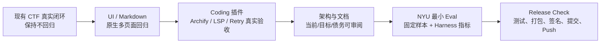
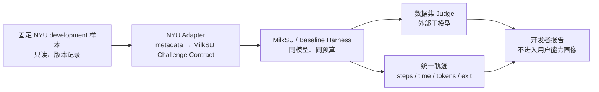

# 架构债与 M3 / R0.4 实际边界

> 决策日期：2026-08-01
>
> 当前调整：暂停 Managed Labs；先完成 UI、Coding Agent 插件、架构/文档和 NYU CTF
> Bench 最小开发者评测。

## 先区分两个“里程碑”

仓库长期规划里的 `M0—M7` 是能力里程碑；团队口头使用的 “M3 MVP / R0.4” 是一次可演示
产品发布检查点。二者不能互相替代。

- **长期 M3**：Vulnerability Research 可用 MVP。当前只有 M3-A 外部证据导入纵切，
  不包含自动触发、最小化或干净环境复现，因此长期 M3 未完成。
- **CTF-first M3 / R0.3.1**：真实 NSSCTF 题库、单题工作区、PI、候选、Browser Judge、
  恢复和复盘闭环。代码和项目记录已经保留一次真实 P3879 `correct=true`。
- **当前 R0.4**：不再把 Labs 当收口条件；重点是产品壳可用性、Coding 插件真实验收、
  架构可审阅性和最小内部评测。

## 当前交付边界

| 能力 | 状态 | R0.4 声明 |
| --- | --- | --- |
| NSSCTF 题库 → Challenge Workspace → PI | **Implemented** | 可声明真实主链已跑通；仍需纳入最终原生回归。 |
| 显式候选 → Browser/Arena Judge → Recovery | **Implemented** | 可声明平台权威结果决定成功。 |
| CTF Trajectory / Debrief / Memory | **Implemented** | 可声明本地可恢复和用户确认后沉淀。 |
| 全局 Rail `CTF → CVE → Coding` 与上下文侧栏 | **Implemented / Partial** | 代码与浏览器回归已有，待原生包和全页面状态回归。 |
| 全页面 Markdown 渲染 | **Implemented / Partial** | 统一安全渲染器与单测已存在；原生真实会话、长代码块和窄窗口仍需回归。 |
| Archify / LSP / Retry | **Partial** | 固定加载和 Smoke 已有，真实 Coding 场景验收未完成。 |
| 架构文档 | **Implemented by this snapshot** | 当前代码和边界已有 Mermaid 快照；生成式 Archify 图仍需更新。 |
| NYU CTF Bench | **Implemented / Partial** | 固定 revision 的只读 Catalog、摘要 Run Record、静态 Report 和开发者 CLI 已实现；无 Runner、Judge 或用户 UI。 |
| Managed Labs / Juice Shop / WebGoat / Vulhub | **Paused** | 本轮不发布、不验收、不出现在完成声明。 |
| HTB / THM 自动化 | **Out of scope** | 不接内容抓取、Lab Token 或 Agent 自动化。 |
| 云端用户系统 | **Out of scope** | 继续 local-first。 |

## R0.4 冻结门

冻结条件：

1. 新用户能从 CTF 题库进入真实题目和 PI，不出现空按钮、重叠、被截断的下拉框或原始 Markdown。
2. 已完成 NSSCTF Accepted、候选不明确恢复、报告脱敏和应用重启恢复回归。
3. Archify、LSP、Retry 各有一个真实可重复验收；CTF 隔离负向测试继续通过。
4. 当前四份架构文档与代码一致，并标明 Labs 暂停和 NYU 仅开发者可见。
5. NYU 最小 Adapter 只读取固定开发样本，记录模型、Harness、预算、退出原因、步骤、时间和
   Judge 结果；不把 benchmark 成绩写进用户能力画像。
6. `go test ./...`、Bridge Policy、前端测试/构建、Sidecar Smoke、文档构建和原生 Wails
   打包全部通过后，才提交并 push。

## 现有架构债

### P0 · 发布前

| 债务 | 代码证据 | 风险 | 收口动作 |
| --- | --- | --- | --- |
| Markdown 原生状态未冻结 | `MarkdownContent.vue`、清洗策略与单测已存在 | 打包 App 的真实长代码块、表格或旧会话仍可能暴露布局问题 | 逐页验证真实会话、代码块、链接和超长内容；保留工具原始输出的等宽 `<pre>`。 |
| 原生 UI 状态未冻结 | 浏览器预览无法覆盖 Wails Binding、原生标题栏和真实数据 | 浏览器看似正常，打包 App 仍可能重叠或无响应 | 用真实 Wails 包验 CTF/CVE/Coding/设置、下拉框、长文本和窄窗口。 |
| Coding 插件只有加载证据 | `bridge.js` 和 Sidecar Smoke 证明注册，不证明真实任务质量 | 面试演示时插件可能不可用或权限不清 | 完成 Archify/LSP/Retry 的固定验收矩阵。 |
| NYU Eval 无 Runner / Judge | `internal/evalbench` 只消费索引和外部摘要结果 | 能比较静态记录，但不能形成独立验证成绩 | 保持安全边界；先提供可审计的报告入口，Runner 需单独设计隔离和 Judge。 |

### P1 · 冻结后优先

| 债务 | 当前集中点 | 建议边界 |
| --- | --- | --- |
| Wails God Facade | `app.go` 约 1,900 行 | 保持公开 Binding 名称，内部委托 `AgentFacade`、`TrainingFacade`、平台 Facade、`VulnFacade`。 |
| CTF 巨型页面 | `CTFPage.vue` 约 3,500 行 | 按 Catalog、Challenge Workspace、Paired Judge、Agent Handoff、History 拆 composable 和 panel。 |
| Browser Manager 混合职责 | `internal/browsercap/manager.go` 约 1,800 行 | Loopback Transport 与 NSSCTF/CTFshow Page Adapter 分离。 |
| CTF Service 混合命令与 Runner | `internal/ctf/service.go` 约 1,700 行 | 保留领域契约，分 Intake、Agent Ingest、Submission/Judge、Recovery Application Service。 |
| Bridge Policy 规则集中 | `bridge-policy.js` 约 1,500 行 | 按普通 Coding、CTF common、Solver、Tool Builder、Strategist 拆策略模块和契约测试。 |
| SQLite 迁移不统一 | Event Store 有 migration；Credential/Memory/Catalog 各自建表 | 引入每库独立、编号、事务化迁移和升级前备份测试。 |
| 明文 SQLite 凭据 | `credentials.db` 0600，但不加密 | 保持“不经 Wails/日志/报告返回”的约束；后续提供可选口令加密，不静默恢复 Keychain。 |

这些都是“沿现有契约拆分”的债，不支持重写 Go/Wails、替换 Pi 或另造一套 Runtime。

### P2 · 数据出现后再做

- Swarm / Agent Race、自动多 Agent 调度和发现消息总线。
- 语义向量记忆、跨分类知识图和自动总结写入。
- 完整 NYU development / 200 test 批量跑分；固定 revision 的 development 索引实际为 57 项。
- Labs、容器 Provider、跨平台网络隔离。
- 云同步、团队协作、PostgreSQL 或公开 API。

## NYU CTF Bench 的最小边界

第一版只需要回答：

1. 同一模型在原始 Pi Coding Harness 与 MilkSU CTF Harness 下是否完成固定样本？
2. 各自用了多少回合、时间、工具调用、错误和提示？
3. 失败是环境、工具、上下文、循环、预算还是候选 / Judge 问题？
4. 恢复后是否重复了已经提交的副作用或丢失证据？

第一版不做排行榜、不训练模型、不向用户推荐 NYU 题，也不把开发集成绩写成真实比赛成绩。

## 可对外使用的准确表述

可以说：

> MilkSU 已跑通一条真实 NSSCTF 的 Intake、Pi 解题工作区、候选闸门、平台 Judge、恢复和
> 训练复盘链路；当前 R0.4 正在完成 UI 原生回归、固定 Coding 插件验收和内部模型评测。

暂时不能说：

- “完整 M0—M7 的 M3 已完成”；
- “Managed Labs 已接入”；
- “Coding 插件体系已稳定完成”；
- “NYU CTF Bench 已有对比成绩”；
- “MilkSU Shell 已实现容器级隔离”。
