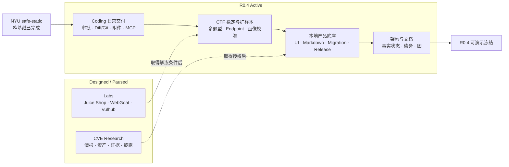
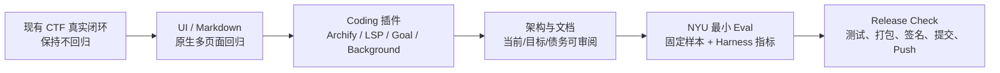
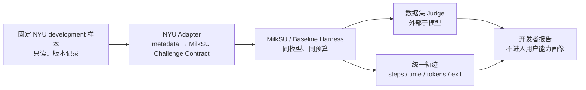

# 架构债与 M3 / R0.4 实际边界

> 决策日期：2026-08-01
>
> 当前调整：暂停 Managed Labs；先完成 UI、Coding Agent 插件、架构/文档和 NYU CTF
> Bench 最小开发者评测。

## 先区分两个“里程碑”

仓库长期规划里的 `M0—M7` 是能力里程碑；团队口头使用的 “M3 MVP / R0.4” 是一次可演示
产品发布检查点。二者不能互相替代。

- **长期 M3**：Vulnerability Research 可用 MVP。当前只有 M3-A 外部证据导入纵切，
  不包含自动触发、最小化或干净环境复现，因此长期 M3 未完成。
- **CTF-first M3 / R0.3.1**：真实 NSSCTF 题库、单题工作区、PI、候选、Browser Judge、
  恢复和复盘闭环。代码和项目记录已经保留一次真实 P3879 `correct=true`。
- **当前 R0.4**：不再把 Labs 当收口条件；重点是产品壳可用性、Coding 插件真实验收、
  架构可审阅性和最小内部评测。

## 当前交付边界

| 能力 | 状态 | R0.4 声明 |
| --- | --- | --- |
| NSSCTF 题库 → Challenge Workspace → PI | **Verified for current narrow path** | 用户目录内 4,204 题；真实主链、候选和平台结果已有记录。多题型仍未验收。 |
| 显式候选 → Browser/Arena Judge → Recovery | **Implemented** | 可声明平台权威结果决定成功；浏览器当前真实配对可见。 |
| CTF Trajectory / Debrief / Memory | **Implemented / Partial evidence** | Event Store 有真实轨迹和恢复事件，Memory Store 有 1 条综合；跨题型复用和错误记忆停用仍欠验收。 |
| 全局 Rail `CTF → CVE → Coding` 与上下文侧栏 | **Verified for current native package** | 原生包已回归；一级/二级选中态明确，Coding 最近任务按仓库分组，CTF 角色会话不混入 Coding。 |
| 全页面 Markdown 渲染 | **Implemented / Partial** | 统一安全渲染器与单测已存在；原生真实会话、长代码块和窄窗口仍需回归。 |
| Archify / LSP / Goal / Background | **Mixed** | Archify 已在真实打包 App 一键生成固定产物、showcase 9/9 并右侧预览；固定 `pi-goal`、后台任务、LSP 与 CTF 隔离 Smoke 已有。LSP Server 尚未打包；当前固定清单不再包含 `pi-retry`。 |
| Coding Plan / Go 与权限策略 | **Implemented / Partial overall** | Codex 风格三档菜单、Project Auto 常规开发 Shell/Git/网络、显式 Full Access 和 Ask 单次工具审批已落地并有交付门禁；右侧终端页已在原生 App 验证交互式项目 PTY，并启停带 PID/端口/日志的后台服务；仍缺跨应用重启终端恢复以及 Browser/Computer Use 授权。 |
| Coding 日常产品动作与 Diff | **Verified for one real delivery chain** | 同一真实打包 App 会话已连续完成理解项目、失败测试、可信 Diff 审阅、最小修复、回归测试和总结；右侧文件级 Diff 页已接线；本地临时远端完成 stage、commit、push 与远端 HEAD 核对。仍欠多语言样本、逐块/行级反馈和托管平台 PR。 |
| 架构文档 | **Verified snapshot** | 当前/目标/债务文档与 Archify 交互式 HTML 已生成；规格验证 9/9、0 error、0 warning。 |
| NYU CTF Bench | **Verified narrow safe-static baseline** | 固定 revision、人工 fail-closed 准入、单次无工具 Runner、Digest Judge 与 Report 已跑通；5 completed 中 3 solved，另有 1 个零调用阻断。无用户 UI，不代表真实 CTF Agent。 |
| Coding 附件 / 项目 MCP / 后台任务 | **Implemented / Verified by packaged gates** | 文件/图片附件、纯文本模型 OCR/视觉降级、项目 `.mcp.json` 选择与摘要固定、单次 MCP 审批和按 Conversation 隔离的后台任务生命周期已接线；仍需多进程压力、重启恢复和产物预览。 |
| Coding Browser / Computer Use | **Planned** | 不因项目 MCP 或 Full Access 静默启用；当前不能列入 M3 完成能力。 |
| Managed Labs / Juice Shop / WebGoat / Vulhub | **Paused** | 本轮不发布、不验收、不出现在完成声明。 |
| HTB / THM 自动化 | **Out of scope** | 不接内容抓取、Lab Token 或 Agent 自动化。 |
| 云端用户系统 | **Out of scope** | 继续 local-first。 |

## 当前项目地图

这张图描述优先级，不表示所有 Active 节点都已完成。`NYU safe-static` 只完成窄的开发者
基线；Coding 和 CTF 的具体未完成项仍以下方债务表为准。

## R0.4 冻结门

冻结条件：

1. 新用户能从 CTF 题库进入真实题目和 PI，不出现空按钮、重叠、被截断的下拉框或原始 Markdown。
2. 已完成 NSSCTF Accepted、候选不明确恢复、报告脱敏和应用重启恢复回归。
3. Archify、LSP、Goal、后台任务与 MCP 的真实状态逐项披露；Archify、审批、后台任务与资源隔离已验，LSP 未打包 Server 的缺口不能被加载 Smoke 冒充。
4. 当前架构快照、CTF/Coding 边界、Labs/CVE 设计和项目状态与代码一致，并标明
   `Implemented / Partial / Planned / Paused / Historical`。
5. 本地备份恢复在任何 Store 打开前执行，二次验证 schema/哈希/路径与数据版本，保留凭据和
   配对令牌，失败可回滚且不会把旧 SQLite WAL 叠到恢复快照。
6. NYU safe-static Runner 只消费人工审核的固定静态材料，记录模型、Harness、预算、退出原因、
   token、成本和 Digest Judge 结果；不执行模型输出，也不把 benchmark 成绩写进用户能力画像。
7. `go test ./...`、Bridge Policy、前端测试/构建、Sidecar Smoke、文档构建和原生 Wails
   打包全部通过后，才提交并 push。

## 现有架构债

### P0 · 发布前

| 债务 | 代码证据 | 风险 | 收口动作 |
| --- | --- | --- | --- |
| Markdown 原生状态未冻结 | `MarkdownContent.vue`、清洗策略与单测已存在 | 打包 App 的真实长代码块、表格或旧会话仍可能暴露布局问题 | 逐页验证真实会话、代码块、链接和超长内容；保留工具原始输出的等宽 `<pre>`。 |
| 原生 UI 状态未冻结 | 浏览器预览无法覆盖 Wails Binding、原生标题栏和真实数据 | 浏览器看似正常，打包 App 仍可能重叠或无响应 | 用真实 Wails 包验 CTF/CVE/Coding/设置、下拉框、长文本和窄窗口。 |
| LSP 仍主要是加载证据 | `bridge.js` 和 Sidecar Smoke 证明注册；LSP 真实调用因缺语言服务器失败 | 面试演示时插件可能显示已加载但不可用 | 打包固定语言服务器并用 fixture 验证诊断；重试继续依赖 Pi/Provider，不恢复已移除的临时自研循环。 |
| Coding 通用能力仍有自研膨胀风险 | 计划、权限、会话、审阅、子 Agent 都有成熟 Pi 候选 | Harness 胶水持续增长并偏离产品重点 | 执行 `pi-resource-whitelist.md` 的 reuse-first 与 custom-code disposition；禁止临时自造替代品。 |
| CTF 真实题型覆盖不足 | 当前本机真实训练记录集中在静态编码/取证类；能力画像多数维度未校准 | 单一路径成功被误述为通用解题能力 | 固定 Web、Reverse、Crypto、Forensics 四类安全验收；每类保留 Judge、轨迹、提示依赖和恢复证据。 |
| Coding Browser / Computer Use 未接入 | 附件、项目 MCP 和后台任务已接入，但浏览器与桌面操作仍明确显示 `未接入` | 用户可能把 MCP 与浏览器能力混为一谈 | 保持独立入口和授权；在真实打包回归前维持 Planned。 |

### P1 · 冻结后优先

| 债务 | 当前集中点 | 建议边界 |
| --- | --- | --- |
| Wails God Facade | `app.go` 约 1,300 行；CTFshow、NSSCTF Web、NSSCTF Arena 已拆为同包平台适配器 | 保持公开 Binding 名称，继续把剩余 Training、Agent 与 Vuln 职责委托给窄 Facade。 |
| CTF 巨型页面 | `CTFPage.vue` 约 3,000 行 | 按 Catalog、Challenge Workspace、Paired Judge、Agent Handoff、History 拆 composable 和 panel。 |
| Browser Manager 混合职责 | `internal/browsercap/manager.go` 约 1,800 行 | Loopback Transport 与 NSSCTF/CTFshow Page Adapter 分离。 |
| CTF Service 混合命令与 Runner | `internal/ctf/service.go` 约 1,700 行 | 保留领域契约，分 Intake、Agent Ingest、Submission/Judge、Recovery Application Service。 |
| Bridge Policy 规则集中 | `bridge-policy.js` 1,785 行 | 通用 Coding 行为优先替换为固定 Pi Package；剩余边界按普通 Coding、CTF common、Solver、Tool Builder、Strategist 拆契约。 |
| SQLite 迁移不统一 | Event Store 有 migration；Credential/Memory/Catalog 各自建表 | 引入每库独立、编号、事务化迁移和升级前备份测试。 |
| 明文 SQLite 凭据 | `credentials.db` 0600，但不加密 | 保持“不经 Wails/日志/报告返回”的约束；后续提供可选口令加密，不静默恢复 Keychain。 |

这些都是“沿现有契约拆分”的债，不支持重写 Go/Wails、替换 Pi 或另造一套 Runtime。

### P2 · 数据出现后再做

- Swarm / Agent Race、自动多 Agent 调度和发现消息总线。
- 语义向量记忆、跨分类知识图和自动总结写入。
- 完整 NYU development / 200 test 批量跑分；固定 revision 的 development 索引实际为 57 项。
- Labs、容器 Provider、跨平台网络隔离。
- 云同步、团队协作、PostgreSQL 或公开 API。

## NYU CTF Bench 的最小边界

第一版只需要回答：

1. 同一模型在原始 Pi Coding Harness 与 MilkSU CTF Harness 下是否完成固定样本？
2. 各自用了多少回合、时间、工具调用、错误和提示？
3. 失败是环境、工具、上下文、循环、预算还是候选 / Judge 问题？
4. 恢复后是否重复了已经提交的副作用或丢失证据？

第一版不做排行榜、不训练模型、不向用户推荐 NYU 题，也不把开发集成绩写成真实比赛成绩。

## 可对外使用的准确表述

可以说：

> MilkSU 已跑通一条真实 NSSCTF 的 Intake、Pi 解题工作区、候选闸门、平台 Judge、恢复和
> 训练复盘链路；当前 R0.4 正在完成 UI 原生回归、固定 Coding 插件验收和内部模型评测。

暂时不能说：

- “完整 M0—M7 的 M3 已完成”；
- “Managed Labs 已接入”；
- “Coding 插件体系已稳定完成”；
- “NYU CTF Bench 的 3/5 静态结果代表完整模型或 CTF Agent 能力”；
- “CTF 已完成 Web / Pwn / Reverse / Crypto / Forensics 多题型验收”；
- “Coding 已支持 MCP Browser 或 Computer Use”（当前只支持本地附件和 opt-in 项目 MCP）；
- “MilkSU Shell 已实现容器级隔离”。
