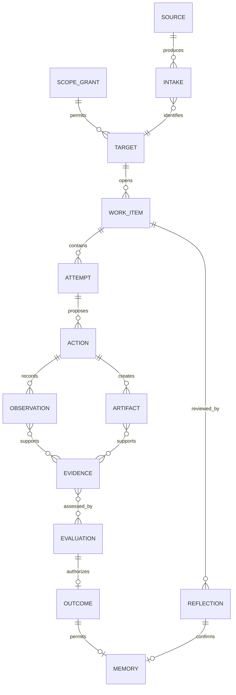

# 授权安全学习与研究平台：顶层设计

> 状态：**Planned**。本文只定义未来架构和产品边界，不表示 Labs 或真实 CVE 工作流已经启用。
>
> 设计日期：2026-08-01

## 1. 产品判断

MilkSU 的长期价值不是替用户批量“扫洞”，而是把安全学习和授权研究中最难积累的部分变成
可恢复、可验证、可复盘的个人工作系统：

- **CTF** 用有明确答案的 Challenge 训练解题方法；
- **Labs** 用可重置的环境训练连续实验、工具使用和系统理解；
- **CVE** 用真实情报、资产范围、研究假设、证据和披露状态支撑赏金猎人的日常工作；
- **Coding** 提供通用代码阅读、工具开发、测试、架构和 Git 能力。

AI 会继续压低通用扫描和一次性脚本的价值。MilkSU 应强化更难被替代的部分：目标选择、
范围判断、实验设计、证据质量、稳定复现、根因解释、报告表达，以及把一次经历转化为人的能力。

## 2. 产品信息架构


### 2.1 顶层导航决策

用户当前主导航继续保持 `CTF / CVE / Coding`。`Labs` 在 CTF 工作区内作为与“题库”并列的
二级入口：

```text
CTF
├─ 题库：NSSCTF、CTFshow、自定义 Challenge
├─ Labs：Juice Shop、WebGoat、Vulhub 白名单包
├─ 训练历史
└─ 能力画像
```

理由：

1. 用户进入 Labs 的首要目的仍是学习，而不是管理容器；
2. Labs 与题库共享分类、难度、推荐、Hint Ladder、Agent、Judge 和复盘；
3. Lab 不是一个“CTF 平台”，不能塞进 NSSCTF/CTFshow 的来源下拉；
4. CVE 研究也能请求一个环境，但它消费的是底层 `Environment Broker`，不会跳进 CTF Labs UI。

如果未来 Labs 的使用量和独立任务模型明显超过 CTF，再通过路由别名升为顶层入口；领域对象和
代码包仍保持独立，不因导航变化改名。

## 3. 四个垂直模块的责任

| 模块 | 核心问题 | 完成事实 | 不负责 |
| --- | --- | --- | --- |
| CTF | 这道题怎样被理解并正确解出？ | Platform/Local Judge 给出明确 Verdict | 管理任意容器、宣布真实漏洞成立 |
| Labs | 怎样获得一个可控、可重置、可判定的训练环境？ | 环境 Ready；训练目标由独立 Judge/Evaluator 判定 | 让 Agent 直接操作 Docker、把 Ready 当 Solved |
| CVE | 哪个授权目标值得研究，证据是否足以形成报告？ | Evidence Gate + Human Review；外部平台状态单独记录 | 无授权扫描、自动扩大范围、把候选当漏洞 |
| Coding | 怎样完成通用软件工程工作？ | 测试、Diff、Git 和用户验收 | 代替 CTF Judge 或 CVE Evidence Gate |

## 4. 共享内核

### 4.1 领域对象



共享 Runtime 只保存不可争议的过程事实；垂直 Role 通过类型化事实描述自己的领域：

- CTF：Challenge、Candidate、JudgeReceipt、Debrief；
- Labs：LabPackage、Lease、InstanceState、Readiness、ResetReceipt；
- CVE：Program、Asset、ResearchCase、Hypothesis、Reproduction、RootCause、Disclosure；
- Coding：Conversation、Workspace、Diff、TestReceipt。

### 4.2 三种真相

| 真相 | 例子 | 权威来源 |
| --- | --- | --- |
| 系统事实 | 命令退出码、文件哈希、环境状态、平台响应 | 确定性 Adapter / Runtime |
| 领域判断 | Flag 正确、复现稳定、证据充分 | Judge / Evaluator / Human Review |
| 学习判断 | 用户是否理解、依赖了几级提示、能否迁移 | 用户 Reflection + 可审计训练轨迹 |

模型文本不直接写入 Outcome、授权范围或能力画像。模型只能提出 Candidate、Hypothesis、
Plan 和解释。

## 5. 授权模型

### 5.1 支持的目标等级

| 等级 | 目标 | 默认动作 |
| --- | --- | --- |
| A · 内置训练 | MilkSU 固定版本的本地 Lab、静态 fixture | 可按包策略自动批准 |
| B · 用户自托管 | 用户明确选择的仓库、容器或私有测试环境 | 读取与启动需要一次范围确认 |
| C · 外部授权 | 赏金项目范围内的资产、比赛动态端点 | 每个 Origin/Socket/Account 显式授权并有到期时间 |
| D · 未知互联网目标 | 搜索结果、题面中偶然出现的地址 | 默认拒绝，不能由模型升级 |

`ScopeGrant` 必须由本地用户动作或受信平台 Adapter 创建。模型不能创建、扩大、续期或把
一个范围复制给另一个 Work Item。

### 5.2 副作用分级

```text
Read-only fact collection
  → Workspace-local mutation
  → Managed Lab action
  → Exact authorized target request
  → External account action / disclosure
```

越靠右，审批越具体。环境启动、网络请求、平台提交和披露提交不能共享一个模糊的“完全权限”。

## 6. 共享服务边界

| 服务 | 责任 | 关键接口 |
| --- | --- | --- |
| Intake Service | 归一化题目、情报、资产、附件和来源 | `AdmitSource`, `AdmitArtifact` |
| Authorization Service | 创建、查询、到期、撤销 Scope | `Grant`, `Check`, `Revoke` |
| Evidence Runtime | 追加事实、恢复 Attempt、投影状态 | `Commit`, `Recover`, `Project` |
| Artifact Store | 内容寻址、哈希、来源与脱敏 | `Put`, `Open`, `Derive` |
| Agent Runtime | 会话、预算、工具目录和角色编排 | `Start`, `Resume`, `Stop` |
| Environment Broker | 固定包获取、启动、重置、停止 | `Prepare`, `Start`, `Reset`, `Destroy` |
| Evaluator Registry | 按版本运行 Judge/Evaluator | `Evaluate`, `ExplainReceipt` |
| Learning Service | Reflection、Memory、能力更新 | `Reflect`, `SaveMemory`, `Calibrate` |

垂直模块通过接口消费这些服务，不能直接读取彼此的可变数据库。

## 7. 共享用户体验

所有工作区遵守相同的交互骨架：

1. 左侧是该领域自己的目录或历史；
2. 中间只有当前最重要的内容、实验和对话；
3. 底部是 Agent Composer 和当前权限；
4. 右侧统一承载环境、材料、证据、协作、浏览器和 Judge；
5. “继续”必须指出继续哪个 Work Item 和最近一次可靠状态；
6. 默认动作使用产品预设，不把内部 Schema、Provider、输出路径或容器参数反问用户。

## 8. 发布与解冻条件

Labs 或 CVE 进入实现前必须同时满足：

1. 用户或项目提供明确授权边界；
2. 目标来源、版本和许可证可固定；
3. 网络、凭据、浏览器和环境能力可以单独审批；
4. Candidate 与 Outcome 的 Judge/Evidence Gate 已定义；
5. 失败、停止、重启和清理可恢复；
6. 有不会访问真实目标的自动化 fixture；
7. 产品文案不暗示无授权扫描或自动漏洞提交。

详细设计分别见：

- [CTF Labs 顶层与详细设计](ctf-labs-design.md)
- [CVE 研究工作台顶层与详细设计](cve-research-workbench-design.md)
