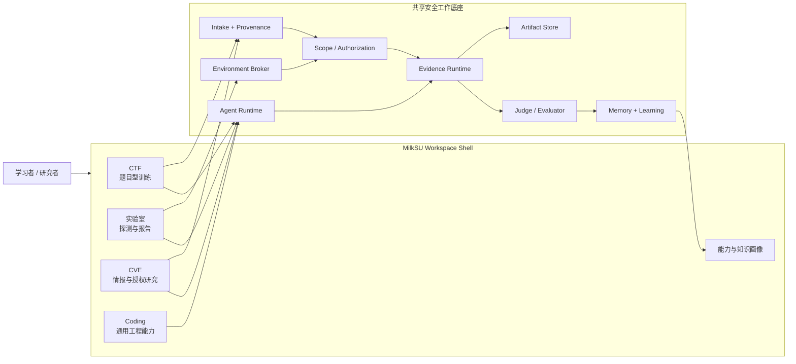
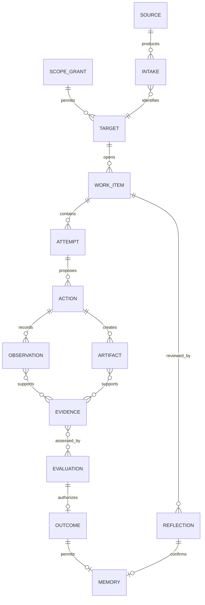

# 授权安全学习与研究平台：顶层设计

> 文档状态：**Long-term Design / Partially Implemented**。本文定义长期架构。
> CTF、Coding、CVE 学习和主导航「实验室」已有当前实现或开发线切片。
> CTF 可重置环境、CVE 披露草稿还没做，不是禁令，也不需要先满足解冻清单。
>
> 设计日期：2026-08-01

## 1. 产品判断

MilkSU 的长期价值不是替用户批量“扫洞”，而是把安全学习和授权研究中最难积累的部分变成
可恢复、可验证、可复盘的个人工作系统：

- **CTF** 用有明确答案的 Challenge 训练解题方法；
- **实验室** 对用户给出的靶做未知漏洞探测，留下可继续编辑的报告；
- **CVE** 用公开情报追踪已知洞，并在档案里做复现报告；
- **Coding** 提供通用代码阅读、工具开发、测试、架构和 Git 能力。

AI 会继续压低通用扫描和一次性脚本的价值。MilkSU 应强化更难被替代的部分：目标选择、
范围判断、实验设计、证据质量、稳定复现、根因解释、报告表达，以及把一次经历转化为人的能力。

## 2. 产品信息架构



### 2.1 当前导航

当前主导航是 `CTF / CVE / 实验室 / Coding`。实验室是独立作业面，不塞进 CVE，也不挂在 CTF 题库下面。

Juice Shop、WebGoat、Vulhub 一类可重置环境仍是 CTF 的长期设计，见
[CTF Labs 设计](ctf-labs-design.md)。不要把那份设计当成当前实验室模块的约束。

## 3. 四个垂直模块的责任

| 模块 | 核心问题 | 完成事实 | 不负责 |
| --- | --- | --- | --- |
| CTF | 这道题怎样被理解并正确解出？ | Platform/Local Judge 给出明确 Verdict | 管理任意容器、宣布真实漏洞成立 |
| 实验室 | 对用户给出的靶，怎样做一轮探测并留下报告？ | Agent 编辑的 `report.md` / `report.html` | 未授权扫描、Kali 应用商店、把候选写成已确认漏洞 |
| CVE | 已知洞怎样被读懂并复现成报告？ | 档案里的活报告；状态标签不是完成面 | 无授权扫描、自动扩大范围、把候选当漏洞 |
| Coding | 怎样完成通用软件工程工作？ | 测试、Diff、Git 和用户验收 | 代替 CTF Judge 或 CVE 报告 |

## 4. 共享内核

### 4.1 领域对象



共享 Runtime 只保存不可争议的过程事实；垂直 Role 通过类型化事实描述自己的领域：

- CTF：Challenge、Candidate、JudgeReceipt、Debrief；
- 实验室：LabJob、Target、Report；
- CTF Labs（长期）：LabPackage、Lease、InstanceState、Readiness、ResetReceipt；
- CVE：Program、Asset、ResearchCase、Hypothesis、Reproduction、RootCause、Disclosure；
- Coding：Conversation、Workspace、Diff、TestReceipt。

### 4.2 三种真相

| 真相 | 例子 | 权威来源 |
| --- | --- | --- |
| 系统事实 | 命令退出码、文件哈希、环境状态、平台响应 | 确定性 Adapter / Runtime |
| 领域判断 | Flag 正确、复现稳定、证据充分 | Judge / Evaluator / Human Review |
| 学习判断 | 用户是否理解、依赖了几级提示、能否迁移 | 用户 Reflection + 可审计训练轨迹 |

模型文本不直接写入 Outcome、授权范围或能力画像。模型只能提出 Candidate、Hypothesis、
Plan 和解释。

## 5. 授权模型

### 5.1 支持的目标等级

| 等级 | 目标 | 默认动作 |
| --- | --- | --- |
| A · 内置训练 | MilkSU 固定版本的本地 Lab、静态 fixture | 可按包策略自动批准 |
| B · 用户自托管 | 用户明确选择的仓库、容器或私有测试环境 | 读取与启动需要一次范围确认 |
| C · 外部授权 | 赏金项目范围内的资产、比赛动态端点 | 每个 Origin/Socket/Account 显式授权并有到期时间 |
| D · 未知互联网目标 | 搜索结果、题面中偶然出现的地址 | 默认拒绝，不能由模型升级 |

`ScopeGrant` 必须由本地用户动作或受信平台 Adapter 创建。模型不能创建、扩大、续期或把
一个范围复制给另一个 Work Item。

### 5.2 副作用分级

```text
Read-only fact collection
  → Workspace-local mutation
  → Managed Lab action
  → Exact authorized target request
  → External account action / disclosure
```

越靠右，审批越具体。环境启动、网络请求、平台提交和披露提交不能共享一个模糊的“完全权限”。

## 6. 共享服务边界

| 服务 | 责任 | 关键接口 |
| --- | --- | --- |
| Intake Service | 归一化题目、情报、资产、附件和来源 | `AdmitSource`, `AdmitArtifact` |
| Authorization Service | 创建、查询、到期、撤销 Scope | `Grant`, `Check`, `Revoke` |
| Evidence Runtime | 追加事实、恢复 Attempt、投影状态 | `Commit`, `Recover`, `Project` |
| Artifact Store | 内容寻址、哈希、来源与脱敏 | `Put`, `Open`, `Derive` |
| Agent Runtime | 会话、预算、工具目录和角色编排 | `Start`, `Resume`, `Stop` |
| Environment Broker | 固定包获取、启动、重置、停止 | `Prepare`, `Start`, `Reset`, `Destroy` |
| Evaluator Registry | 按版本运行 Judge/Evaluator | `Evaluate`, `ExplainReceipt` |
| Learning Service | Reflection、Memory、能力更新 | `Reflect`, `SaveMemory`, `Calibrate` |

垂直模块通过接口消费这些服务，不能直接读取彼此的可变数据库。

## 7. 共享用户体验

所有工作区遵守相同的交互骨架：

1. 左侧是该领域自己的目录或历史；
2. 中间只有当前最重要的内容、实验和对话；
3. 底部是 Agent Composer 和当前权限；
4. 右侧统一承载环境、材料、证据、协作、浏览器和 Judge；
5. “继续”必须指出继续哪个 Work Item 和最近一次可靠状态；
6. 默认动作使用产品预设，不把内部 Schema、Provider、输出路径或容器参数反问用户。
7. Composer “+”只列已经审阅的附件、任务状态、Scope、Skill 与 MCP；`/` 是同一能力的快捷入口。
   选择动作不直接发送，也不能安装 Server 或扩大授权，Scope/Skill 必须可见且可移除。

安全工具接到哪个工作区，由当前切片决定。工具连接成功只表示能力可用，不能建立 Challenge、
Finding、Reproduction 或 Judge 事实；这些仍由领域 Runtime 和独立回执持有。

## 8. 实现时要守的边界

做 Labs 或 CVE 纵深时，在切片里带上用得上的授权、来源、审批、证据和恢复即可，不要把下面
写成开工条件：

- 对用户未授权的外部目标保持拒绝，文案不要暗示无授权扫描或静默代交披露；
- 能固定的来源、版本和许可证就固定；
- Candidate 不能当 Outcome；
- 失败、停止和清理要能从当前切片恢复。

详细设计分别见：

- [CTF Labs 顶层与详细设计](ctf-labs-design.md)
- [CVE 研究工作台顶层与详细设计](cve-research-workbench-design.md)
