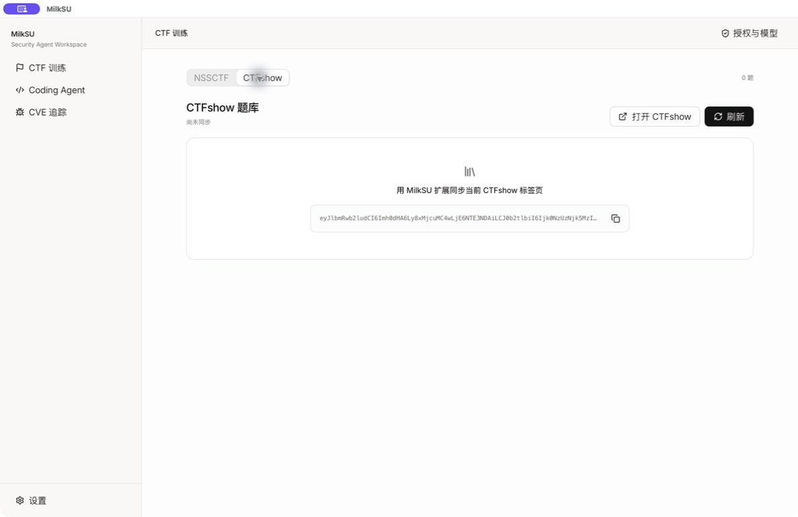

# CTF 训练首页 UX 审视

## 任务

让用户在进入训练场后快速完成“选题库 → 找题 → 开始”，并让能力画像退居辅助位置。

## 1. 原首页

健康度：需要重构。

- “今日任务”、统计、能力画像、推荐、赛事题单和入口在同一条纵向信息流中竞争注意力。
- 题库来源不可见，用户无法预期 NSSCTF 与其他平台如何切换。
- 能力画像约占推荐区域一半宽度，抢走了选题这一主任务的空间。
- 大量解释性文案降低了首屏扫描速度。

## 2. 重排后的 NSSCTF 首页

健康度：主路径清楚。

- 题库切换成为首个控件，来源与题量立即可见。
- 删除产品自述，把首屏保留给继续训练、推荐题和赛事题单。
- 能力画像收为 250px 侧卡，约占内容区 6/24；头像、总分、置信度和小型雷达图仍完整。
- 推荐题使用双列紧凑列表，主区域明显大于画像区域。

## 3. CTFshow 空状态

健康度：路径可执行，真实同步待登录验证。

- 切换后只展示 CTFshow 的同步与题库状态，不混入 NSSCTF 的任务和 Arena。
- 同步必须由用户在当前已登录的 CTFshow 标签页主动点击扩展触发。
- 扩展只借用当前标签页权限读取官方题库接口；不会读取 Cookie、密码或浏览历史。

## 可见的无障碍风险

- 题库切换已暴露为带名称的单选控件。
- 表格行以按钮呈现，可由键盘触发。
- 截图无法验证完整 Tab 顺序、焦点环、读屏朗读和对比度数值；这些需要运行态检查。
