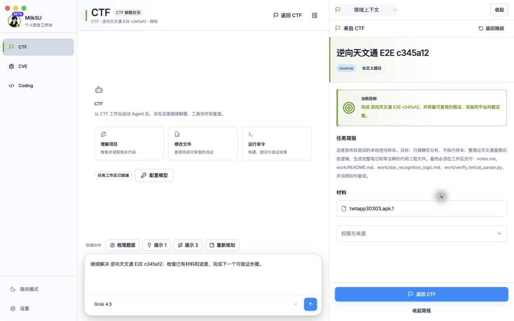
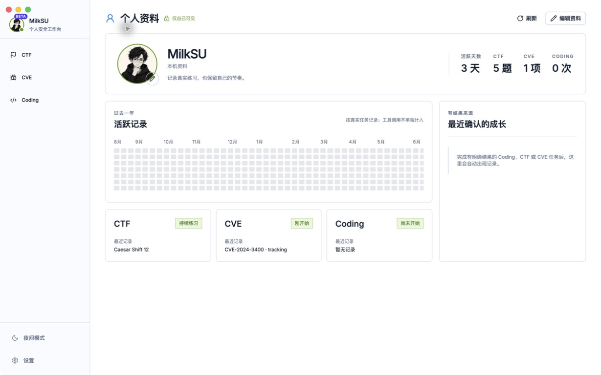

# MilkSU 战术档案界面系统

> 状态：Approved visual contract
>
> 确认日期：2026-08-12
>
> 适用范围：MilkSU Desktop 与私有 `milksu-admin` Web 管理端，日间与夜间模式。

## 目标

MilkSU 使用一套任务型游戏界面语言：黑色指挥台承载操作与实时状态，纸质档案承载题目、CVE、
用户和任务事实。蓝色只表示可执行动作，酸绿色只表示当前目标、选中与确认；斜切、档案叠页和
印刷微标建立游戏感，不依靠积分、连续打卡、装饰性图表或霓虹噪声。

本轮实现的唯一视觉源是用户确认的[方案 2](game-ui/tactical-archive-approved.png)。旧六张图保留为
历史设计输入，不再覆盖方案 2 的材质、颜色、组件几何与首屏层级。

## 页面原型

| 原型 | 负责覆盖 |
| --- | --- |
| [Coding 任务页](game-ui/coding-mission-dark.png) | 对话、任务来源、目标、简报、材料、返回路径与 PiP |
| [CTF 列表页](game-ui/ctf-library-dark.png) | 导航、收藏夹、筛选、表格、选中展开、状态和主操作 |
| [个人资料页](game-ui/profile-light.png) | 日间模式、身份、活跃格、模糊成长阶段和确认记录 |
| [设置页](game-ui/settings-dark.png) | 二级导航、表单、排序、分段选择、状态、危险操作和构建追踪 |
| [Admin 夜间](game-ui/admin-dark.png) | 高密度用户表、选中用户、额度操作和流水 |
| [Admin 日间](game-ui/admin-light.png) | Admin 的同构日间主题 |

这些图片共同构成规范，不要求页面逐像素复制示例数据。业务事实、可达操作和无障碍语义以当前
产品代码为准。

## 不变量

1. Desktop 主导航在同一窗口宽度下保持固定，不随模块伸缩。宽屏显示图标和文字；窄屏只显示图标。
2. 左上角永远是当前用户的圆形头像，不用品牌 Logo 冒充用户。
3. 绿色只表示身份、选中、已确认或正向状态；蓝色表示操作、链接和正在执行。
4. 每个页面只有一个最明显的下一步。次级操作保持描边或安静文字样式。
5. 角切、网格和辉光只用在当前焦点容器，普通列表、设置行和日志保持平整。
6. 深浅主题共享尺寸、结构、状态和层级；日间模式以中性档案纸为主画布，命令、导航和实时状态仍
   保持深色指挥面，避免退化为普通白色后台。
7. CTF/CVE 的状态仍由用户手工维护；视觉强化不引入自动项目管理。
8. CTF/CVE 进入 Coding 后，右栏首先让人看懂“从哪里来、做什么、材料是什么、如何返回”，内部
   Scope、Evidence 和来源细节默认折叠。
9. 个人成长只显示真实活动、模糊阶段和有来源的确认记录，不显示伪精确能力分。
10. Admin 继续以表格和审阅面板为主，不增加仪表盘卡片墙。

## 组件语言

- **App Shell**：近黑碳纤维指挥底，日间内容区切换为中性档案纸；固定 rail；一像素石墨分隔线。
- **Module Header**：黑色斜切指挥条、压缩大标题、来源/返回动作；筛选和收藏夹独立成第二层。
- **Dossier**：真实纸张纹理、叠页与裁切角；只承载题目、CVE、用户和权限等稳定事实。
- **Focus Panel**：酸绿左缘或斜切楔形；只给当前任务、选中记录或审阅对象。
- **Primary Action**：高饱和蓝色；页面同时最多一个主操作组。
- **Confirmed State**：酸绿色；不与主按钮抢层级。
- **Form Field**：冷色底、单一边框；聚焦时使用蓝色边框与很轻的外环。
- **Table/List**：平整分隔；选中行使用左缘和微弱底色；展开内容仍留在列表上下文中。
- **Dialog/Popover**：与所在主题同色的实体浮层、清晰边缘、短动效；不使用大面积毛玻璃。
- **Empty/Error/Warning**：先说明当前事实，再给一个可执行动作；不放装饰插画。
- **Motion**：120–180ms 的颜色、边缘和轻位移反馈；遵循 `prefers-reduced-motion`。

## 方案 2 组件映射

| 参考元素 | 产品组件 |
| --- | --- |
| 左侧斜切选中导航 | `WorkspaceRail`、Admin rail |
| 黑色 Coding 指挥条 | `WorkspaceTopBar` |
| 中央 Active Operation 档案 | `MissionOperationPanel` |
| 四阶段任务轨 | `MissionOperationPanel` phase rail |
| 酸绿 Objective 带 | `tactical-acid-panel` |
| 黑色 Command Composer | `ChatComposer` |
| 右侧叠页 Dossier | `DomainTaskContextPanel`、Admin `UserInspector` |
| 平面数据表 | `CTFPage`、`VulnPage`、Admin `UserList` |

## 实施与验收

共享令牌与基础组件先行，再迁移页面。Desktop 与 Admin 都必须在日间、夜间以及窄屏状态下验收；
视觉验收使用实际运行截图与上述原型逐项对比。功能测试之外，至少核对导航稳定、唯一主操作、键盘
焦点、文字可读、弹层不越界和状态颜色语义。

## 实际界面验收

以下图片来自 `MilkSU Beta` 与 Admin 实际运行界面，不是设计稿。Desktop 截图对应功能提交
`2fc493cc4be705ec054f782b930db125c40f0972`，Beta 构建为 clean，tracking ID 为
`a8cc501e9d993f50106bec6cc7bc597f2926c4f61475d6a54e7449e49ee57c08`。Admin 截图对应
`milksu-admin@0f1d86d47105c25b186a27165e9d02166a077eca`。

| 实际页面 | 验收重点 |
| --- | --- |
| [CTF 任务页](game-ui/qa/ctf-task-light.jpg) | 首屏只突出题面、手工状态、一个 Coding 入口；轨迹与证据默认收起 |
| [CTF → Coding](game-ui/qa/ctf-coding-light.jpg) | 输入框只显示人类可读任务；完整结构化上下文仍交给 Agent；右栏保留来源、目标、材料与返回 |
| [CVE 列表](game-ui/qa/cve-list-light.jpg) | 全部/收藏夹、搜索、手工状态与选中详情处于同一列表语境 |
| [CVE → Coding](game-ui/qa/cve-coding-light.jpg) | 公开 CVE 摘要、研究目标与安全边界可读；不伪造自动项目状态 |
| [个人资料](game-ui/qa/profile-light.jpg) | 圆形用户头像、真实活跃格、三个方向的模糊阶段，不显示伪精确分数 |
| [设置夜间模式](game-ui/qa/settings-dark.jpg) | 二级导航稳定，构建追踪显示 branch、完整 commit、clean 与 tracking ID |
| Admin 日间 | 表格、选中用户与额度操作构成一个清楚的管理任务面；截图保存在私有 Admin 仓库 |
| Admin 夜间 | 与日间共享布局和状态语义，绿色表示选中/确认，蓝色表示操作；截图保存在私有 Admin 仓库 |

### CTF 任务接力

### 个人资料

### Admin 日间与夜间

Admin 的实际日间与夜间截图保存在私有 `milksu-admin/docs/evidence/game-ui/`，避免把内测用户资料
复制进对内测用户开放的 Desktop 仓库。

### 日夜主题纠偏复检

用户随后提供的原生截图证明，上一轮验收没有覆盖完整的日夜页面矩阵：日间模式中的深色 rail、
设置导航和 Coding 右栏继承了纸面文字色，CTF/CVE 内容区还残留旧蓝色 chrome。修复后的共享
主题把内容事实限定到中性纸面，把导航、页头、筛选、Composer 和右栏限定到深色命令面；夜间
事实区保持中性炭黑，不再使用大面积海军蓝。

`MilkSU Beta` clean 构建 `9d3b53fc6acb40ed234ae97519f9c3413edc34e4` 已通过原生 Computer
Use 复检：设置页追踪、CTF 日/夜、CVE 日/夜、CTF → Coding 和 CVE → Coding 右栏均可读，
tracking ID 为 `28bdf05ab9ed974ef9880769833227fe5428e0149246d5cef1ed7dbf5f8b9954`。
内置浏览器同时用于开发期快速检查纸面/命令面对比，但没有桌面 Runtime 数据，因此不作为正式
验收回执。
