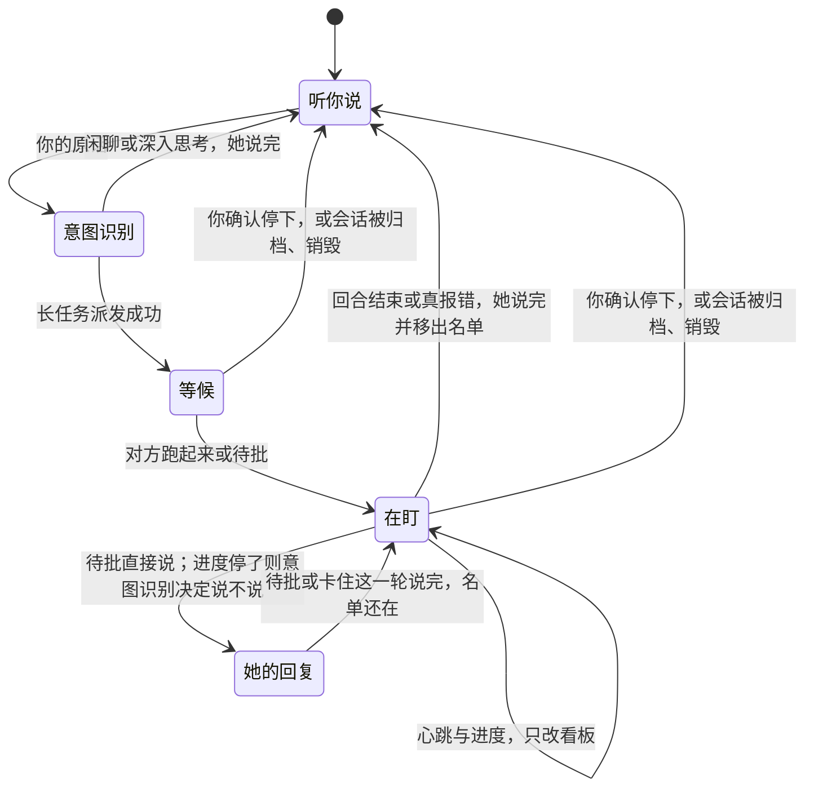

# 看板娘盯住自己派出的会话

> 文档状态：Target / Designed
>
> 对齐日期：2026-09-24
>
> 2026-09-24 对齐过的目标写在下面。仓库里若仍有直连转卖站、设置里的钥匙框，或把识别转给账户服务，都不是这份目标。没有真实任务回执之前，不得写成已经做到。
> 产品 UI 只写在仓库根目录 `AGENTS.md`，本页不复述 token 或原语数字。

## 背景

用看板娘办事时，她常常只在开头应一声，事情做完、卡住、或者在等你点允许，手机上都没有下文。所以会觉得她不主动，也不聪明。

2026-09-24 的讨论里先看过一套更重的做法：话先经过一层轻路由，分成闲聊、深入思考、长任务；长任务交给独立 Worker；宿主只在做完、待批、卡住时再叫她说话。那套里的 Worker 曾写成看板娘自己的 Pi 子代理。后面把范围收窄了，收成下面这一句：

别的会话就是她在管的 agent。她自己的 Pi 只负责听你这句话，并决定是直接回，还是把活派出去。她不调用自己的 sub-agent。派出去之后，宿主盯那条会话上已经有的引擎事件；做完、等批准、卡住，才再开她一轮，让她说一两句。

闲聊还是长任务的分流仍由她这一轮 Pi 决定。开口与否、以及一条记忆值不值得留下，由 Jev 回答。她自己的模型只负责把话说出来、把任务派出去。开口是 [issue #117](https://github.com/MilkSU-Official/milksu/issues/117) 第五条。记忆落盘前丢掉碎片是第四条；第四条里的外部研究素材筛选没有抓取入口，这版不做。issue 里另外三条不在这版。

## 预期

产品里这层叫意图识别，英文是 Intent。实现可以是 Jev，也可以是当前这条对话正在用的那个模型。

你说一句话，先做意图识别，分成三档：闲聊、深入思考、长任务。三档的结果都注入这一轮，模型看得到。推理档不改。闲聊她直接回答。深入思考仍是她自己这一轮答完。长任务派到一条 Coding、CTF、CVE 或实验室对话，这轮结束。

跑的过程中她不逐条播报工具。那条对话做完、弹出批准、或真的报错停掉时，她直接通知你并给建议。手机上只有她的回复。卡住时由意图识别按卡在什么上决定告不告诉你；要说的话，也是通知你、说明问题、告诉你要不要干预。她不直接停掉或改那条会话。

只盯她派成功的会话。教学提示、定时播报、闲聊这三个开关维持关闭。

## 现在代码里实际有什么

这些是 2026-09-24 对仓库的阅读，不是目标。

看板娘是一条单独的 Pi 会话。用户的话从 `Send` 进 sidecar 的 `send_message`，再进 `session.prompt`。这一轮里模型自己选：直接说，或调用 `companion_board`、`companion_dispatch`、`companion_memory`、`companion_app`，以及 read / bash / edit / write / grep / find / ls。工具表里没有 `subagent`。一轮在 `agent_end` 之后审稿，发出 `turn_settled`，runtime 把 `inFlight` 清掉。

`companion_dispatch` 的 `speak` / `create_conversation` 会把文字送进另一条会话。那条会话有自己的 Pi。Coding 会话上的后台子代理来自 `pi-subagents`，挂在那条会话上，不挂在看板娘这条上。系统提示现在还写着：调研类工作派出去，并让那条对话用 subagent 进 Working。

其他会话的引擎事件已经进 `ObserveEngineEvent`，只改看板：

| 事件 | 看板状态 |
| --- | --- |
| `assistant.delta`、`tool.started`、`tool.progress` | `running` |
| `approval.requested` | `needs_approval` |
| `assistant.settled`、`assistant.completed` | `idle` |
| `engine.error` | `error` |
| `engine.stopped`、`session.destroyed` | `idle` |

设置里的「任务事件」默认开，但运行时没有读它来开一轮。看板只有她自己再调用 `companion_board` 时才会被读到。所以派出去的事之后再没有她的声音。

幂等投递记录在 `companion` 的 state 文件里，字段是 `deliveries`。那是「这把钥匙已经投过」，不是「这条会话还要盯到结束」。

## 判断

每条都写当时凭什么这么定。

**她管的是会话，不是自己的 sub-agent。** 讨论里定的：这些会话就是她的 sub-agent；她窗口直接管理这些 agent；她最好不要调自己的 sub-agent。代码侧对得上：她的工具表没有 `subagent`，`pi-subagents` 属于普通 Coding 会话。因此这次不给她加子代理工具，也不让宿主替她去列、去停那些子代理。会话内部要不要再开子代理，由那条会话自己的 Pi 决定。系统提示里「让那条对话用 subagent」这句删掉，避免她用转达文字去指挥那一层。

**分流先走意图识别，不先交给她这一轮模型自己猜。** 2026-09-24 对齐：三档是闲聊、深入思考、长任务。输出按 Jev 的惯例用 `choice`，取得分最高的一档，并带置信度。置信度低到什么程度才不猜，等真实调用再定，这页不写死 0.5。三档都注入这一轮的模型上下文。不改推理档。只开高推理仍可能回得很短，所以深入思考靠注入，不靠把思考拨到最高。记忆和卡住的结果不注入。不扫描用户句子。

**没接上时，另打一次当前对话正在用的那个模型。** 未登录、没有钥匙、调用失败、额度用尽，都算没接上。这一次只要同样的档位或概率，不另开一个 Pi，也不在同一轮里顺口识别。产品名不叫 Jev。兜底模型是这条对话的主模型，不是看板娘专有的第二个内核。

**每次识别都出现在和工具调用同一层的折叠记录里。** 主界面和看板娘都这样。记录里写明哪一处、谁判的、结果。Jev 和主模型兜底都进这里。这是给用户看的，不是只写日志。

**做完、待批、真报错直接说。卡住才问意图识别。** 做完认 `assistant.settled` / `assistant.completed`。待批认 `approval.requested`。真报错认已经停掉的 `engine.error`：凭据撤回、模型拒绝、余额或权限不够、写会话失败。限流、500、上下文溢出仍由那条对话自己重试，不先开口。派发当时的空闲不是这些事件，不会被当成做完。心跳和 `tool.progress` 只改看板。卡住是进度停了之后，把卡在什么上交给意图识别，用 `noul` 决定告不告诉你。告诉你时说明问题，并说明要不要由你来干预。她不能靠这轮直接停或改口。沿用现在的引擎事件。接起来别扭就改造这套事件，不另做第二套。`task_events` 关上时不通知。教学提示、定时播报、闲聊这三个开关这次仍不读。鼠标键盘闲置不在这版的 `state` 里。

**记忆留不留走 `noul`。** 提取结果在写入前识别一次。低于日后定下的门槛就丢掉。没接上时改由主模型按同样的概率形式判，不因为账户服务不可用就停掉记忆，也不因为调用失败就一律写入。外部研究素材没有抓取入口，这版不做。门槛数字等真实调用再定。

**Jev 走 OpenRouter，钥匙留在 `accounts.milksu.org`。** 2026-09-24 对过三家入口：官方 TypeSafe 的 `POST https://api.typesafe.ai/v1/systemone` 能通，但是候补，公开接口也不能按终端用户发钥匙和单独额度。`jevtypesafeai.com` 能通，标价是官方的十倍。OpenRouter 的 `POST https://openrouter.ai/api/alpha/decisions` 能通，模型是 `typesafe/jev-1.13`，标价与官方相同（每百万输入 token $0.042）。同一天用本机那把默认钥匙又打了一次：Decisions 返回 200，模型解析成 `typesafe/jev-1.13-20260917`，一道 `noul` 带回了概率。`GET /api/v1/key` 标明它不是 Management key，也不是 Provisioning key；`GET /api/v1/keys` 返回 401。所以这把只能证明判定通了，不能拿去给用户发钥匙。发钥匙要另配一把 Management key，调用 `POST https://openrouter.ai/api/v1/keys`，给推理钥匙设美元上限 `limit` 和重置周期 `limit_reset`，并用 `external` 标上 MilkSU 用户。明文只返回一次。Management key 不能拿去跑模型。因此供应商用 OpenRouter，不把 TypeSafe 或 `jevtypesafeai.com` 的钥匙发给桌面。账户服务上的页面、表和路由写在 milksu-admin 的 `docs/jev-openrouter.md`。

每人一把不同的推理钥匙，由 Management key 调用 `POST /api/v1/keys` 生成，再按 TokenFlux 那条路静默下到本机。桌面拿这把钥匙直连 OpenRouter，不把每次识别转给 Worker。界面不展示、不能复制。设置里没有钥匙框。TokenFlux 没有这种发放接口，模型钥匙继续在档案里手填。2026-09-24 对过 TokenFlux 文档：创建钥匙只有 `https://tokenflux.dev/keys` 的控制台。未登录、没有钥匙、调用失败或额度用尽时，改走上面的主模型兜底。

**只盯她派成功的会话。** 看板能列出所有在跑的会话，但现有提示要求她只在你问进度时才去读。若任何会话一结束她都说话，她会变成全局旁白。盯梢从 `speak`、`speak_many`、`create_conversation` 投递成功开始。`stop` 被你确认并执行后，这条从名单去掉，不再补一句。

**不重写 Pi 的循环。** 她的回合开始、工具、中止、`turn_settled` 都已经在 sidecar 里。注入是再走一轮同一个 `session.prompt` 的后续，不是第二套 harness。

**注入的内容不画成你说的话。** `sendPrompt` 一进来就发 `user_message`，手机会出用户气泡。宿主通知若走这条，会变成一条假的用户消息，记忆提取还会把它当成你的原句。Pi 的 `custom` 消息今天只在组上下文时塞进这一次请求，不写回抄本。因此要单独一条 sidecar 命令：模型看得到发生了什么，手机上只出现她的回复，不出现一条伪造的用户句，这一轮也不把通知文字送去提取记忆。

**盯梢写进现有的 state 文件。** 只放内存的话，看板娘 sidecar 一重启，名单就没了，而那条会话可能还在跑。`persistedState` 已经在写 todos、记忆和 deliveries。盯梢作为同文件里的新字段，不另做一套存储，也不做版本迁移框架。旧文件没有这个字段就当作没有在盯的会话。

**做完、待批、报错只认事件，不认一份空闲快照。** 名单从派发成功开始。`assistant.settled` / `assistant.completed` 说收束并移出。`approval.requested` 说一句，名单还在。已经停掉的 `engine.error` 说一句并移出。派发当时对方常常仍是 idle，那不是事件。若现有事件接起来别扭，改造这套引擎事件，不另做一套任务事件。

**卡住由意图识别决定说不说。** 进度事件停了，才把卡在什么上送去识别。不先写一个秒数。说了就通知用户并给建议，不直接动那条会话。同一段安静只问一次，中间再出现进度就把这段清掉。

**她自己还在说话时不插队。** `inFlight` 从 `Send` 开始，到 `assistant.settled` 结束。这期间的通知排成一条，等她这轮结束再注入。多条通知叠在一起时合成一条再注入，避免连着开好几轮。

**批准和停、改口仍由你按按钮。** 注入轮只让她把事情说出来。`steer`、`stop`、改设置、退出、重启继续走现有的确认停靠。她不能靠这轮注入绕过按钮。

## 状态机

归档和销毁只把名单清掉，不另说一句。那不是她要汇报的结果。

## 怎么做

1. 投递成功时写入盯梢：会话 id、标题、派发时的那句任务、状态（等候或在盯）、这一段安静是否已经说过。`speak_many` 里每一条成功的都记。失败的不记。
2. `ObserveEngineEvent` 在改看板之后看名单。不在名单里的会话照旧只改看板。
3. `task_events` 为关：不注入，名单可以继续记着，打开之后才说。关着的时候发生的收束不补说。
4. 意图识别在桌面直连 OpenRouter，模型 `typesafe/jev-1.13`。分流用 `choice`。记忆和卡住用 `noul`。钥匙用登录后静默拉下的那把推理钥匙。没接上就另打一次当前对话的主模型，只要同样的结构。每次识别写进和工具调用同一层的折叠记录。
5. 分流的三档注入这一轮模型上下文。记忆和卡住的结果不注入。通知轮不发 `user_message`，手机上只有她的回复。
6. 系统提示删掉「让那条对话用 subagent 进 Working」。长任务用 `companion_dispatch`，短问直接回。
7. 设置里不出现钥匙。不新做进度胶囊或另一套任务窗。

## 账户服务

主机名是已经在用的 `accounts.milksu.org`。登录会话仍只在 Electron 主进程。Management key 只在账户页保存，加密后留在 D1，不进仓库，不回显，不下发。每人的推理钥匙生成后，按 TokenFlux 的模型钥匙一样静默下到本机主进程，界面不给看。页面和表以 milksu-admin 的 `docs/jev-openrouter.md` 为准。

| 步骤 | 谁做 | 留下什么 |
| --- | --- | --- |
| 账户页填好 Management key | Worker 加密保存 | 桌面拿不到这把 |
| 给这个账户发放 | Worker `POST /api/v1/keys` | 服务器留下 ciphertext 和 hash。桌面登录后拉下明文，存进和 TokenFlux 钥匙同一处 |
| 每次识别 | 桌面直连 OpenRouter | Worker 不转发。没钥匙就走主模型兜底 |
| 停用 | Worker `PATCH` 或 `DELETE /api/v1/keys/{hash}` | 这一把停掉。别人的不动 |

`limit` 从 MilkSU 的 OpenRouter 余额里扣。额度数字等第一次真实用量再定。桌面若仍直连 `jevtypesafeai.com`，或设置里还有钥匙输入框，产品路径改完后删掉。

## 准入

用户要看见的，是她派出去的那条对话做完或在等批准时，手机会自己多出她的一两句。现在这条不成立：事件只改看板。

最小能交付的一块，是一条真实派发：她把一句调研交给一条对话，那条对话跑完后她说一句；中间的工具进度她不说话。待批是同一条线上的第二种事件。

上游阶梯：会话循环仍是当前内核。意图识别不生成正文。OpenRouter 能按 Management key 给每人发一把推理钥匙，桌面直连是为了少一次 Worker 往返。TokenFlux 没有对应的发放接口，所以模型钥匙仍手填。不把意图识别嵌进工具表里当一个让模型自己决定要不要调用的工具。折叠记录只是把已经发生的识别显示出来。

成功看真实任务，不看单测本身。单测只锁规则：等候时的 idle 不说话、跑起来之后的 settled 说一次、心跳不注入、开关关上不注入、注入不产生用户气泡。产品回归里的看板娘路径，要有一次派发然后她自己说收束。没有这次回执，本页保持 Designed。

没有收益时怎么删：关掉「任务事件」即停止做完、待批、报错和卡住的通知。记忆识别随提取开关。再删盯梢字段、宿主通知、桌面上的识别客户端，以及账户服务上的发放。已发出的 OpenRouter 推理钥匙逐个停用。对方会话和她原来的派发不受影响。

三端同一套。桌面只认已经配置的账户地址。「任务事件」仍是这些通知的总闸。用户不注册 OpenRouter，也不在设置里填钥匙。

## 这次不做

不实现 issue #117 的循环哨兵、命令风险分和 Computer Use 仲裁。第四条里的外部研究素材筛选这版不做。不让她管理 `pi-subagents`。不在每个心跳做意图识别。不接教学提示、定时播报、闲聊。不因为别的会话自己在跑就开口。不新做一套任务界面。Management key 不下到本机。推理钥匙不下到 renderer，也不交给模型当上下文。不走 `jevtypesafeai.com`。不把 TypeSafe 官方钥匙发给用户。不把识别转给 Worker 再转发。
