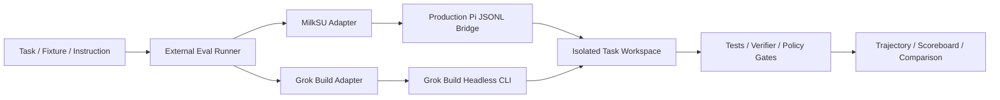

# Coding Agent 评测设计

> 文档状态：**Research / Point-in-time design note**
>
> 记录日期：2026-08-14
>
> 当前决定：只记录设计，近期不实施。本页不是产品功能、开发授权、里程碑或实现队列。
>
> 时效边界：Agent、模型、评测框架和 MilkSU Runtime 都在快速变化。未来采用本页前，必须重新核对
> 当前产品边界、Pi/Grok Build 版本、开源项目维护状态、许可证、任务格式和真实失败轨迹；不能把本页
> 直接当作长期有效的架构结论。

## 结论

MilkSU 可以用类似 TDD 的方法建立 Coding Agent 任务测试集，但更准确的名称是
**验收驱动的 Agent Evaluation**：先固定任务、工作区、预算、禁止行为和独立 Judge，再让同一模型在
不同 Agent Harness 中重复完成任务。

评测不应进入 MilkSU 产品启动链、Vue、Desktop RPC 或正式用户状态。任务、第三方数据集、Agent
Adapter、运行轨迹和报告应位于独立评测仓库；MilkSU 主仓库只保留正式 Runtime、必要的接口契约测试和
已有 deterministic fixture。

当前不需要为测试增加 `RunBenchmark`、`LoadFixture` 或 `GetScore` 等产品 API。第一阶段可以直接通过
现有 Pi JSONL Bridge 调用 MilkSU Coding 核心，通过 Grok Build headless CLI 调用对照 Agent。

## 目标与非目标

评测希望回答：

- 相同 Provider 和模型下，MilkSU/Pi 与 Grok Build 等 Agent Harness 的任务完成率有何差异；
- Agent 是否真正修改了正确文件、通过测试并控制 Diff 范围；
- 失败恢复、会话续接、Steering、审批、工具选择、时间和费用是否稳定；
- 普通、中等、高级和专业用户分别在哪些场景需要人工介入；
- 一次 Runtime、Prompt、工具或权限变更是否造成可观察的回归。

本设计不用于：

- 在产品里展示排行榜或能力分数；
- 把模型自述、单张截图或 LLM 主观评分当作任务完成；
- 为 benchmark 维护第二套 Agent Runtime；
- 用一次成功外推完整 Coding、CTF、CVE 或桌面能力；
- 让测试接口进入正式 Desktop RPC 或打包 App。

## 当前基础

MilkSU 已有 [Coding Agent 真实交付验收](../coding-agent-delivery-acceptance.md) 和
`scripts/test-coding-agent-delivery.mjs`。当前 deterministic fixture 已覆盖计划、附件读取、代码修改、
测试、失败恢复、审批、越界拒绝、Sidecar 重启恢复、Compaction、中止，以及 Token、时长、工具调用、
`runManifest` 和 `scoreboard`。

这能验证正式 Pi Bridge 和工具循环的局部契约，但目前仍以固定任务和 fake provider 为主，不能证明：

- 多个真实仓库上的稳定完成率；
- 同一模型在不同 Agent Harness 下的差异；
- 重复运行的方差和 Pass@1 / Pass@3；
- 长任务、大仓库、复杂依赖和不同用户水平下的体验；
- Grok Build 等成熟产品对照结果。

因此后续工作应扩展任务和外部执行器，而不是把更多测试协调逻辑塞进产品。

## 建议结构

如果未来恢复该工作，建议建立独立私有仓库 `milksu-agent-evals`：

```text
milksu-agent-evals/
├── adapters/
│   ├── milksu-pi/
│   └── grok-build/
├── cases/
│   ├── smoke/
│   ├── novice/
│   ├── intermediate/
│   ├── advanced/
│   └── professional/
├── upstream/
├── journeys/
├── runner/
└── reports/
```

调用关系为：



SWE-bench、Terminal-Bench 或自定义 Case 提供任务、环境和 Verifier；Runner 负责准备工作区并选择
Agent Adapter；Adapter 负责把统一任务转换为目标 Agent 的调用；Judge 只观察最终产物和正式轨迹。

## 调用边界

### MilkSU/Pi

MilkSU Adapter 可以复用当前 Pi Bridge 已有动作：

```text
create_session
send_message
steer_message
approval_response
abort_session
compact_session
destroy_session
```

Adapter 启动正式 `sidecar/pi/bridge.js`，通过 stdin/stdout 交换 JSONL，并收集 `ready`、工具事件、
审批、`message_done` 和错误事件。评测仓库固定待测 MilkSU commit，主仓库保留 Bridge 契约测试。

### Grok Build

Grok Build Adapter 使用 headless CLI，在隔离的任务目录和 `GROK_HOME` 中运行，避免个人历史、MCP、
Skill 或本机配置污染结果。两侧尽量固定相同 TokenFlux Endpoint、API Key、模型 ID、任务、预算、网络、
超时和初始文件；无法完全对齐的 System Prompt、工具 Schema 或模型参数必须记录为 Harness 差异。

第一阶段不必立即接入大型框架。可以先实现一个很薄的本地 Runner；需要运行外部数据集、Docker
环境、并发 Trial 或标准轨迹时，再评估接入 [Harbor](https://github.com/harbor-framework/harbor)。

## Task 与 Judge

每个 Case 至少描述：

- 用户层级与任务说明；
- 固定初始仓库、依赖和环境；
- 可见测试与独立隐藏测试；
- 允许和禁止修改的路径或效果；
- 网络、工具、回合、时间、Token 和费用预算；
- 是否允许人工批准、Steering 或接管；
- 最终成功条件和失败分类。

主要结果应由测试、文件状态、Diff、服务健康检查或其他确定性 Verifier 建立。LLM Judge 只适合补充
评价解释清晰度、交付说明或用户体验，不应替代核心完成判定。

Agent 输出具有随机性，真实模型对照应重复运行。除安全、越权、凭据和范围等硬 Gate 外，不宜因为
一次随机失败直接阻断每个 PR。可以分层执行：

- PR：fake provider 和 deterministic contract；
- Nightly：少量真实模型任务，每项重复三次；
- Weekly / Release：更完整任务集、对照 Agent 和成本统计；
- Desktop Journey：正式 macOS App 的独立黑盒 Runbook，不强行塞进容器评测。

## 用户分层

| 用户层级 | 代表任务 | 主要观察 |
| --- | --- | --- |
| 普通用户 | 用自然语言让 Agent 跑起小项目并修复明显错误 | 首次结果时间、是否要求终端知识、错误是否可理解、完成状态是否明确 |
| 中等用户 | 多文件 Bug、补测试、查看 Diff、运行中追加要求、重启继续 | 测试和 Diff、失败恢复、Steering、会话续接、人工介入次数 |
| 高级用户 | 模型选择、MCP、浏览器、后台任务、子 Agent | 工具发现与选择、权限状态、自动 worktree、可观察性和扩展能力 |
| 专业用户 | 大仓库、长任务、CI、PR、成本与审计 | 可复现性、批量/headless、轨迹导出、p50/p95、费用、长时稳定性 |

MilkSU 相比终端 Agent 的潜在优势是桌面可见执行、Browser/Computer Scope、Artifact Preview、审批、
CTF/CVE 上下文和领域 Evidence；当前最大未知不是功能数量，而是这些能力在不同用户和真实任务上的
稳定成功率。Grok Build 的主要成熟度基线来自 headless/CLI、会话与 worktree、配置、MCP、Skill、
插件和较完整的终端工作流，而不是可以不经对照就假定其所有任务必然更好。

## 可参考的开源项目

| 项目 | 参考价值 | 当前建议 |
| --- | --- | --- |
| [Harbor](https://github.com/harbor-framework/harbor) | 多 Agent Adapter、容器任务、并发 Trial、Verifier 和标准轨迹 | 后续主要候选；第一阶段可先不引入 |
| [SWE-bench](https://github.com/SWE-bench/SWE-bench) | 真实 GitHub Issue 与独立测试判定 | 后续选小型 Verified 子集 |
| [Terminal-Bench](https://github.com/harbor-framework/terminal-bench) | 终端、环境准备和长任务 | 用于失败恢复和系统任务 |
| [Aider Polyglot](https://github.com/Aider-AI/polyglot-benchmark) | 多语言、短任务、测试驱动 | 适合快速真实模型回归 |
| [OpenHands Benchmarks](https://github.com/OpenHands/benchmarks) | Agent 执行、容器和日志参考 | 借鉴，不作为 MilkSU 主 Runtime |
| [ToolSandbox](https://github.com/apple/ToolSandbox) | 有状态、多轮工具调用 | Coding 基线稳定后再考虑 |

引入任何项目时仍需重新检查固定版本、许可证、维护状态、任务污染、容器权限、网络和凭据边界。

## 暂停点与未来重新评估

本设计当前停留在研究记录，不创建评测仓库、不增加接口、不下载数据集、不运行付费批量任务。

未来出现以下条件之一时，可以重新评估：

- 需要用事实判断 MilkSU/Pi 与 Grok Build 等 Harness 的差距；
- Coding Agent 的一次变更缺少可靠的真实模型回归；
- 准备验证完整自然功能任务、长任务或专业用户工作流；
- 专业用户需要正式 headless MilkSU 或 CI 接口；
- 真实用户失败积累到足以形成代表性 Incident Cases。

重新评估时优先确认：现有 fixture 是否仍代表当前 Runtime、Pi Bridge 是否仍是合适调用面、Harbor
是否仍维护且支持目标 Agent、Grok Build CLI 是否变化、TokenFlux 模型路由是否一致，以及历史 Case
是否已因模型训练污染或产品架构变化而失去区分度。
