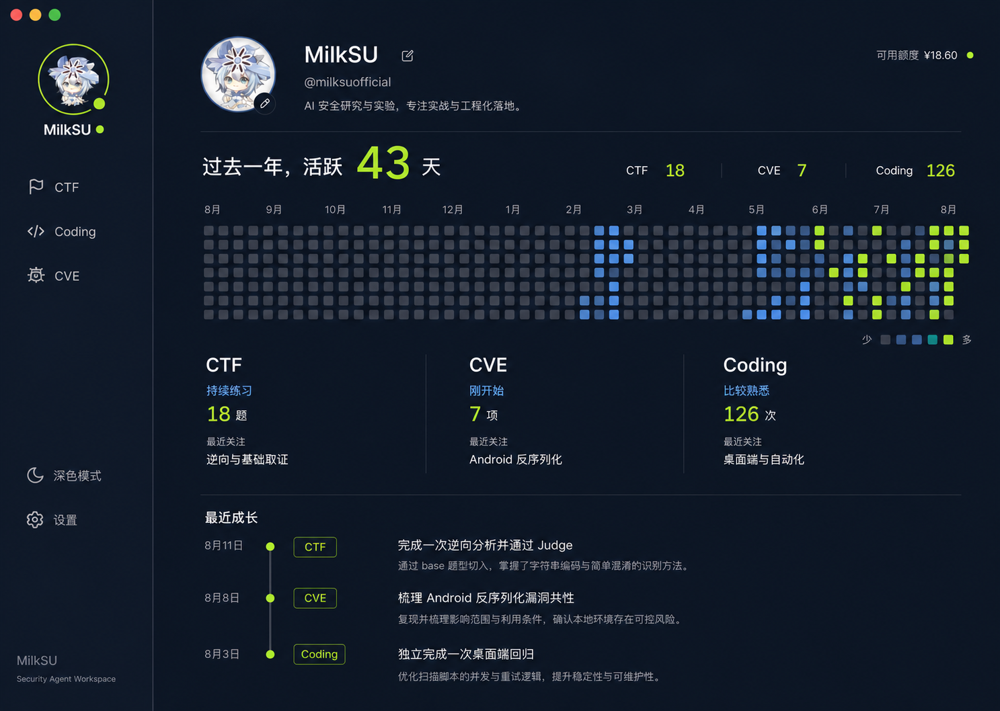
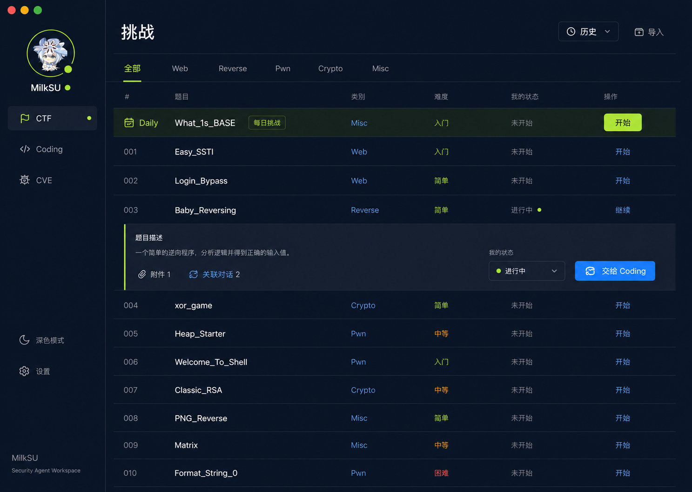
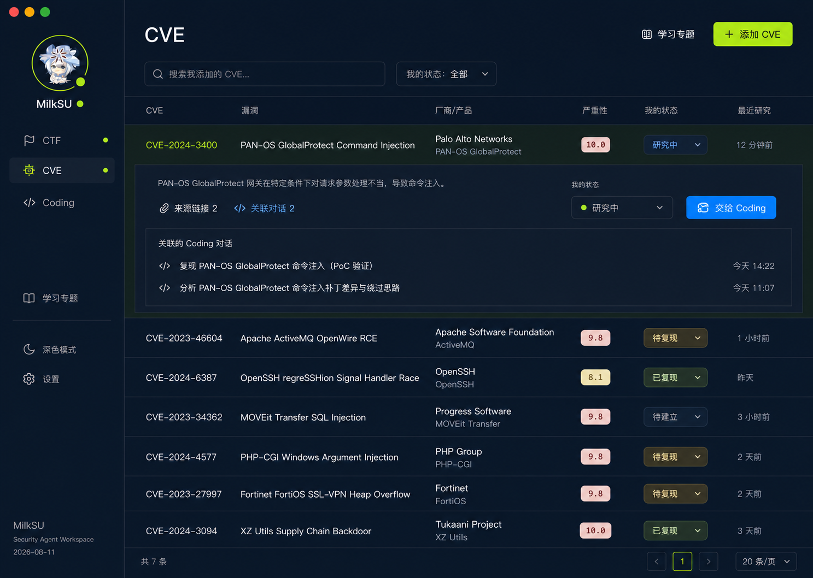
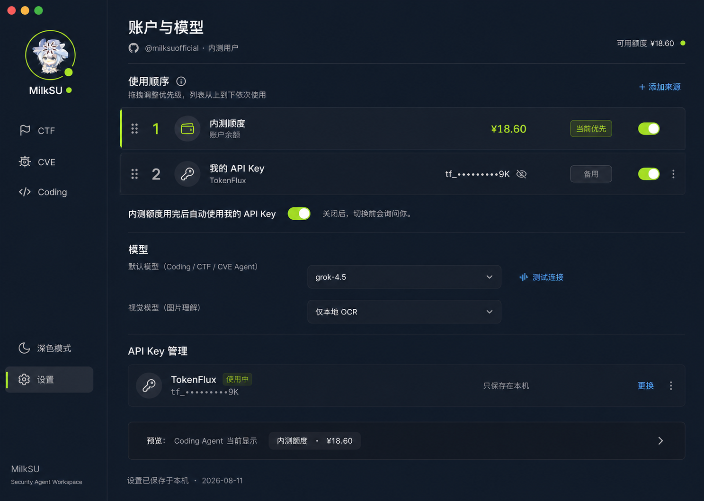
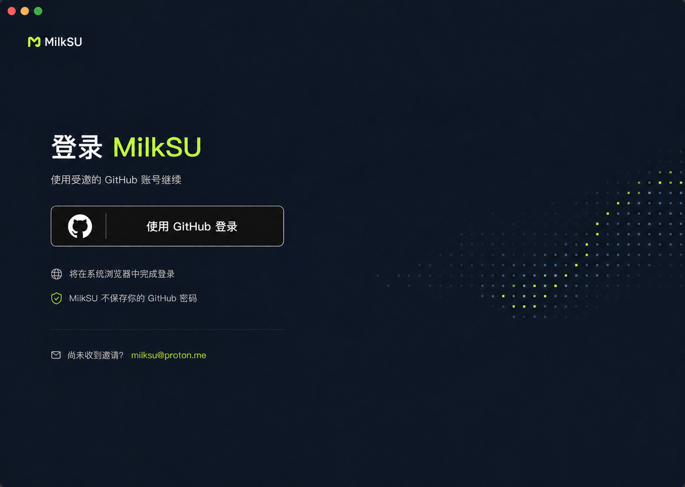
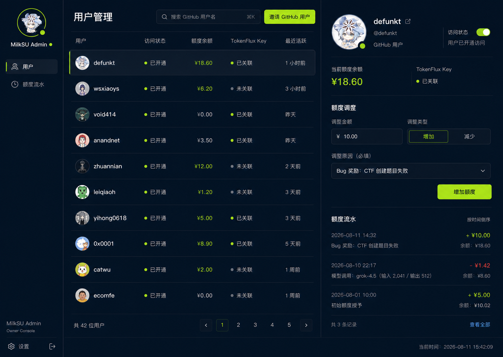

# 个人安全工作台计划

> 状态：Approved Product Plan
>
> 形成日期：2026-08-11
>
> 目标关联：Codex 任务 `019fe9ee-b865-75b3-903d-bada1266f254`（进行中）→ 本产品计划 →
> [当前开发目标](current-objectives.md#进行中目标个人安全工作台)
>
> 本文是下一阶段产品目标，不是完成证据。执行时先读取
> `current-objectives.md`、`product-code-admission.md`、`current-system.md` 和当前代码。

## 进行中目标

完成 MilkSU 个人安全工作台：固化已确认的产品决策、问答与界面稿；将 CTF/CVE 做薄并接入
统一 Coding；实现真实个人成长页；在独立私有目录 `/Users/milksu/code/milksu-admin` 建立
GitHub 登录、邀请制访问、额度与流水管理 API/管理前端；让 MilkSU 客户端接入账户额度与
自有 API Key 的可选路由；按纵向切片完成测试、Beta 追踪和真实验收。

本目标已经作为当前 Codex 任务的进行中目标创建。阶段进度以
[当前开发目标](current-objectives.md#进行中目标个人安全工作台) 为准，本文保存稳定产品决策与
验收方向。

## 当前进度

- 已实现并测试：个人资料、轻量 CTF/CVE、共享 Coding 上下文、独立 Admin 基线、账户额度与本机
  Key 的全局/对话级顺序。
- 已从干净提交 `ab6b9587d5894947f3eef83caa56ec3134c581d5` 构建 `MilkSU Beta`；设置页确认
  tracking ID `aa6a63bd1635572e225d70a6529a2d702e6757894519857e9745b180870ee0db`。
- 原生 Computer Use 已复检个人页、CTF/CVE 草稿交接、领域上下文 PiP、返回状态、关联对话和
  无虚构 CVE 资产。当前包没有真实账户部署配置，本机也没有可用模型凭据，所以 GitHub 登录、
  真实额度以及 App 内 Agent 实际完成 CTF/CVE 仍是完成线，不以按钮或草稿代替。
- 全局左栏固定为窄栏，头像使用圆形裁切；Coding 会话历史默认收起，只在用户点击后以浮层展开，
  不再因 CTF、CVE、Coding、个人资料和设置切换而挤动主页面。
- 独立 Admin 已到提交 `b0e54ae627063e5ac97674a78c9646fbaa0289c9`：邀请、暂停访问、额度增减、
  用户流水和全局流水均有实际 API/界面与测试；Supabase、GitHub OAuth 和 TokenFlux 仍待真实部署。

## 目标

把 CTF 和 CVE 收成轻量的个人记录与任务入口，把分析、工具和动态工作继续交给同一个
Coding Agent。个人资料页诚实记录用户在 CTF、CVE 和 Coding 中的活动与成长。

内测结束前补上 GitHub 登录、邀请、额度和模型来源切换；用户可以使用 MilkSU 分发的额度，
也可以继续使用自己保存在本机的 API Key。

## 已确认界面

这些图片是实现目标，不代表功能已经完成：

### 个人资料页

### CTF 挑战页

### CVE 研究页

### 账户与模型来源

### GitHub 登录页

### 独立内测管理后台

## 实施顺序

### 1. 个人入口与成长页

- 左上角改为当前用户头像；点击后弹出菜单，由“个人资料”进入完整页面。
- 个人页展示全年活跃格、CTF/CVE/Coding 的真实次数、模糊阶段和最近成长。
- 活跃与成长自动来自用户发起的真实任务；Agent 的工具调用不单独计数。
- 详细对话、代码和材料留在本机，只同步个人资料与简短成长概况。
- 全局六维雷达停止展示。先保留并注释现有实现，说明它只可能在以后迁入 CTF 内部。

### 2. CTF 变薄

- 主页面只保留每日挑战、题库、分类、历史和导入。
- 每日挑战是题库首行；允许换题，不做连续打卡、积分和月历奖励。
- 题目展开后只显示必要材料、手工状态、关联 Coding 对话和“交给 Coding”。
- 历史只记录明确开始、导入或从题目发起的 Coding 对话；浏览题库不产生记录。

### 3. CVE 变薄

- 首页只显示用户明确加入研究的公开 CVE；公共数据源只用于搜索和添加。
- 条目展开后只显示简要材料、手工状态、关联 Coding 对话和“交给 Coding”。
- 学习专题是 CVE 内的次级入口，只保存标题、简介、CVE 列表和关联对话。
- “我的漏洞披露提交”暂缓，不进入本轮。

### 4. 安全工具接入 Coding

| 阶段 | 项目 |
| --- | --- |
| 优先接入 | capa、本机安装的 CodeQL、Taskflow 中可复用的 CodeQL MCP |
| 下一步 | Shannon 外部 Worker |
| 后续连接 | Strix、用户已有 CAPEv2、用户已有 Assemblyline |
| 学习或评测 | CAI、ARTEMIS、AgentRE-Bench、Agentic SOC |
| 不进入产品 | BoxPwnr、PentAGI |

工具只在 Coding 中提供能力，CTF/CVE 不复制工具面板或 Agent Loop。每项接入前按上游授权、
权限范围和真实任务重新判断。

### 5. GitHub 内测账户

- 使用 Supabase Auth 和系统浏览器完成 GitHub 登录；只有邀请用户可以进入内测。
- 登录后左上角显示用户头像；资料允许修改头像、显示名称和一句介绍。
- 所有联系入口统一使用 `milksu@proton.me`。
- 新建独立私有后台仓库，保存邀请、账户额度、模型路由和管理员页面；不放进桌面端仓库。

### 6. 额度与模型来源

- 账户额度和用户自己的 API Key 是两个独立来源。
- 默认账户额度优先、个人 Key 备用；用户可以调整顺序和自动切换方式。
- Coding 中的临时选择只影响当前对话，设置页保存全局默认。
- 个人 Key 只留在本机；账户额度由私有后台管理。MilkSU Admin 不保存或转发任何模型 Key。
- 账户模型使用 [TokenFlux Team](https://docs.tokenflux.dev/docs/tokenflux/team.html)：管理员邀请成员，
  成员在 TokenFlux 创建自己的团队 Key，再保存在本机凭据库；管理员只管理成员、额度和停用状态，
  看不到成员 Key 明文。
- 自动切换只允许发生在模型尚未输出、也未执行工具之前；已经产生内容或外部效果后必须原地报错，
  不能换来源重放同一回合。
- TokenFlux 的真实余额与消费明细、硬限额和同步延迟在接入真实团队后实测；没有可靠结果前，后台
  人民币流水只作为 MilkSU 内测预算账本，不伪装成 TokenFlux 的实时账单。
- 管理后台支持邀请、暂停访问、初始赠送和带原因的额度增减，Bug 奖励进入同一流水。

### 7. 收口

- 每个纵切使用现有测试和一项真实用户任务验收，不把按钮或模拟数据当完成。
- 从干净提交构建 Beta，在设置页核对 branch、完整 commit 和 tracking ID 后再做原生 UI 回归。
- CTF、CVE、个人资料、登录和模型来源全部通过后，才更新正式 App 和 Current 文档。

## 本轮不做

- 自动项目管理、自动改变 CTF/CVE 状态。
- 把 Coding 产物复制成 CTF/CVE 的结构化展示系统。
- 连续打卡、积分、排行榜和公开个人主页。
- 漏洞披露提交追踪、自动联系厂商或自动提交漏洞。
- 第二套通用 Agent Harness。

## 附录：决策问答记录

这里保存本轮连续确认的结果。问题经过压缩，不逐字重复聊天；后续 Agent 仍需按当前代码和
仓库规范决定实现细节。

| # | 核对的问题 | 已确认答案 |
| --- | --- | --- |
| 1 | CTF/CVE 更像个人记录还是任务入口？ | 两者并重，偏个人记录。 |
| 2 | 是否建立自动选题或推荐模块？ | 不建立；用户可以直接问 Coding。 |
| 3 | 哪个领域适合每日内容？ | 只有 CTF 做“每日挑战”。 |
| 4 | CVE 如何组织学习内容？ | 做“学习专题”，按漏洞类型串联多个公开 CVE。 |
| 5 | CTF/CVE 状态是否自动追踪？ | 完全手工；Judge 等验收事实与手工状态分离。 |
| 6 | 如何关联 Coding 对话？ | 只自动记录从当前 CTF/CVE 发起的 Coding 对话。 |
| 7 | 是否推断其他对话属于某道题或某个 CVE？ | 不推断，不增加复杂的关联管理界面。 |
| 8 | 页面需要多少说明文字？ | 用户看一眼能懂；需要长篇解释才能使用的功能不做。 |
| 9 | CTF 页面叫什么、采用什么结构？ | 使用玩家熟悉的“挑战”与题库列表，不使用“案件”。 |
| 10 | 是否突出“正在做的挑战”？ | 不突出；历史收进“历史”入口，每日挑战放题库首行。 |
| 11 | 是否做连续打卡、月历和积分？ | 本轮不做。 |
| 12 | 是否保留 GitHub 风格格子？ | 保留，但只在个人页展示真实活跃度。 |
| 13 | 每日挑战如何选择？ | 当天稳定、排除已完成题目，允许用户主动换题。 |
| 14 | 哪些操作写入 CTF 历史？ | 明确开始、导入或从题目发起 Coding；单纯浏览不写入。 |
| 15 | 全局能力画像展示什么？ | 活跃格、CTF/CVE/Coding 概况和最近确认成长。 |
| 16 | CTF 成长是否给精确分数？ | 不给；只显示“刚开始、持续练习、比较熟悉”等阶段。 |
| 17 | 成长记录由谁提交？ | 从真实用户任务自动形成，不要求用户手工申报。 |
| 18 | Agent 工具调用是否算成长？ | 不单独计算；按用户发起并完成的真实任务计。 |
| 19 | 哪些资料同步到账号？ | 头像、资料、活跃日期、阶段和简短成长；对话、代码、材料留本机。 |
| 20 | 个人页是否公开？ | 第一版私有，仅本人可见。 |
| 21 | 个人资料可以改什么？ | 头像、显示名称和一句介绍。 |
| 22 | 六维雷达如何处理？ | 从全局移除，代码暂留并注释，只可能以后放进 CTF 内部。 |
| 23 | 登录后左上角显示什么？ | 用户自己的头像，不再显示 MilkSU Logo。 |
| 24 | 头像菜单放什么？ | 先放个人资料，并为账户、设置、退出保留自然位置。 |
| 25 | 内测使用什么登录？ | GitHub OAuth；Google 暂缓。 |
| 26 | 谁能登录内测？ | 受邀用户；代码仓库权限和账户额度分开管理。 |
| 27 | 管理系统放在哪里？ | 独立私有仓库 `/Users/milksu/code/milksu-admin`，包含 Web 管理前端和 API 后端。 |
| 28 | 额度如何表示和奖励？ | 直接显示人民币余额；支持初始赠送、Bug 奖励和带原因的增减流水。 |
| 29 | 账户额度与个人 API Key 如何共存？ | 两者都可用、可排序；默认账户额度优先，个人 Key 备用，Coding 可临时选择。 |
| 30 | TokenFlux、CVE 披露和联系入口如何处理？ | TokenFlux 明细与硬限额先实测；披露追踪暂缓；联系统一为 `milksu@proton.me`。 |
| 31 | 全局侧栏如何避免切换页面时忽大忽小？ | 固定使用窄栏；Coding 会话历史默认收起，需要时由一个按钮打开浮层。头像裁切为圆形。 |
